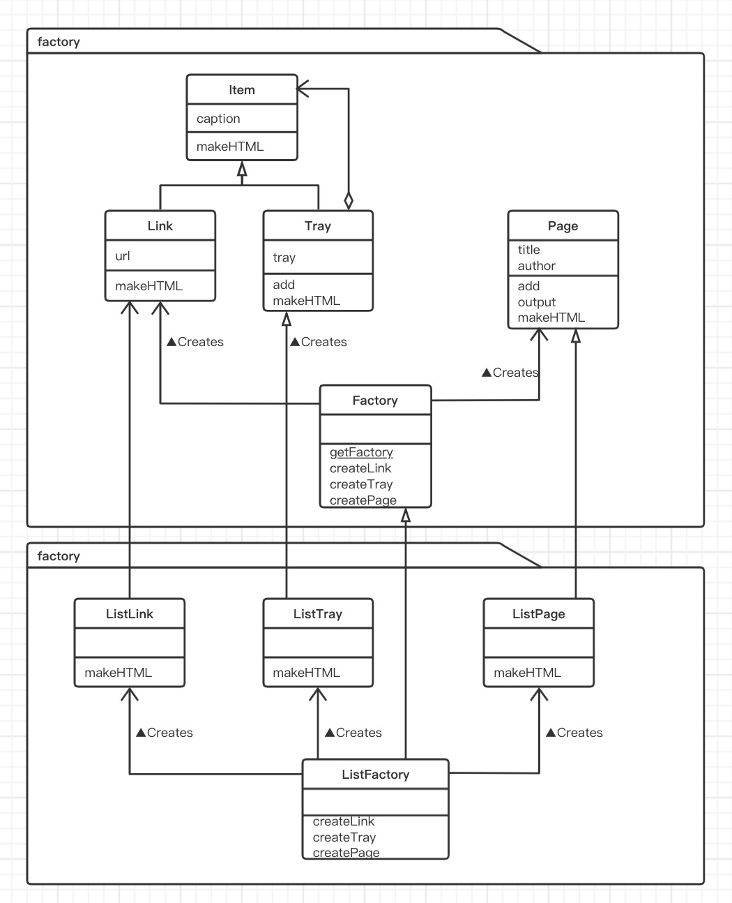
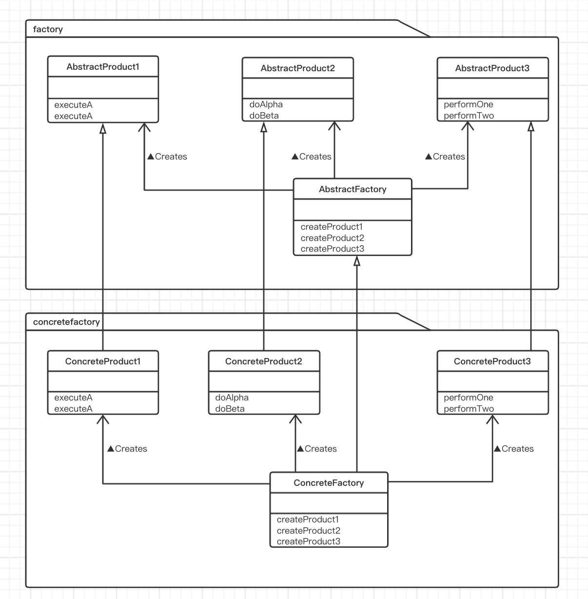

# 抽象工厂模式（Abstract Factory 模式）

> 学习Abstract Factory 模式。
>
> Abstract 的意思是“抽象的”，Factory的意思是“工厂”。将它们组合起来我们就可以知道 Abstract Factory 表示“抽象工厂”的意思。
>
> 通常，我们不会将“抽象的”这个词与“工厂”这个词联系到一起。所谓工厂，是将零件组装成产品的地方，这是一项具体的工作。那么“抽象工厂”到底是什么意思？
>
> 因为在Abstract Factory 模式中，不仅有“抽象工厂”，还有“抽象零件”和“抽象产品”。**抽象工厂的工作是将“抽象零件”组装为“抽象产品”**。
>
> 大家先回忆一下面向对象编程中的”抽象“这个词的具体含义。它指的是”不考虑具体怎样实现，而是仅关注接口（API）“的状态。例如，抽象方法（Abstract Method）并不定义方法的具体实现，而是仅仅只确定了方法的名字和签名（参数的类型和个数）。
>
> 关于”忘记方法的具体实现（假装忘记），使用抽象方法进行编程“的设计思想，我们在Template Method 模式和 Builder模式中已经稍微提及了一些。
>
> 在Abstract Factory 模式中将会出现抽象工厂，它会将抽象零件组装为抽象产品。也就是说，我们并不关心零件的具体实现，而是只关心接口（API）。我们仅使用该接口（API）将零件组装成为具体的产品。

## 示例类图

> 

## 示例程序

> 实例程序中，类被划分为以下3个包。
>
> - factory包：包含抽象工厂、零件、产品的包
> - 无名包：包含Main类的包
> - listfactory包：包含具体工厂、零件、产品的包（这里使用`<ul>`标签输出为HTML文件）
>
> | 包          | 名字        | 说明                                                 |
> | ----------- | ----------- | ---------------------------------------------------- |
> | factory     | Factory     | 表示抽象工厂的类（制作Link、Tray、Page）             |
> | factory     | Item        | 方便统一处理Link和Tray的类                           |
> | factory     | Link        | 抽象零件：表示HTML的链接的类                         |
> | factory     | Tray        | 抽象零件：表示含有Link和Tray的类                     |
> | factory     | Page        | 抽象零件：表示HTML页面的类                           |
> | 无名        | Main        | 测试程序行为的类                                     |
> | listfactory | ListFactory | 表示具体工厂的类（制作ListLink、ListTray、ListPage） |
> | listfactory | ListLink    | 具体零件：表示HTML的链接的类                         |
> | listfactory | ListTray    | 具体零件：表示含有Link和Tray的类                     |
> | listfactory | ListPage    | 具体零件：表示HTML页面的类                           |
>
> ### 抽象类的零件：Item 类
>
> Item类是Link类和Tray类的父类（Item有“项目”的意思）。这样，Link类和Tray类就具有可替换性了。
>
> caption字段表示项目的“标题”
>
> makeHTML方法是抽象方法，需要子类来实现这个方法。该方法会返回HTML文件的内容（需要子类去实现）。
>
> ```java
> public abstract class Item {
>     /**
>      * 标题
>      */
>     protected String caption;
> 
>     public Item(String caption){
>         this.caption = caption;
>     }
> 
>     /**
>      * 返回HTML文件的内容
>      * @return 文件名
>      */
>     public abstract String makeHTML();
> }
> ```
>
> ### 抽象的零件：Link类
>
> Link类是抽象地表示HTML的超链接的类
>
> url字段中保存的是超链接所指向的地址。乍一看，在Link类中好像一个抽象方法都没有，但实际上并非如此。由于Link类中没有实现父类（Item类）的抽象方法（makeHTML），因此它也是抽象类。
>
> ```java
> public abstract class Link extends Item{
>     /**
>      * 超链接的地址
>      */
>     protected String url;
> 
>     public Link(String caption, String url) {
>         super(caption);
>         this.url = url;
>     }
> }
> ```
>
> ### 抽象的零件：Tray类
>
> Tray类表示的是一个含有多个Link类和Tray类的容器（Tray有托盘的意思。想象成在托盘上放置着一个一个项目）。
>
> Tray类使用add方法将Link类和Tray类集合在一起。为了表示集合的对象是“Link类和Tray类”，我们设置add方法的参数为Link类和Tray类的父类Item类。
>
> 虽然Tray类也继承了Item类的抽象方法makeHTML，但它并没有实现该方法。因此，Tray类也是抽象类。
>
> ```java
> public abstract class Tray extends Item {
>     protected ArrayList tray = new ArrayList();
> 
>     public Tray(String caption) {
>         super(caption);
>     }
> 
>     public void add(Item item) {
>         tray.add(item);
>     }
> }
> ```
>
> ### 抽象的产品：Page类
>
> Page类是抽象地表示HTML页面的类。如果Link和Tray比喻成抽象的“零件”，那么Page类就是抽象的“产品”。title和author分别是表示页面标题和页面作者的字段。作者名字通过参数传递给Page类的构造函数。
>
> 可以使用add方法向页面中增加Item（即Link或Tray）。增加的Item将会在页面中显示出来。
>
> output方法首先根据页面标题确定文件名，接着调用makeHTML方法将会自身保存的HTML内容写到文件中，
>
> 其中，我们可以去掉如下语句（1）中的this，将其写为如下语句（2）那样。
>
> - writer.write(this.makeHTML());          （1）
> - writer.write(makeHTML);                    （2）
>
> 为了强调用的是Page类自己的makeHTML方法，我们显式地加上了this。这里调用的makeHTML方法是一个抽象方法。output方法是一个简单的**Template Method 模式**的方法。
>
> ```java
> public abstract class Page {
>     protected String title;
>     protected String author;
>     protected ArrayList content = new ArrayList();
> 
>     public Page(String title, String author) {
>         this.title = title;
>         this.author = author;
>     }
> 
>     public void add(Item item){
>         content.add(item);
>     }
>     public void output() {
>         try {
>             String filename = title + ".html";
>             Writer writer = new FileWriter(filename);
>             writer.write(this.makeHTML());
>             writer.close();
>             System.out.println(filename + "编写完成。");
>         } catch (IOException e) {
>             e.printStackTrace();
>         }
>     }
>     public abstract String makeHTML();
> }
> ```
>
> ### 抽象的工厂：Factory 类
>
> 代码中的getFactory方法可以根据知道的类名生成具体工厂的实例。例如，可以像下面这样，将参数classname指定为具体工厂的类名所对应的字符串。
>
> “listfactory.ListFactory”
>
> getFactory方法通过**调用Class类的forName方法来动态的读取类信息，接着使用newInstance方法生成该类的实例**，并将其作为返回值返回给调用者。
>
> Class类属于java.lang包，是用来表示的类。Class类包含与Java的标准类库中。forName是java.lang.Class的类方法（静态方法），newInstance则是java.lang.Class的实例方法。
>
> 请注意，虽然getFactory方法生成的是具体工厂的实例，但是返回值的类型是生成抽象工厂类型。
>
> createLink、createTray、createPage等方法是用于在抽象工厂中生成零件和产品的方法。这些方法都是抽象方法，具体的实现被交给了Factory类的子类。不过，确定了犯法的名字和签名。
>
> ```java
> public abstract class Factory {
>     public static Factory getFactory(String classname) {
>         Factory factory = null;
>         try {
>             factory = (Factory) Class.forName(classname).newInstance();
>         } catch (ClassNotFoundException e) {
>             System.out.println("没有找到" + classname + "类。");
>         } catch (Exception e) {
>             e.printStackTrace();
>         }
>         return factory;
>     }
>     public abstract Link createLink(String caption, String url);
>     public abstract Tray createTray(String caption);
>     public abstract Page createPage(String title, String author);
> }
> ```
>
> ### 使用工厂将零件组装称为产品：Main类
>
> 在理解了抽象的零件、产品、工厂的代码后，我们看看Main类的代码Main类使用使用抽象工厂生产零件并将零件组装成产品。Main类中只引入了factory包，从这一点可以看出，**该类并没有使用任何具体零件、产品和工厂**。
>
> 具体工厂的类名是通过命令行来指定的。例如，如果要使用listfactory包中的ListFactory类，可以在命令行中输入命令。
>
> - java Main listfactory.ListFactory
>
> Main类会使用getFactory方法生成该参数（arg[0]）对应的工厂，并将其保存在factory变量中。
>
> 之后，Main类会使用factory生成Link和Tray，然后将Link和Tray都放入Tray中，最后生成Page并将生成结果输出至文件。
>
> ```java
> public class Main {
>     public static void main(String[] args) {
>         if (args.length != 1) {
>             System.out.println("Usage: java Main class.name.of.ConcreteFactory");
>             //pers.abstractFactory.sampleCode.listfactory.ListFactory
>             System.out.println("Example 1: java Main listfactory.ListFactory");
>             System.out.println("Example 1: java Main tablefactory.TableFactory");
>             System.exit(0);
>         }
>         Factory factory = Factory.getFactory(args[0]);
> 
>         Link people = factory.createLink("人民日报", "http://www.people.com.cn/");
>         Link gmw = factory.createLink("光明日报", "http://www.gmw.cn/");
> 
>         Link us_yahoo = factory.createLink("Yahoo!", "http://www.people.com.cn/");
>         Link jp_yahoo = factory.createLink("Yahoo!Japan", "http://www.yahoo.co.jp/");
>         Link excite = factory.createLink("Excite", "http://www.excite.com/");
>         Link google = factory.createLink("Google", "http://www.google.com/");
> 
>         Tray trayNews = factory.createTray("日报");
>         trayNews.add(people);
>         trayNews.add(gmw);
> 
>         Tray trayYahoo = factory.createTray("Yahoo");
>         trayYahoo.add(us_yahoo);
>         trayYahoo.add(jp_yahoo);
> 
>         Tray traySearch = factory.createTray("检索引擎");
>         traySearch.add(trayYahoo);
>         traySearch.add(excite);
>         traySearch.add(google);
> 
>         Page page = factory.createPage("LinkPage", "杨文轩");
>         page.add(trayNews);
>         page.add(traySearch);
>         page.output();
>     }
> }
> ```
>
> ### 具体的工厂：ListFactory类
>
> ListFactory类实现了Factory类的createLink方法、createTray方法以及createPage方法。当然，各个方法内部只是分别简单的new出了ListLink类的实例、ListTray类的实例以及ListPage类的实例。
>
> ```java
> public class ListFactory extends Factory {
> 
>     @Override
>     public Link createLink(String caption, String url) {
>         return new ListLink(caption,url);
>     }
> 
>     @Override
>     public Tray createTray(String caption) {
>         return new ListTray(caption);
>     }
> 
>     @Override
>     public Page createPage(String title, String author) {
>         return new ListPage(title, author);
>     }
> }
> ```
>
> ### 具体的零件：ListLink类
>
> ListLink类是Link类的子类。在ListLink类中必须实现的方法是哪个呢？对了，就是在父类中声明的makeHTML抽象方法。ListLink类使用`<li>`标签和`<a>`标签来制作HTML片段。这段HTML片段也可以ListTary和ListPage的结果合并起来，就如同将螺栓和螺母拧在一起一样。
>
> ```java
> public class ListLink extends Link {
>     public ListLink(String caption, String url) {
>         super(caption, url);
>     }
> 
>     /**
>      * 返回HTML文件的内容
>      * @return 文件名
>      */
>     @Override
>     public String makeHTML() {
>         return "<li><a href = \"" + url + "\">" + caption + "</a></li>\n";
>     }
> }
> ```
>
> ### 具体的零件：ListTray类
>
> ListTray类是Tray类的子类。这里我们重点看一下makeHTML方法是如何实现的。tray字段中保存了所有需要以HTML格式输出的Item，而负责将它们以HTML格式输出的就是makeHTML方法了。
>
> makeHTML方法首先使用<li>标签输出标题（caption），接着使用<ul> 和<li>标签输出每个Item。输出的结果先暂时保存在StringBuffer中，最后再通过toString方法将输出结果转换为String类型并返回给调用者。
>
> 那么每个Item又是如何输出为HTML格式的呢？当然就是调用每个Item的makeHTML方法了。请注意，这里并不关心item中保存的实例究竟是ListLink的实例韩式ListTray的实例，只是简单的调用了item.makeHTML()语句而已。这里不**能使用switch语句或if语句去判断item中保存的实例的类型**，否则就是非面向对象编程了。变量item是Item类型的，而Item类有声明了makeHTML方法，而ListLink类和ListTray类都是Item类的子类，因此可以放心调用了。之后item会帮我们进行处理。至于item究竟进行了什么样的处理，只有item的实例（对象才知道。这就是面向对象的优点。
>
> 这里使用的java.util.Iterator类与我们在Iterator模式中学习的迭代去在功能上是相同的，不过它是Java类库中自带的。为了从java.util.ArrayList类中得到java.util.Iterator,我们调用iterator方法。
>
> ```java
> public class ListTray extends Tray {
>     public ListTray(String caption) {
>         super(caption);
>     }
> 
>     /**
>      * 返回HTML文件的内容
>      * @return 文件名
>      */
>     @Override
>     public String makeHTML() {
>         StringBuffer buffer = new StringBuffer();
>         buffer.append("<li>\n");
>         buffer.append(caption + "\n");
>         buffer.append("<ul>\n");
>         Iterator it = tray.iterator();
>         while (it.hasNext()) {
>             Item item = (Item) it.next();
>             buffer.append(item.makeHTML());
>         }
>         buffer.append("</ul>\n");
>         buffer.append("</li>\n");
>         return buffer.toString();
>     }
> }
> ```
>
> ### 具体的产品：ListPage类
>
> ListPage类是Page类的子类。ListPage将字段中保存的内容输出为HTML格式。
>
> ```java
> public class ListPage extends Page {
> 
>     public ListPage(String title, String author) {
>         super(title, author);
>     }
> 
>     @Override
>     public String makeHTML() {
>         StringBuffer buffer = new StringBuffer();
>         buffer.append("<html><head><meta http-equiv=\"Content-Type\" content=\"text/html; charset=utf-8\" /><title>" + title + "</title></head>\n");
>         buffer.append("<body>\n");
>         buffer.append("<h1>" + title + "</h1>");
>         buffer.append("<ul>\n");
>         Iterator it = content.iterator();
>         while (it.hasNext()) {
>             Item item = (Item) it.next();
>             buffer.append(item.makeHTML());
>         }
>         buffer.append("</ul>\n");
>         buffer.append("<ur><address>" + author + "</address>");
>         buffer.append("</body></html>\n");
>         return buffer.toString();
>     }
> }
> ```

## 为示例程序增加其他工厂

> 使用tablefactory将超链接以表格形式展示出来。
>
> | 包           | 名字         | 说明                                                    |
> | ------------ | ------------ | ------------------------------------------------------- |
> | tablefactory | TableFactory | 表示具体工厂的类（制作TableLink、TableTray、TablePage） |
> | tablefactory | TableLink    | 具体零件：表示HTML的超链接类                            |
> | tablefactory | TableTray    | 具体零件：表示含有Link和Tray的类                        |
> | tablefactory | TablePage    | 具体零件：表示HTML页面的类                              |
>
> ### 具体的工厂：TableFactory类
>
> TableFactory类是Factory类的子类。createLink方法、createTray方法以及createPage方法的处理是分别生成TableLink、TableTray、TablePage的实例。
>
> ```java
> public class TableFactory extends Factory {
>     @Override
>     public Link createLink(String caption, String url) {
>         return new TableLink(caption,url);
>     }
> 
>     @Override
>     public Tray createTray(String caption) {
>         return new TableTray(caption);
>     }
> 
>     @Override
>     public Page createPage(String title, String author) {
>         return new TablePage(title,author);
>     }
> }
> ```
>
> ### 具体的零件：TableLink类
>
> TableLink类是Link类的子类。它的makeHTML方法的处理是使用<td>标签创建表格的列。
>
> ```java
> public class TableLink extends Link {
> 
>     public TableLink(String caption, String url) {
>         super(caption, url);
>     }
> 
>     /**
>      * 返回HTML文件的内容
>      *
>      * @return 文件名
>      */
>     @Override
>     public String makeHTML() {
>         return "<td><a href=\"" + url + "\">" + caption + "</a></td>\n";
>     }
> }
> ```
>
> ### 具体的零件：TableTray类
>
> TableTray类是Tray类的子类，其makeHTML方法的处理是使用`<td>`和`<table>`标签输出Item。
>
> ```java
> public class TableTray extends Tray {
>     public TableTray(String caption) {
>         super(caption);
>     }
> 
>     /**
>      * 返回HTML文件的内容
>      *
>      * @return 文件名
>      */
>     @Override
>     public String makeHTML() {
>         StringBuffer buffer = new StringBuffer();
>         buffer.append("<td>");
>         buffer.append("<table width=\"100%\" border=\"1\"><tr>");
>         buffer.append("<td bgcolor=\"#cccccc\" align=\"center\" colspan=\"" + tray.size() +"\"><b>" + caption + "</b></td>");
>         buffer.append("</tr>\n");
>         buffer.append("<tr>\n");
>         Iterator it = tray.iterator();
>         while (it.hasNext()) {
>             Item item = (Item) it.next();
>             buffer.append(item.makeHTML());
>         }
>         buffer.append("</tr></table>");
>         buffer.append("</td>");
>         return buffer.toString();
>     }
> }
> ```
>
> ### 具体的产品：TablePage类
>
> TablePage类是Page类的子类。
>
> ```java
> public class TablePage extends Page {
>     public TablePage(String title, String author) {
>         super(title, author);
>     }
> 
>     @Override
>     public String makeHTML() {
>         StringBuffer buffer = new StringBuffer();
>         buffer.append("<html><head><meta http-equiv=\"Content-Type\" content=\"text/html; charset=utf-8\" /><title>" + title + "</title></head>\n");
>         buffer.append("<body>\n");
>         buffer.append("<h1>" + title + "</h1>\n");
>         buffer.append("<table width=\"80%\" border=\"3\" >" );
>         Iterator it = content.iterator();
>         while (it.hasNext()) {
>             Item item = (Item) it.next();
>             buffer.append("<tr>" + item.makeHTML() + "</tr>");
>         }
>         buffer.append("</table>\n");
>         buffer.append("<hr><address>" + author + "</address>");
>         buffer.append("</body></html>\n");
>         return buffer.toString();
>     }
> }
> ```

## Abstract Factory 模式的类图

> 

## Abstract Factory 模式中的登场角色

- ### AbstractProduct（抽象产品）

  > AbstractProduct角色负责定义AbstractFactory角色所生成的抽象零件和产品的接口（API）。
  >
  > 在示例程序中，由Link类、Tray类、和Page类扮演此角色。

- ### AbstractFactory（抽象工厂）

  > AbstractFactory角色负责定义用于生产抽象产品的接口（API）。
  >
  > 在示例程序中，由Factory类扮演此角色。

- ### Client（委托者）

  > Client角色仅会调用AbstractFactory角色和AbstractProduct角色的接口（API）来进行工作，对于具体的零件、产品和工厂一无所知。
  >
  > 在示例程序中，由Main类扮演此角色。

- ### ConcreteProduct（具体产品）

  > ConcreteProduct角色负责实现AbstractProduct角色的接口（API）。
  >
  > 在示例程序中，由以下包中的以下类扮演此角色。
  >
  > - listfactory包：ListLink类、ListTray类和ListPage类。
  > - tablefactory包：TableLink类、TableTray类和TablePage类。

- ### ConcreteFactory（具体工厂）

  > ConcreteFactory角色负责实现AbstractFactory角色的接口（API）。
  >
  > 在示例程序中，有以下包中的以下类扮演此角色。
  >
  > - listfactory包：ListFactory类
  > - tablefactory包：TableFactory类

## 思路要点

- ### 易于增加具体的工厂

  > 在Abstract Factory 模式中增加具体的工厂是非常容易的。这里说的“容易”指的是需要编写哪些类和需要实现哪些方法都非常清楚。
  >
  > 假设现在我们要在示例程序中增加新的具体工厂，那么需要做的就是编写Factory、Link、Tray、Page这4个类的子类，并实现它们定义的抽象方法。也就是说factory包中的抽象部分全部具体话即可。
  >
  > 这样一来，无论要增加多少个具体工厂（或是要修改具体工厂的Bug），都无需修改抽象工厂和Main部分。

- ### 难以增加新的零件

  > 请试想一下要在Abstract Factory 模式中增加新的零件时应当如何做。例如，我们要在factory包中增加一个表示图像的Picture零件。这是，我们必须要对所有的具体工厂进行相应的修改才行。例如，在listfactory包中，我们必须要做以下修改。
  >
  > - 在ListFactory中加入createPicture方法
  > - 新增ListPicture类
  >
  > 已经编写完成的具体工厂越多，修改的工作量就会越大。

## 所学知识

> 最难理解的就是Abstract Factory 模式了。因为在该模式中，类之间结构复杂，登场角色也多，与只有一个类的Singleton模式相比，它们有很大的区别。如果说Singleton模式时“独舞”，那Abstract Factory模式就是“群舞”了