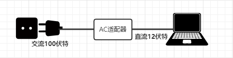
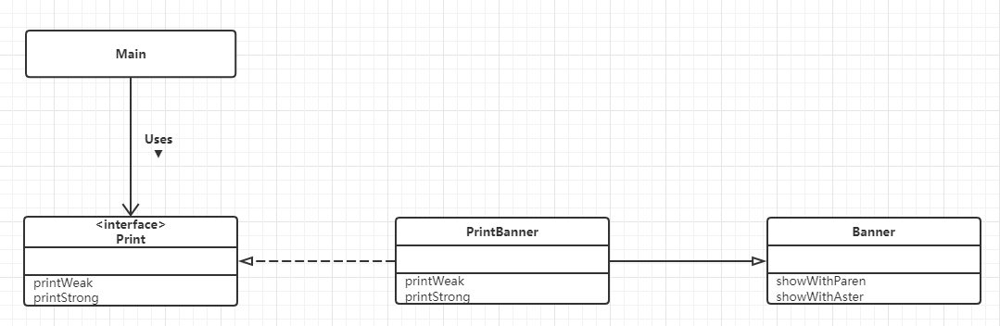
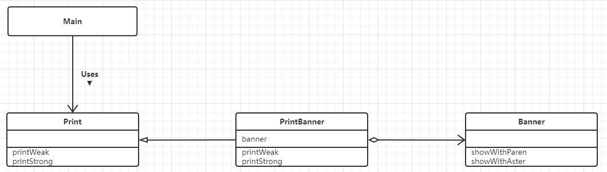
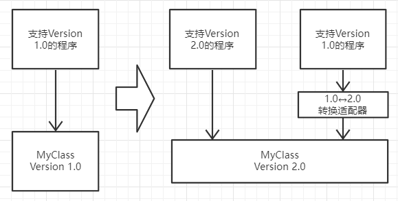

# Adapter模式（适配器模式）

> 如果想让额定工作电压是直流12伏特的笔记本在交流100伏特的AC电源下工作，应该怎么做呢？
>
> 通常，我们回使用AC适配器，将家庭用的交流100伏特电压转换成我们所需要的直流12伏特电压。
>
> 这就是适配器的工作，它位于实际情况于需求之间，填补两者之间的差异。
>
> 适配器的英文是`Adapter`，意思是“使……相互适合的东西”。
>
> 前面说的AC适配器的作用就是让工作于直流12伏特环境的笔记本电脑适合于交流100伏特的环境。
>
> 
>
> 在程序世界中，经常会存在现有程序无法直接使用，需要适当的变换之后才能使用的情况。
>
> 这种用于填补“现有的程序”和“所需的程序”之间差异的设计就是 `Adapter模式`
>
> `Adapter 模式` 也被称作 `Wrapper 模式`。Wrapper 有“包装器”的意思，就像用精美的包装纸将普通商品包装成礼物那样，替我们把某样东西包起来，使其能够用于用途的东西就被称为“包装器”或”适配器“。
>
> Adapter 模式有以下两种：
>
> - 类适配器模式（使用继承的适配器）
> - 对象适配器模式（使用委托的适配器）

## 示例类图（1）

> 

## 示例程序（1）（使用继承的适配器）

>首先，让我们来看一段使用继承的适配器的示例程序。这里示例程序是一段会将输入的文字显示为`(Hello)`或是`*Hello*`的简单程序。
>
>目前`Banner`类（Banner有广告横幅的意思）中，有将字符用括号括起来的`showWithParen`方法和将字符用*号括起来的`shwoWithAster`方法。我们假设`Banner`类是类似前文中的“交流100伏特电压”的“实际情况”。
>
>假设`Print`接口中声明了两种方法，即弱化字符串显示（加括号）的`printWeak`（weak有弱化的意思）方法，和强调字符串显示（加*号）的`printStrong`（strong有强化的意思）方法。我们假设这个接口是类似于前文中的“直流12伏特电压”的“需求”。
>
>现在要做的事情是使用`Banner`类编写一个实现了`Print`接口的类，也就是说要做一个将“交流100伏特电压”转换成“直流12伏特电压”的适配器。
>
>扮演适配器角色的是`PrintBanner`类。该类继承了`Banner`类并且实现了“需求”——`Print`接口。`PrintBanner`类使用`showWithParen`方法实现了`printWeak`，使用`showWithAster`方法实现了`printStrong`。这样，`PrintBanner`类就具有适配器的功能了。
>
>### Banner 类
>
>```java
>
>public class Banner {
>private String string;
>
>public Banner(String string) {
>   this.string = string;
>}
>
>/**
>    * 显示用括号
>    */
>   public void showWithParen(){
>       System.out.println("(" + string + ")");
>   }
>
>   /**
>    * 显示用星号
>    */
>   public void showWithAster(){
>       System.out.println("*" + string + "*");
>   }
>}
>```
>
>### Print 接口
>
>```java
>/**
>* Target 对象
>*/
>public interface Print {
>   /**
>    * 打印弱化字符串
>    */
>   public abstract void printWeak();
>
>   /**
>    * 打印强化字符串
>    */
>   public abstract void printStrong();
>}
>```
>
>### PrintBanner 类
>
>```java
>/**
>* Adapter 适配
>*/
>public class PrintBanner extends Banner implements Print{
>   public PrintBanner(String string) {
>       super(string);
>   }
>
>   /**
>    * 打印弱化字符串
>    */
>   @Override
>   public void printWeak() {
>       showWithParen();
>   }
>
>   /**
>    * 打印强化字符串
>    */
>   @Override
>   public void printStrong() {
>       showWithAster();
>   }
>}
>```
>
>### Main 类
>
>```java
>/**
>* Client 请求者
>*/
>public class Main {
>   public static void main(String[] args) {
>       Print p = new PrintBanner("Hello");
>       p.printWeak();
>       p.printStrong();
>   }
>}
>```

## 示例类图（2）

> 

## 示例程序（2）（使用委托的示例代码）

> ### Banner 类
>
> ```java
> /**
>  * Adaptee 被适配
>  */
> public class Banner {
>     private String string;
> 
>     public Banner(String string) {
>         this.string = string;
>     }
> 
>     /**
>      * 显示用括号
>      */
>     public void showWithParen(){
>         System.out.println("(" + string + ")");
>     }
> 
>     /**
>      * 显示用星号
>      */
>     public void showWithAster(){
>         System.out.println("*" + string + "*");
>     }
> }
> ```
>
> ### Print 抽象类
>
> ```java
> /**
>  * Target 对象
>  */
> public abstract class Print {
>     /**
>      * 打印弱化字符串
>      */
>     public abstract void printWeak();
> 
>     /**
>      * 打印强化字符串
>      */
>     public abstract void printStrong();
> }
> ```
>
> ### PrintBanner 类
>
> ```java
> /**
>  * Adapter 适配
>  */
> public class PrintBanner extends Print{
> 
>     private Banner banner;
> 
>     public PrintBanner(String string) {
>         this.banner = new Banner(string);
>     }
> 
>     /**
>      * 打印弱化字符串
>      */
>     @Override
>     public void printWeak() {
>         banner.showWithParen();
>     }
> 
>     /**
>      * 打印强化字符串
>      */
>     @Override
>     public void printStrong() {
>         banner.showWithAster();
>     }
> }
> ```
>
> ### Main 类
>
> ```java
> /**
>  * Client 请求者
>  */
> public class Main {
>     public static void main(String[] args) {
>         PrintBanner p = new PrintBanner("Hello");
>         p.printWeak();
>         p.printStrong();
>     }
> }
> ```

## Adapter 模式中的角色

- ### Target（对象）

  > 该角色负责定义所需的方法。
  >
  > 即让笔记本电脑正常工作所需的直流12伏特电源。
  >
  > 在示例程序中，由`Print`接口（使用继承时）和`Print`类（使用委托时）扮演此角色。

- ### Client（请求者）

  > 该角色负责使用`Target`角色所定义的方法进行具体处理。
  >
  > 即直流12伏特电源所驱动的笔记本电脑。
  >
  > 在示例程序中，由`Main`类扮演此角色。

- ### Adaptee（被适配）

  > 注意不是`Adept-er`（适配）角色，而是`Adapt-ee`（被适配）角色。
  >
  > `Adeptee`是一个持有既定方法的角色。即交流100伏特电源。
  >
  > 在示例程序中，由`Banner`类扮演此角色。
  >
  > 如果`Adaptee`角色中的方法与`Target`角色的方法相同（也就是说家庭使用的电压就是12伏特直流电压），就不需要接下来的`Adapter`角色了。

- ### Adapter（适配）

  > `Adapter`模式的主人公。使用`Adapter`角色的方法来满足`Target`角色的需求，这是`Adapter`模式的目的，也是`Adapter`角色的作用。
  >
  > `Adapter`角色就是将交流100伏特电压转换为直流12伏特电压适配器。
  >
  > 在示例程序中，由`PrintBanner`类扮演这个角色。
  >
  > 在类适配器模式中，`Adapter`角色通过继承来只用`Adaptee`角色，而在对象适配器模式中，`Adapter`角色通过委托来使用`Adaptee`角色。

## 思路要点

- ### 什么时候使用`Adapter`模式

  >很多时候，我们并非从零开始变成，经常会用到现有的类。
  >
  >特别是当现有的类已经被充分测试过了，Bug很少，而且已经被用于其他软件之中时，我们更愿意将这些类作为组件重复利用。
  >
  >`Adapter`模式会对现有的类进行适配，生成新的类。
  >
  >通过该模式可以很方便的创建我妈需要的方法群。
  >
  >当出现Bug时，由于我们很明确地知道Bug不在现有的类（`Adaptee`角色）中，所以只需调查扮演`Adapter`角色的类即可。
  >
  >这样一来，代码问题的排查就会变得非常简单。

- ### 如果没有现成的代码

  >让现有的类适配新的接口（API）时，使用`Adapter`模式似乎时理所当然的。
  >
  >不过实际上，我们在让现有的类适配新的接口时，常常会有“只要将这里稍微修改一下就可以了”的想法，一不留神就会修改现有的代码。
  >
  >但是需要注意的时，如果要对已经测试已经完毕的现有代码进行修改，就必须在修改后逐渐进行测试。
  >
  >使用`Adapter`模式可以在完全不改变现有代码的前提下使现有代码适配于新的接口（API）。
  >
  >此外，在`Adapter`模式中，并非一定需要现成的代码。
  >
  >只要知道现有的功能，就可以编写出新的类。

- ### 版本升级与兼容性

  >软件的生命周期总是伴随着版本的升级，而在版本升级的时候经常会出现“与旧版本的兼容性”问题。
  >
  >如果能够完全抛弃旧版本，那么软件的维护工作就会轻松的多，但是显示中往往无法这样做。
  >
  >这时，可以使用`Adapter`模式使新旧版本兼容，帮助我们轻松的同时维护新版本和旧版本。
  >
  >例如，假设我们今后只想维护新版本。这时可以让新版本扮演`Adapter`角色，旧版本扮演`Target`角色。
  >
  >接着编写一个扮演`Adapter`角色的类，让它使用新版本的类来实现旧版本的类中的方法。
  >
  >

- ### 功能完全不同

  >当然，当`Adapter`角色和`Target`角色的功能完全不同时，`Adapter`模式时无法使用的。
  >
  >就如同我们无法用交流100伏特电压让自来水出水一样。