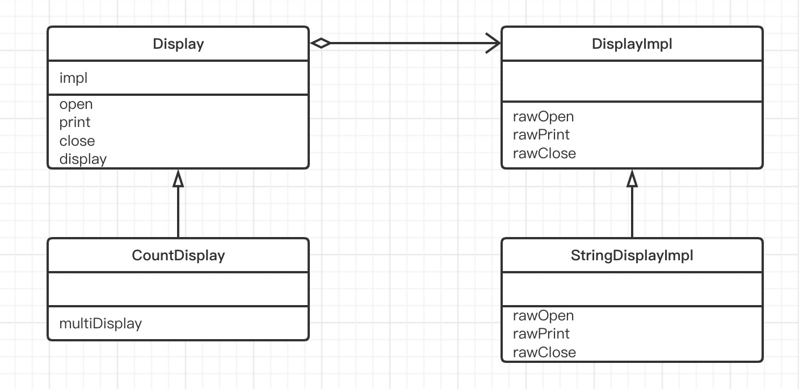
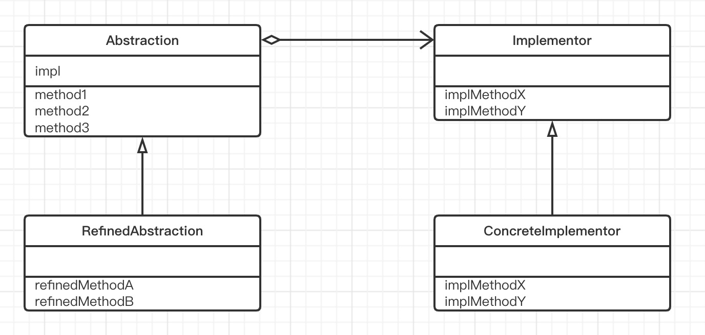

# Bridge模式（桥接模式）

> Bridge 的意思是“桥梁“。就像在现实世界中，桥梁的功能是将河流的两侧链接起来一样，Bridge模式的作用也就是将两样东西链接起来，它们分别是**类的功能层次结构**和**类的实现层次结构**。
>
> Bridge 模式的作用实现”类的功能层次结构“和”类的实现层次结构“之间搭建桥梁。
>
> - 类的功能层次结构
> - 类的实现层次结构
>
> ## 类的层次结构的两个作用
>
> - ### 希望增加新功能时
>
>   假设现在有一个类Something。当我们想在Something中增加新功能时（想增加一个具有方法时），会编写一个Something类的子类（派生类），即SomethingGood类。这样就构成了一个小小的类层次结构。
>
>   Something
>
>   ​       ｜—   SomethingGood
>
>   这就是为了增加新功能而产生的层次结构。
>
>   - 父类具有基本功能
>
>   - 在子类中增加新的功能
>
>   以上这种层次结构被称为“**类的功能层次结构**”
>
>   如果我们要继续在SomethingGood类的基础上增加新的功能，该怎么办？这时，我们可以同样的编写一个SomethingGood类的子类，即SomethingBetter类。这样，类的层次结构就加深了。
>
>   Something
>
>   ​       ｜—  SomethingGood
>
>   ​                     ｜—  SomethingBetter
>
>   当要增加新的功能时，我们可以从各个层次 的类中找出最符合自己需求的类，然后以他为父类编写子类，并在子类中增加新的功能。这就是“类的功能层次结构”。
>
> - ### 希望增加新实现时
>
>   抽象类声明了一些抽象方法，定义了接口（API），然后子类负责去实现这些抽象方法。父类的任务是通过声明抽象方法的方式定义接口（API），而子类的任务是实现抽象方法。正是由于父类和子类的这种任务分担，我们才可以编写出具有高可替换性的类。
>
>   这里其实也存在层次结构。例如，当子类ConcreteClass实现父类AbstractClass类的抽象方法时，它们之间就构成了一个小小的层次结构。
>
>   AbstractClass
>
>   ​       ｜—  ConcreteClass
>
>   但是这里的类的层次结构并非用于增加功能，也就是说，这种层次结构并非用于方便我们增加新的方法。它的真正作用时帮助我们实现下面这样的任务分担。
>
>   - 父类通过声明抽象方法来定义接口（API）
>
>   - 子类通过实现具体方法类实现接口（API）
>
>   这种层次结构被称为**“类的实现层次结构**”
>
>   当我们以其他方式实现AbstractClass时，例如要实现AnotherConcreteClass时，类的层次结构会稍微发生一些变化。
>
>   AbstractClass
>
>   ​       ｜—  ConcreteClass
>
>   ​       ｜—  AnotherConcreteClass
>
>   为了一种新的实现的方式，我们继承了AbstractClass的子类，并实现了其中抽象方法。这就是类的实现层次结构。
>
> - ### 类的层次结构的混杂与分离
>
>   大家应该理解了类的功能层次结构与类的实现层次结构。那么，当我们想要编写子类时，就需要像这样先确认自己的意图：“我是要增加功能呢？还是要增加实现呢？”当类的层次结构只有一层时，功能层次结构与实现层次结构是混杂在一个层次结构中的。这样很容易使类的层次结构变的复杂，也难以透彻的理解类的层次结构。因为自己难以确定究竟应该在类的哪一个层次机构中去增加子类。
>
>   因此，我们需要将“类的功能层次结构”与“类的实现层次结构”分离为两个独立的类层次结构。当然，如果只是简单的将它们分开，两者之间必然会缺少联系。所以我们还需要在它们之间搭建一座桥梁。

## 示例类图

> 

## 示例程序

> ### 类的功能层次结构：Display类
>
> Display类的功能是抽象的，负责“显示一些东西”。该类位于“类的功能层次结构”最上层。
>
> 在impl字段中保存的是实现了Display类的具体功能的实例（impl是Implementation（实现）的缩写）。
>
> 该实例通过Display类的构造函数被传递给Display类，然后保存在impl字段中，以共后面的处理使用（impl字段即是类的两个层次结构的“桥梁”）。
>
> open、print、close这3个方法是Display类提供的接口（API）。它们表示“显示的步骤”。
>
> - open是显示前的处理。
> - print是显示处理。
> - close是显示后的处理。
>
> 请注意这3个方法的实现，这3个方法都调用了impl字段的实现方法。这样，Display的接口（API）就被转换成为了DisplayImpl的接口（API）。
>
> display方法调用open、print、close这3个Display类的接口（API）进行了“显示”处理。
>
> ```java
> public class Display {
>     private DisplayImpl impl;
> 
>     public Display(DisplayImpl impl) {
>         this.impl = impl;
>     }
> 
>     /**
>      * 显示前处理
>      */
>     public void open() {
>         impl.rawOpen();
>     }
> 
>     /**
>      * 显示处理
>      */
>     public void print() {
>         impl.rawPrint();
>     }
> 
>     /**
>      * 显示后处理
>      */
>     public void close() {
>         impl.rawClose();
>     }
> 
>     public final void display() {
>         open();
>         print();
>         close();
>     }
> }
> ```
>
> ### 类的功能层次结构：CountDisplay类
>
> CountDisplay类在Display类的基础上增加了一个新功能。Display类只具有“显示”的功能，CountDiaplay类则具有“只显示规定的次数”的功能，这就是multiDisplay方法。
>
> CountDisplay类继承了Display类的open、print、close方法，并使用它们来增加这个新功能。
>
> 这就是“类的功能层次结构”。
>
> ```java
> public class CountDisplay extends Display{
>     public CountDisplay(DisplayImpl impl) {
>         super(impl);
>     }
> 
>     /**
>      * 增加的行功能
>      * @param times 倍数
>      */
>     public void multiDisplay(int times) {
>         open();
>         for (int i = 0; i < times; i++) {
>             print();
>         }
>         close();
>     }
> }
> ```
>
> ### 类的实现层次结构：DisplayImpl 类
>
> 现在，我们来看桥的另一侧——“类的实现层次结构”。
>
> DisplayImpl类位于“类的实现层次机构”的最上层。
>
> DisplayImpl类是抽象类，它声明了rawOpen、rawPrint、rawClose这3个抽象方法，它们分别与Display类的open、print、close方法相对应，进行显示前、显示、显示后处理。
>
> ```java
> public abstract class DisplayImpl {
>     /**
>      * 显示前处理
>      */
>     public abstract void rawOpen();
> 
>     /**
>      * 显示处理
>      */
>     public abstract void rawPrint();
> 
>     /**
>      * 显示后处理
>      */
>     public abstract void rawClose();
> }
> ```
>
> ### 类的实现层次结构：StringDisplayImpl类
>
> StringDisplayImpl类是显示字符串的类。不过，它不是直接地显示字符串，而是继承了DisplayImpl类，作为其子类来使用rawOpen、rawPrint、rawClose方法进行显示。
>
> ```java
> public class StringDisplayImpl extends DisplayImpl{
>     private String string;
>     private int width;
> 
>     public StringDisplayImpl(String string) {
>         this.string = string;
>         this.width = string.getBytes().length;
>     }
> 
>     /**
>      * 显示前处理
>      */
>     @Override
>     public void rawOpen() {
>         printLine();
>     }
> 
>     /**
>      * 显示处理
>      */
>     @Override
>     public void rawPrint() {
>         System.out.println("|" + string + "|");
>     }
> 
>     /**
>      * 显示后处理
>      */
>     @Override
>     public void rawClose() {
>         printLine();
>     }
> 
>     private void printLine() {
>         System.out.print("+");
>         for (int i = 0; i < width; i++) {
>             System.out.print("-");
>         }
>         System.out.println("+");
>     }
> }
> ```
>
> ### Main类
>
> Main类将上述4个类组合起来显示字符串。虽然变量d1中保存的是Display类的实例，而变量d2和d3中保存的是CountDisplay类的实例，但他们内部都保存着StringDisplayImpl类的实例。
>
> 由于d1、d2、d3都属于Display类的实例，因此我们可以调用他们的display方法。此外，我们还可以调用d3的multiDisplay方法。
>
> ```java
> public class Main {
>     public static void main(String[] args) {
>         Display d1 = new Display(new StringDisplayImpl("Hello, China."));
>         Display d2 = new CountDisplay(new StringDisplayImpl("Hello. World."));
>         CountDisplay d3 = new CountDisplay(new StringDisplayImpl("Hello, Universe."));
>         d1.display();
>         d2.display();
>         d3.display();
>         d3.multiDisplay(5);
>     }
> }
> ```

## Bridge模式中的登场角色

### Bridge模式的类图

> 

- ### Abstraction（抽象化）

  > 该角色位于“类的功能层次结构”的最上层。它使用Implementor角色的方法定义了基本的功能。该角色中保存了Implementor角色的实例。
  >
  > 在示例程序中，由Display类扮演此角色。

- ### RefinedAbStraction（改善后的抽象化）

  > 在Abstraction角色的基础上增加了新功能的角色。
  >
  > 在示例程序中，由CountDisplay类扮演此角色。

- ### Implementor（实现者）

  > 该角色位于“类的实例层次结构”的最上层。它定义了用于实现Abstraction角色的接口（API）的方法。
  >
  > 在示例程序中，由于DisplayImpl类扮演此角色。

- ### ConcreteImplementor（具体实现者）

  > 该角色负责实现在Implement角色中定义的接口（API）。
  >
  > 在示例程序中，由StringDisplayImpl类扮演此角色。

## 思路要点

- ### 分开后更容易扩展

  > Bridge 模式的特征是将“类的功能层次结构”与“类的实现层次结构”分离开了。将类的这两个层次结构分离开由利于独立地对它们进行扩展。
  >
  > 当想要增加功能是，只需要在“类的功能层次结构”一侧增加类即可，不必对“类的实现层次结构”做任何修改。而且，**增加后的功能可以被“所有的实现”使用**。
  > 

- ### 继承是强关联，委托是弱关联

  > 虽然使用“继承”很容易扩展类，但是类之间也形成了一种强关联关系。例如，在下面的代码中，SomethingGood类是Something的子类，但只要不修改代码，就无法改变这种关系，因此我一说它们之间形成了一种强关联关系。
  >
  > ```java
  > class SomethingGood extends Something {
  > 	……
  > }
  > ```
  >
  > 如果想要很轻松的改变类之间的关系，使用继承就不适合了，因为每次改变类之间关系时都需要修改程序。这时，我们可以使用“委托”来代替“继承”关系。
  >
  > 示例程序的Display类中使用了“委托”。Display类的impl字段保存了实现的示例。这样，类的任务就发生了转移。
  >
  > - 调用open方法会调用impl.rawOpen()方法
  > - 调用print方法会调用impl.rawPrint()方法
  > - 调用close方法会调用impl.rawClose()方法
  >
  > 也就是说，当其他类要求Display类“工作”的时候，Dispaly类并非自己工作，而是将工作“交给impl”。这就是“委托”。
  >
  > 继承是强关联关系，但委托是弱关联关系。这是因为只有Display类的实例生成时，才与作为参数被传入的类构成关联。例如，在示例程序中，当Main类生成Display类和CountDisplay类的实例时，才将StringDisplayImpl类的实例作为参数传递给Display类和CountDisplay类。
  >
  > 如果我们不传递StringDisplayImpl类的实例，而是将其他ConcreteImplementor角色的实例传递给Display类和CountDisplay类，就能哼容易的改变实现。这时，发生变化的代码只有Main类，Display类和DisplayImpl类则不需要做任何修改。
  >
  > 继承是强关联关系，委托是弱关联关系。在设计类的时候，我们必须充分理解这一点。在Template Method模式中，也讨论了继承和委托的关系。

## 所学知识

> 学习了用于在类的两层次结构之间搭建桥梁的Bridge模式。
>
> 通过分离这两种类的层次结构，可以更加清晰地扩展。