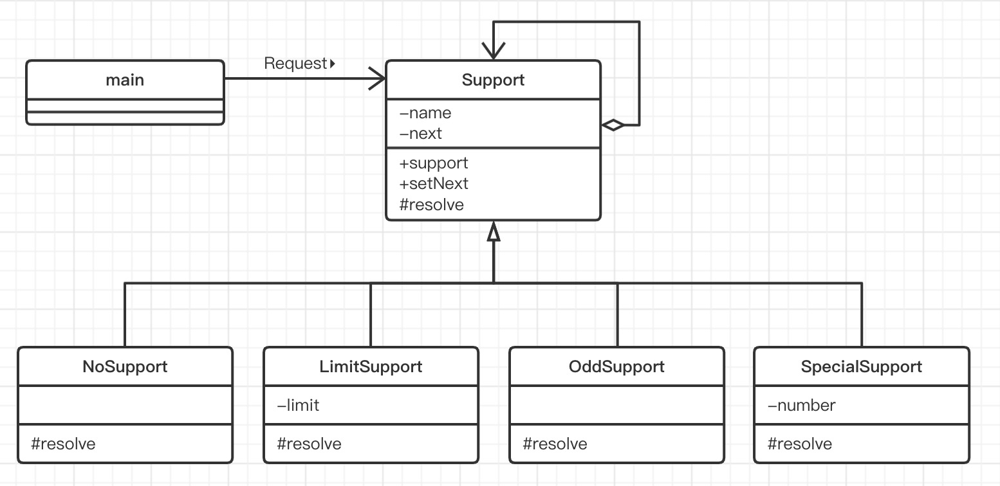
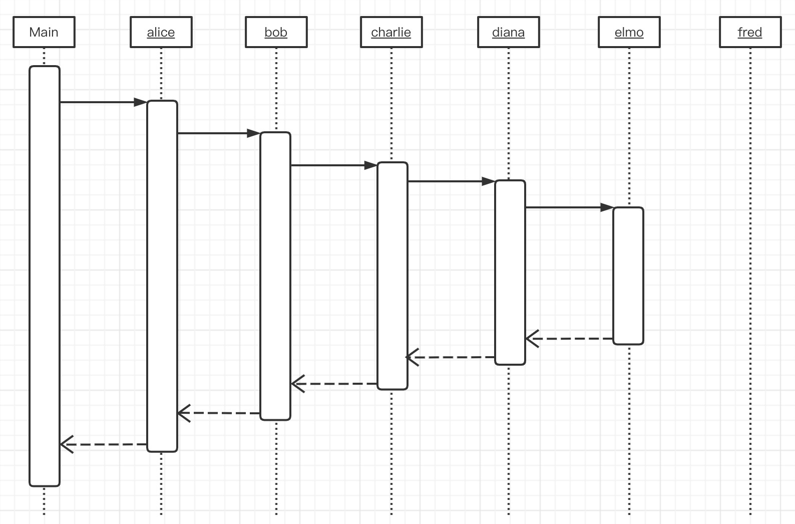
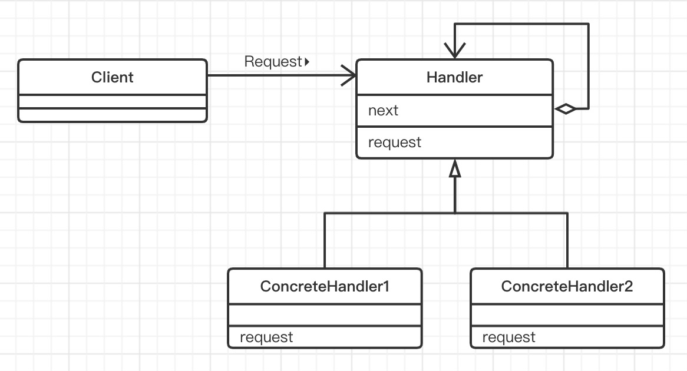

# Chain of Responsibility模式（责任链模式）

> 首先看看什么是**推卸责任**。假设现在我们要去公司领取资料。首先我们向公司前台打听要去哪里领取资料，她告诉我们应该去“营业窗口”。然后等我们到了“营业窗口”后，又被告知应该去“售后部门”。等好不容易赶到售后部门，又被告知应该去“资料中心”，因此最后我们又不得不敢往“资料中心”。像这样，在找到合适的办理人之前，我们被不断的踢给一个又一个人，这就是“推卸责任”。
>
> “推卸责任”听起来有些贬义的意思，但是有时候也确实存在需要“推卸责任”的情况。例如，当外部勤秋程序进行某个处理，但程序暂时无法直接决定由那个对象负责处理时，就需要推卸责任。这种情况下我们可以考虑**将多个对象组成一条责任链，然后按照他们在指责链上的顺序一个一个地找出到底应该谁来负责处理**。
>
> 这种模式被称为**Chain of Responsibility 模式**。Responsibility有“责任”的意思，该模式称为“责任链”。总之，我们可以将它想象为推卸责任的结构，这有利于记住这种模式。
>
> 使用Chain of Responsibility 模式可以弱化“请求方”和“处理方”之间的关联关系，让双方各自都成为可独立复用的组件。此外，程序还可以应对其他需求，如根据情况不同，负责处理对象也会发生变化的这种需求。
>
> 当一个人被要求做什么事情时，如果他可以做就自己做，如果不能做就将“要求”转给另外一个人。下一个人如果可以自己处理，就自己做；如果不能自己处理，就再转给另外一个人……这就是Chain of Responsibility 模式。

## 示例类图

> 

## 示例程序

> ### Trouble类
>
> Trouble类时表示发生问题的类。number是问题编号。通过getNumber方法可以获取问题编号。
>
> ```java
> public class Trouble {
>     /**
>      * 问题编号
>      */
>     private int number;
> 
>     /**
>      * 生成问题
>      * @param number 问题编号
>      */
>     public Trouble(int number) {
>         this.number = number;
>     }
> 
>     /**
>      * 获取问题编号
>      * @return 问题编号
>      */
>     public int getNumber() {
>         return number;
>     }
> 
>     /**
>      * 代表问题的字符串
>      * @return
>      */
>     @Override
>     public String toString() {
>         return "[Trouble " + number + ']';
>     }
> }
> ```
>
> ### Support类
>
> Support类是用来解决问题的抽象类，它是职责链上的对象。
>
> next字段中指定了要推卸给的对象。可以通过setNext方法设定该对象。
>
> resolve方法是需要子类去实现的抽象方法。如果resolve返回true，则表示问题已经被处理，如果返回false则表示问题还没有被处理（即需要被推卸给下一个对象）。Resolve有“解决”的意思。
>
> support方法会调用resolve方法，如果resolve方法返回false，则support方法会将问题转交给下一个对象。如果已经达到指责链中的最后一个对象，则表示没有人处理问题，将会显示出处理失败的相关信息。在本例中我们只是简单的输出处理失败的相关信息，但根据需求不同，有时候也需要抛出异常。
>
> support方法调用了抽象方法resolve，因此它属于Template Method模式。
>
> ```java
> public abstract class Support {
> 
>     /**
>      * 解决问题的实例的名字
>      */
>     private String name;
>     /**
>      * 要推卸给的对象
>      */
>     private Support next;
> 
>     /**
>      * 生成的问题实例
>      * @param name 问题名字
>      */
>     public Support(String name) {
>         this.name = name;
>     }
> 
>     /**
>      * 设置要推卸给的对象
>      * @param next 要推卸给的对象
>      * @return 要推卸的对象
>      */
>     public Support setNext(Support next){
>         this.next = next;
>         return next;
>     }
> 
>     /**
>      * 解决问题的步骤
>      * @param trouble 问题
>      */
>     public final void support(Trouble trouble){
>         if (resolve(trouble)) {
>             done(trouble);
>         } else if (next != null){
>             next.support(trouble);
>         } else {
>             fail(trouble);
>         }
>     }
> 
>     @Override
>     public String toString() {
>         return "[" + name + "]";
>     }
> 
>     /**
>      * 解决问题的方法
>      * @param trouble 问题
>      * @return true 解决  false 未解决
>      */
>     protected abstract boolean resolve(Trouble trouble);
> 
>     /**
>      * 解决
>      * @param trouble 问题
>      */
>     protected void done(Trouble trouble){
>         System.out.println(trouble + "is resolved by " + this + ".");
>     }
> 
>     /**
>      * 未解决
>      * @param trouble 问题
>      */
>     protected void fail(Trouble trouble){
>         System.out.println(trouble + "cannot be resolved.");
>     }
> }
> ```
>
> ### NoSupport类
>
> NoSupport类是Support类的子类。NoSupport类的resolve方法总是返回false。则它是一个永远“不解决问题”的类
>
> ```java
> public class NoSupport extends Support{
>     public NoSupport(String name) {
>         super(name);
>     }
> 
>     /**
>      * 解决问题的方法
>      * 自己什么也不处理
>      * @param trouble 问题
>      * @return true 解决  false 未解决
>      */
>     @Override
>     protected boolean resolve(Trouble trouble) {
>         return false;
>     }
> }
> ```
>
> ### LimitSupport类
>
> LimitSupport类**解决编号小于limit值的问题**。reslove方法在判断编号小于limit值后，只是简单的返回true，但是实际上这里应该是解决问题的代码。
>
> ```java
> public class LimitSupport extends Support{
>     /**
>      * 可以解决编号小于limit的问题
>      */
>     private int limit;
> 
>     public LimitSupport(String name, int limit) {
>         super(name);
>         this.limit = limit;
>     }
> 
>     /**
>      * 解决问题的方法
>      * @param trouble 问题
>      * @return true 解决  false 未解决
>      */
>     @Override
>     protected boolean resolve(Trouble trouble) {
>         if (trouble.getNumber() < limit) {
>             return true;
>         } else {
>             return false;
>         }
>     }
> }
> ```
>
> ### OddSupport类
>
> OddSupport类**解决奇数编号的问题**。
>
> ```java
> public class OddSupport extends Support{
> 
>     public OddSupport(String name) {
>         super(name);
>     }
> 
>     /**
>      * 解决问题的方法
>      * @param trouble 问题
>      * @return true 解决  false 未解决
>      */
>     @Override
>     protected boolean resolve(Trouble trouble) {
>         if (trouble.getNumber() % 2 == 1) {
>             return true;
>         } else {
>             return false;
>         }
> 
>     }
> }
> ```
>
> ### SpecialSupport类
>
> S pecialSupport类**只解决指定编号的问题**。
>
> ```java
> public class SpecialSupport extends Support{
>     /**
>      * 只能解决指定编号的问题
>      */
>     private int numble;
> 
>     public SpecialSupport(String name, int numble) {
>         super(name);
>         this.numble = numble;
>     }
> 
>     /**
>      * 解决问题的方法
>      *
>      * @param trouble 问题
>      * @return true 解决  false 未解决
>      */
>     @Override
>     protected boolean resolve(Trouble trouble) {
>         if (trouble.getNumber() == numble){
>             return true;
>         }else {
>             return false;
>         }
>     }
> }
> ```
>
> ### Main类
>
> Main类首先生成了Alice至Fred等6个解决问题的实例。虽然此处定义的变量都是Support类型的，但是实际上所保存的变量却是NoSupport、LimitSupport、SpecialSupport、OddSupport等各个类的实例。
>
> 接下来，Main类调用setNext方法将Alice至Fred这6个实例串联在职责链上。之后，Main类逐个生成问题，并将他们传递给alice，然后显示最终谁解决了该问题。请注意，这里的问题编号从0开始，增长步长为33。这里的33并没有什么特别的意思，我们只是随便使用一个增长步长使程序有趣而已。
>
> ```java
> public class Main {
>     public static void main(String[] args) {
>         Support alice = new NoSupport("Alice");
>         Support bob = new LimitSupport("Bob",100);
>         Support charlie = new SpecialSupport("Charlie", 429);
>         Support diana = new LimitSupport("Diana", 200);
>         Support elmo = new OddSupport("Elmo");
>         Support fred = new LimitSupport("Fred",300);
>         // 形成责任链
>         alice.setNext(bob).setNext(charlie).setNext(diana).setNext(elmo).setNext(fred);
>         // 制造各种问题
>         for (int i = 0; i < 500; i+= 33) {
>             alice.support(new Trouble(i));
>         }
>     }
> }
> ```
>
> ### 实例程序时序图
>
> 

## Chain of Responsibility 模式中登场角色

- ### Handler（处理者）

  > Handler角色定义了处理请求的接口（API）。Handler角色知道“下一个处理者”是谁，如果自己无法处理请求，它会将请求转给“下一个处理者”。当然，“下一个处理者”也是Handler角色。
  >
  > 在示例程序中，由Support类扮演此角色。负责处理请求的是support方法。

- ### ConcreteHandler（具体的处理者）

  > ConcreteHandler角色是处理请求的具体角色。
  >
  > 在示例程序中，由NoSupport、LimitSupport、OddSupport、SpecialSupport等各个类扮演此角色。

- ### Client（请求者）

  > Client角色是向一个ConcreteHandle角色发送请求的角色。
  >
  > 在示例程序中，由Main类扮演此角色。

## Chain of Responsibility 模式类图

> 

## 思路要点

- ### 弱化了发出请求的人和处理请求的人之间的关系

  > Chain of Responsibility 模式的最大优点就在于它弱化了发出请求的人（Client 角色）和处理请求的人（ConcreteHandler 角色）之间的关系。Client角色向第一个ConcreteHandler角色发出请求，然后请求会在职责链中传播，直到某个ConcreteHandler角色处理该请求。
  >
  > 如果不使用该模式，就必须有某个伟大的角色知道“谁该处理什么请求”，这有点类似中央集权制。而让“发出请求的人”知道“谁应该处理该请求”并不明智，因为如果发出请求的人不得不知道处理请求的人各自的责任分摊情况，就会降低其作为可复用的组件的独立性。
  >
  > 补充说明：为了简单期间，在示例程序中，我们让扮演Client角色的Main类负责串联起ConcreteHandle的职责链。

- ### 可以动态地改变责任链

  > 在示例程序中，问题的解决是按照从Alice到Fred的固定顺序进行处理的。但是，我们还需要考虑负责处理的各个ConcreteHandler角色之间的关系可能会发生变化的情况。如果使用Chain of Responsibility 模式，通过委托推卸责任，就可以根据情况变化动态地重新组织职责链。
  >
  > 如果不使用Chain of Responsibility 模式，而是在程序中固定写明“某个请求需要谁处理”这样的对应关系，那么很难在程序中去改变请求的处理者。
  >
  > 在视窗系统中，用户有时需要可以自由地在视窗中添加空间（按钮和文本输入框等）。这时，Chain of Responsibility 模式就有了用武之地。

- ### 专注于自己的工作

  > “推卸”这个词虽然有贬义，但是反过来想，这样才可以使每个对象更专注于自己的工作，即每个ConcreteHandler角色都专注于自己所负责的处理。当自己无法处理时，ConcreteHandler角色就会干脆地对下一个处理者说一句“嘿，交给你了”，然后将请求转出去。这样，每个ConcreteHandler角色就只能处理它应该负责的请求了。
  >
  > 如果我们不使用Chain of Responsibility 模式又会怎样呢？这时，我们需要编写一个“决定谁应该负责什么样的处理”的方法。亦或是让每个ConcreteHandler角色自己负责“任务分配”工作，即“如果自己不能处理，就转交给那个人。如果他也不能处理，那就根据需痛情况将请求再转交给另外一个人”。

- ### 推卸请求会导致处理延迟吗

  > 使用Chain of Responsibility 模式可以推卸请求，直至找到合适的处理请求的对象，这样确实提高了程序的灵活性，但是难道不会导致处理延迟吗？
  >
  > 确实如此，与“事先确定那个对象负责什么样的处理当接收到请求时，立即让相应的对象去处理请求”相比，使用Chain of Responsibility 模式确实会导致处理请求发生了延迟。
  >
  > 不过，这是一个需要权衡的问题。如果请求和处理者之间的关系时确定的，而且需要非常快的处理速度时，不使用Chain of Responsibility 模式会更好。

## 所学知识

> 学习了将处理请求的实例串联在职责链上，然后当接收到请求后，按顺序去确认每个实例是否可以处理请求，如果不能处理，就推卸请求的Chain of Responsibility 模式。
>
> 在视窗系统中经常会使用到Chain of Responsibility 模式。