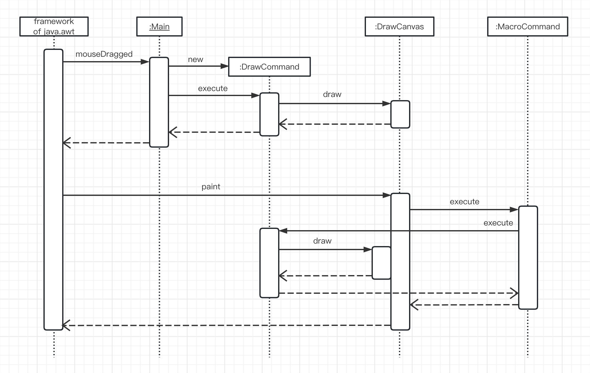

# Command模式

> 一个类在进行工作时会调用自己或是其他类的方法，虽然调用结果会反映在对象的状态中，但并不会留下工作的历史记录。
>
> 这时，如果我们有一个类，用来表示“请进行这项工作”的“命令”就会方便很多。每一项想做的工作就不再是“方法调用”这种动态处理了，而是一个表示命令的类的实例，即而已用“物”来表示。想要管理工作的历史记录，只需管理这些实例的集合即可，而且还可以随时再次执行过去的命令，或是将多个过去的命令整合为一个新命令并执行。
>
> 在设计模式中，我们称这样的“命令”为**Command模式**（command有“命令”的意思）。
>
> Command有时也被称为事件（event）。它与“事件驱动编程”中的“事件”是一样的意思。当发生点击鼠标、按下键盘按键等事件时，我们可以先将这些事件作成实例，然后按照发生顺序放入队列中。接着，再依次去处理它们。在GUI（graphical user interface）编程中，经常需要与“事件”打交道。

## 示例类图

> 

## 示例程序

> 下面我们来看一段使用了Command模式的示例程序。这段示例程序是一个画图软件，它的功能很简单，即用户拖动鼠标时程序会绘制出红色圆点，点击clear按钮后会清除所有的圆点。
>
> 用户每拖动一次鼠标，应用程序都会为“在这个位置画一个点”这条命令生成一个DrawCommand类的实例。只要保存了这条命令，以后有需要时就可以重新绘制。

| 包      | 名字         | 说明                             |
| ------- | ------------ | -------------------------------- |
| command | Command      | 表示“命令”的接口                 |
| command | MacroCommand | 表示“由多条命令整合成的命令”的类 |
| drawer  | DrawCommand  | 表示“绘制一个点的命令”的类       |
| drawer  | Drawable     | 表示“绘制对象”的接口             |
| drawer  | DrawCanvas   | 表示“绘制对象”的类               |
| 无名    | Main         | 测试程序行为的类                 |

### Command接口

> Command接口是表示“命令”的接口。在该接口中只定义了一个方法，即execute（execute有“执行”的意思）。至于调用execute方法后具体会进行什么样的处理，则取决于实现了Command接口的类。总之，Command接口的作用就是“执行”什么东西。

```java
package command;

public interface Command {
    public abstract void execute();
}
```

### MacroCommand类

> MacroCommand类表示“由多条命令整合成的命令”。该类实现了Command接口。MacroCommand中的**Macro**有“大量的”的意思，在编程中，它一般表示〝由多条命令整合成的命令”。
>
> Macrocomand类的commands字段是java.util.Stack类型的，它是保存了多个Comand（实现了Command接口的类的实例）的集合。虽然这里也可以使用java.util.ArrayList类型，不过后文中会提到，为了能轻松地实现undo方法，我们还是决定使用java.util.Stack类型。
>
> 由于MacroCommand类实现了Command接口，因此在它内部也定义了execute方法。那么execute方法应该进行什么处理呢？既然要运行多条命令，那么只调用commands字段中各个实例的execute方法不就可以了吗？这样，就可以将MacroCommand自己保存的所有Command全部执行一遍。不过，如果while循环中要执行的command又是另外一个MacroCommand类的实例呢？这时，该实例中的execute方法也是会被调用的。因此，最后的结果就是所有的Command全部都会被执行。
>
> append方法用于向MacroCommand类中添加新的Command(所谓“添加新的Command”是指添加新的实现(implements)了command接口的类的实例)。新增加的Command也可能是MacroCommand类的实例。这里的if语句的作用是防止不小心将自己(this)添加进去。如果这么做了，execute方法将会陷人死循环，永远不停地执行。这里我们使用了java.util.Stack类的push方法，它会将元素添加至java.util.Stack类的实例的末尾。
>
> undo方法用于删除commands中的最后一条命令。这里我们使用了java.util.Stack类的pop方法，它会将push方法漆加的最后一条命令取出来。被取出的命令将会从stack类的实例中被移除。
>
> clear方法用于删除所有命令。

```java
package command;

import java.util.Iterator;
import java.util.Stack;

public class MacroCommand implements Command{
    /**
     * 命令集合
     */
    private Stack commands = new Stack();

    /**
     * 执行
     */
    @Override
    public void execute() {
        Iterator it = commands.iterator();
        while (it.hasNext()) {
            ((Command) it.next()).execute();
        }
    }

    /**
     * 添加命令
     * @param cmd 命令
     */
    public void append(Command cmd) {
        if (cmd != this) {
            commands.push(cmd);
        }
    }

    /**
     * 删除最后一条命令
     */
    public void undo() {
        if (!commands.empty()) {
            commands.pop();
        }
    }

    /**
     * 删除所有命令
     */
    public void clear() {
        commands.clear();
    }
}
```

### DrawCommand类

> DrawCommand类实现了Command接口，表示“绘制一个点的命令”。在该类中有两个字段，即drawable和position。drawable保存的是“绘制的对象”（我们会在稍后学习Drawable接口）；position保存的是“绘制的位置”。Point类是定义在java.awt包中的类，它表示由X轴和Y轴构成平面上的坐标。
>
> DrawCommand类的构造函数会接收两个参数，一个是实现了Drawable接口的类的实例，一个是Point类的实例，接收后会将它们分别保存在drawable字段和position字段中。它的作用是生成“在这个位置绘制点”的命令。
>
> execute方法调用了drawable字段的draw方法。它的作用是执行命令。

```java
package drawer;

import command.Command;
import java.awt.Point;

public class DrawCommand implements Command {

    protected Drawable drawable;

    private Point position;

    public DrawCommand(Drawable drawable, Point position) {
        this.drawable = drawable;
        this.position = position;
    }

    @Override
    public void execute() {
        drawable.draw(position.x, position.y);
    }
}
```

### Drawable接口

> Drawable接口是表示“绘制对象”的接口。draw方法是用于绘制的方法。在示例程序中，我们尽量需求简单一点，因此暂时不考虑指定点的眼神和点的大小。

```java
package drawer;

public interface Drawable {
    public abstract void draw(int x, int y);
}
```

### DrawCanvas类

> DrawCanvas类实现了Drawable接口，它是java.awt.Canvas的子类。
>
> 在history字段中保存的是DrawCanvas类自己应当执行的绘制命令的集合。该字段是command.MacroCommand类型的。
>
> DrawCanvas类的构造函数使用接收到的宽（width）、高（height）和绘制内容（history）去初始化DrawCanvas类的实例。在构造函数内部被调用的setSize方法和setBackground方法是java.awt.Canvas的方法，它们的作用分别是指定大小和背景色。
>
> 当需要重新绘制DrawCanvas时，Java处理（java.awt的框架）会调用print方法。它所做的事情仅仅是调用history.execute方法。这样，记录在history中的所有历史命令都会被重新执行一遍。
>
> draw方法是为了实现Drawable接口而定义的方法。DrawCanvas类实现了该方法，它会调用g.setColor指定颜色，调用g.fillOval画圆点。

```java
package drawer;

import command.MacroCommand;
import java.awt.*;

public class DrawCanvas extends Canvas implements Drawable {
    /**
     * 颜色
     */
    private Color color = Color.red;

    /**
     * 要绘制的原点半径
     */
    private int radius = 6;

    /**
     * 命令的历史记录
     */
    private MacroCommand history;

    /**
     * 构造函数
     */
    public DrawCanvas(int width, int height, MacroCommand history) {
        setSize(width, height);
        setBackground(Color.white);
        this.history = history;
    }

    /**
     * 重新全部绘制
     * @param g
     */
    public void paint(Graphics g) {
        history.execute();
    }

    /**
     * 绘制
     * @param x x
     * @param y y
     */
    @Override
    public void draw(int x, int y) {
        Graphics g = getGraphics();
        g.setColor(color);
        g.fillOval(x - radius, y - radius, radius * 2, radius * 2);
    }
}
```

### Main类

> Main类是启动应用程序的类。
>
> 在history字段中保存的是绘制历史记录。它会被传递给DrawCanvas实例。也就是说，Main类的实例与DrawCanvas类的实例共享绘制历史记录。
>
> canvas字段表示绘制区域。它的初始值是400×400。
>
> clearButton字段是用于删除与绘制圆点的按钮。JButton类是在，javax.swing包中定义的按钮类。
>
> Main类的构造函数中设置了用于接收鼠标按下等事件的监听器（listener），并安排了各个控件（组件在界面中的布局）。
>
> 首先，我们设置了一个用于横向放置控件的buttonBox按钮盒。请注意，为了可以在里面横向放置控件，我们在调用它的构造函数时传递了参数BoxLayout.X_AXIS。接着，我们在buttonBox中放置了一个clearButton。然后，又设置了一个用于纵向放置控件的按钮盒mainBox，并将buttonBox和canvas置于其中。
>
> 最后，我们将mainBox置于JFrame中。也可以直接在java.awt.JFrame中放置控件，不过如果是在javax.swing.JFrame中，则必须将控件放置在通过getContentPane方法获取的容器之内。
>
> 
>
> Main类实现了ActionListener接口中的actionPerformed方法。clearButton被按下后会被清空所有绘制历史记录，然后重新绘制canvas。
>
> Main类还实现了在MouseMotionListener接口中的mouseMoved方法和mouseDragged方法。当鼠标被拖动时（mouseDragged），会生成一条“在这个位置画点”的命令。该命令会先被添加至绘制历史记录中。
>
> ```java
> history.append(cmd);
> ```
>
> 然后立即执行。
>
> ```java
> cmd.execute()
> ```
>
> Main类还实现了在WindowListener中定义的那些以window开头的方法。除了退出处理的方法（exit）外，其他方法什么都不做。
>
> main方法中生成了Main类的实例，启动了应用程序。

```java
package pers.command.sampleCode;

import command.Command;
import command.MacroCommand;
import drawer.DrawCanvas;
import drawer.DrawCommand;

import javax.swing.*;
import java.awt.event.*;

public class Main extends JFrame implements ActionListener, MouseMotionListener, WindowListener {

    /**
     * 绘制的历史记录
     */
    private MacroCommand history = new MacroCommand();

    /**
     * 绘制区域
     */
    private DrawCanvas canvas = new DrawCanvas(400, 400, history);

    /**
     * 删除按钮
     */
    private JButton clearButton = new JButton("clear");

    /**
     * 构造函数
     * @param title 标题
     */
    public Main(String title) {
        super(title);

        this.addWindowListener(this);
        canvas.addMouseMotionListener(this);
        clearButton.addActionListener(this);

        Box buttonBox = new Box(BoxLayout.X_AXIS);
        buttonBox.add(clearButton);
        Box mainBox = new Box(BoxLayout.Y_AXIS);
        mainBox.add(buttonBox);
        mainBox.add(canvas);
        getContentPane().add(mainBox);

        pack();
        show();
    }

    public void actionPerformed(ActionEvent e) {
        if (e.getSource() == clearButton) {
            history.clear();
            canvas.repaint();
        }
    }


    @Override
    public void mouseDragged(MouseEvent e) {
        Command cmd = new DrawCommand(canvas, e.getPoint());
        history.append(cmd);
        cmd.execute();
    }

    @Override
    public void mouseMoved(MouseEvent e) {

    }

    @Override
    public void windowOpened(WindowEvent e) {

    }

    @Override
    public void windowClosing(WindowEvent e) {
        System.exit(0);
    }

    @Override
    public void windowClosed(WindowEvent e) {

    }

    @Override
    public void windowIconified(WindowEvent e) {

    }

    @Override
    public void windowDeiconified(WindowEvent e) {

    }

    @Override
    public void windowActivated(WindowEvent e) {

    }

    @Override
    public void windowDeactivated(WindowEvent e) {

    }

    public static void main(String[] args) {
        new Main("Comand Patten Sample");
    }
}
```

### 示例程序时序图

> 

## Command模式中的登场角色

- ### Command（命令）

  >Command角色负责定义命令的接口（API）。在示例程序中，由Command接口扮演此角色。

- ### ConcreteCommand（具体的命令）

  > ConcreteCommand角色负责实现在Command角色中定义的接口（API）。
  >
  > 在示例程序中由MacroCommand类和DrawCommand类扮演此角色。

- ### Receiver（接收者）

  > Receiver角色是Command角色执行命令时的对象，也可以称其为命令接收者。
  >
  > 在示例程序中，由DrawCanvas类接收DrawCommand的命令。

- ### Client（请求者）

  >Client角色负责生成ConcreteCommand角色并分配Receiver角色。
  >
  >在示例程序中，由Main类扮演此角色。在响应鼠标拖拽事件时，它生成了DrawCommand类的实例，并将其扮演Receiver角色的DrawCanvas类的实例传递给了DrawCommand类的构造函数。

- ### Invoke（发动者）

  > Incoker角色时开始执行命令的角色，它会调用在Command角色中定义的接口（API）。
  >
  > 在示例程序中，由Main类和DrawCanvas类扮演此角色。这两个类都调用了Command接口中的execute方法。Main类同时扮演了Client角色和Invoker角色。

### Command模式的类图

> 

### Command模式的时序图

> 

## 拓展思路要点

- ### **命令中应该包含哪些信息**

  > 关于“命令”中应该包含哪些信息这个问题，其实并没有绝对的答案。命令的目的不同，应该包含的信息也不同。DrawCommand类中包含了要绘制的点的位置信息，但不包含点的大小、颜色和形状等信息。
  >
  > 假设我们在DrawCommand类中保存了“事件发生的事件戳”，那么当重新绘制时，不仅可以正确地画出图形，可能还可以重现出用户鼠标操作的缓急。
  >
  > 在DrawCommand类中还有表示绘制对象的drawable字段。在示例程序中，由于只有一个DrawCanvas的实例，所有绘制都是在它上面进行的，所以这个drawable字段暂时没有太大意义。但是，当程序中存在多个绘制对象（即Receiver角色）时，这个字段就可以发挥作用了。这是因为只要ConcreteCommand角色自己“知道”Receiver角色，不论谁来管理或是持有ConcreteCommand角色，都是可以执行execute方法的。

- ### 保存历史记录

  > 在示例程序中，MacroCommand类的实例（history）代表了绘制的历史记录。在该字段中保存了之前所有的绘制信息。也就是说，如果我们将它保存为文件，就可以永久保存历史记录。

- ### 适配器

  > 示例程序的Main类实现了3个接口，但是并没有使用这些接口中的全部方法。
  >
  > 例如MouseMotionListener接口中的以下方法。
  >
  > ```java
  > public void mouseMoved(MouseEvent e)
  > public void mouseDragged(MouseEvent e)
  > ```
  >
  > 在这两个方法中，我们只用到了mouseDragged方法。
  >
  > 再例如，WindowListener接口中的以下方法。
  >
  > ```java
  > public void windowClosing(WindowEvent e)
  > public void windowActivated(WindowEvent e)
  > public void windowClosed(WindowEvent e)
  > public void windowDeactivated(WindowEvent e)
  > public void windowDeiconified(WindowEvent e)
  > public void windowIconified(WindowEvent e)
  > public void windowOpened(WindowEvent e)
  > ```
  >
  > 在这7个方法中，我们仅用到了windowClosing方法。
  >
  > 为了简化程序，java.awt.event包为我们提供了一些被称为适配器（Adapter）的类。例如，对于MouseMotionlistener接口有MousenotionAdapter类；对windowListener接口有WindowAdapter类。
  >
  > | 接口                | 适配器             |
  > | ------------------- | ------------------ |
  > | MouseMotionListener | MouseMotionAdapter |
  > | WindowListener      | WindowAdapter      |
  >
  > 这里，我们以MouseMotionAdapter为例进行学习。该类实现了MouseMotionlistener接口，即实现了在该接口中定义的所有方法。不过，所有的实现都是空(即什么都不做)的。因此，**我们只要编写一个MouseMotionadapter类的子类，然后实现所需要的方法即可**，而不必在意其他不需要的方法。
  >
  > 特别是把Java匿名内部类(anonymous inner alass)与适配器结合起来使用时，可以更轻松地编写程序。请大家对比以下两段代码，一个是使用了接口MouseMotionListener的示例代码，另一个是使用了内部类MouseMotionAdapter的示例代码。请注意，这里省略了其中的细节代码。
  >
  > ```java
  > public class Main extends JFrame implements ActionListener, MouseMotionListener, WindowListener {
  >   ...
  >   public Main() {
  >     ...
  >   	canvas.addMouseMotionListener(this);
  >     ...
  >   }
  >   ...
  >   // MoseMotionListener接口中的方法
  >   public void mouseMoved(MouseEvent e) {
  >   }
  >   public void mouseDragged(MouseEvent e) {
  >     Command cmd = new DrawCommand(canvas, e.getPoint());
  >     history.append(cmd);
  >     cmd.execute();
  >   }
  > }
  > ```
  >
  > ```java
  > public class Main extends JFrame implements ActionListener, WindowListener {
  >   ...
  >   public Main(String title) {
  >     ...
  >     canvas.addMoouseMotionListener(new MouseMotionAdapter) {
  >     	public void mouseDragged(MouseEvent e) {
  >         Command cmd = new DrawCommand(canvas, e.getPoint());
  >         history.append(cmd);
  >         cmd.execute();
  >       }
  >     }
  >     ...
  >   }
  > }
  > ```
  >
  > 如果大家不熟悉内部类的语法，可能难以理解上面的代码。不过，我们仔细看一下代码清单22-8中的代码就会发现如下特点。
  >
  > - **newMousevotionAdapter()这里的代码与生成实例的代码类似**
  > - **之后的{...}部分与类定义（方法的定义）相似**
  >
  > 其实这里是编写了一个MouseMotionadapter类的子类(匿名)，然后生成了它的实例。请注意这里只需要重写所需的方法即可，其他什么都不用写。
  >
  > 另外需要说明的是，在编译匿名内部类时，生成的类文件的名字会像下面这样，其命名规则是〝主类名与编号.class”。
  >
  > ​	Main$1.class

