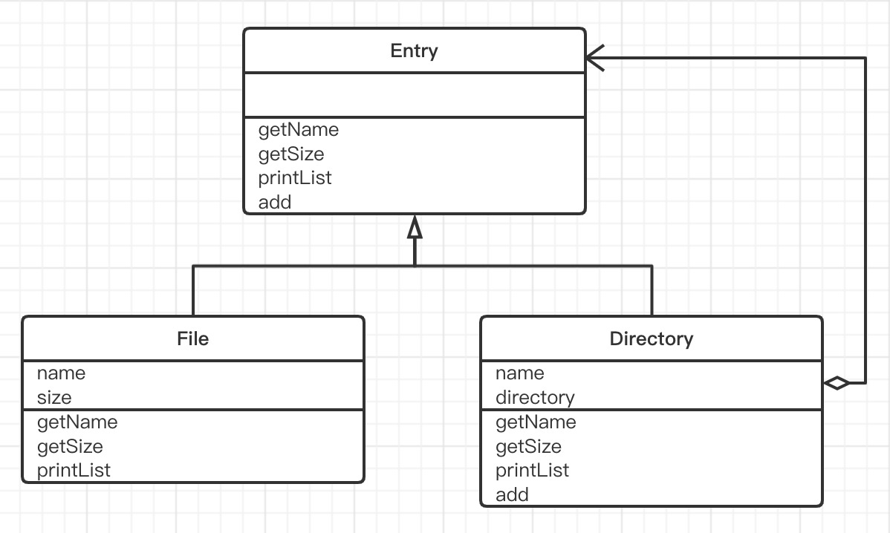
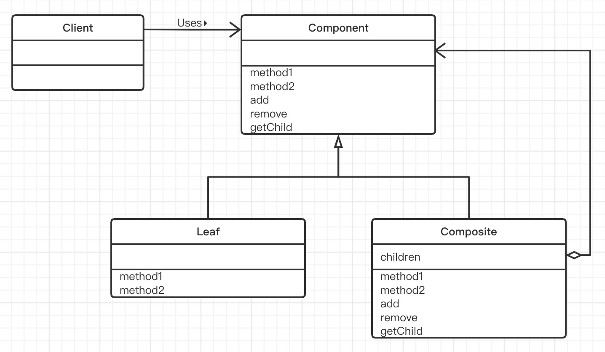

# Composite模式（组合模式）

>  在计算机的文件系统中，有“文件夹”的概念（在有些操作系统中，也称为“目录”）。文件夹里面既可以放入文件，也可以放入其他文件夹（子文件夹）。在子文件夹中，一样地既可以放入文件，也可以放入子文件夹。可以说，文件时形成了一种容器结构、递归结构。
>
> 虽然文件夹与文件是不同类型的对象，但是它们都“可以被放入到文件夹中”。文件夹中和文件有时也被统称“目录条目”（directory entry）。在目录条目中，文件夹和文件被当作时同一种对象看待（即一致性）。
>
> 例如，想要查找某个文件夹和文件有什么东西时，找到的可能是文件夹，也可以是文件。简单地说，找到的都是目录条目。
>
> 有时，与将文件夹和文件都作为目录条目看待一样，将容器和内容作为同一种东西看待，可以帮助我们方便地处理问题。在容器中既可以放入内容，也可以放入小容器，然后在那个小容器中，又可以继续放入更小的容器。这样，就形成了容器结构、递归结构。
>
> Composite模式就是用于创造出这样的结构的模式。能够使容器与内容具有一致性，创造出递归结构的模式就是Composite模式。Composite在英文中是“混合物” “复合物”的意思。

## 示例类图

> 

## 示例程序

> ### Entry类
>
> Entry类是一个表示目录条目的抽象类。File类和Directory类就是它的子类。
>
> 目录条目有一个名字，我们可以通过getName方法获取这个名字。getName方法的实现由子类负责。
>
> 此外，目录条目还有一个大小。我们可以通过getSize方法获得这个大小。getSize方法的实现也由子类负责。
>
> 向文件夹中放入文件和文件夹（即目录条目）的方法是add方法。不过实现这个add方法的目录条目类的子类Directory类。在Entry类中，它只是简单的抛出异常而已。当然，add方法有多种实现方式。
>
> printList方法用于显示文件夹中的内容的“一览”，他有两种形式，一种是不带参数的printList()，另一种是带参数的printList(String)。我们称这种定义方法的方式称为重载（overload）。程序在运行时会根据传递的参数类型选择并执行合适的printList方法。这里printList()的可见性时public，外部可以直接调用；而printList(String)的可见性时protocted，只能被Entry类的子类调用。
>
> toString方法定义了实例的标准的文字显示方式。
>
> ```java
> public abstract class Entry {
>     /**
>      * 获取名字
>      * @return 名字
>      */
>     public abstract String getName();
> 
>     /**
>      * 获取大小
>      * @return 大小
>      */
>     public abstract int getSize();
> 
>     /**
>      * 加入目录条目一览
>      * @param entry
>      * @return
>      * @throws FileTreatmentException
>      */
>     public Entry add(Entry entry) throws FileTreatmentException {
>         throw new FileTreatmentException();
>     }
> 
>     /**
>      * 显示目录一览
>      */
>     public void printList() {
>         printList("");
>     }
> 
>     /**
>      * 为一览加上前缀并显示目录条目一览
>      * 显示代表类的文字
>      * @param prefix
>      */
>     protected abstract void printList(String prefix);
> 
>     public String toString() {
>         return getName() + "（" + getSize() + "）";
>     }
> }
> ```
>
> ### File类
>
> File类是表示文件的类，它是Entry类的子类。
>
> 在File类中有两个字段，一个表示文件名的name字段，另一个表示文件大小的size字段。
>
> 调用File类的构造函数，则会根据传入的文件名和文件大小生成文件实例。
>
> new File("readme.txt", 1000)
>
> getName方法和getSize方法分别返回文件的名字和大小。
>
> 此外，File类还实现了父类要求它实现的printList(String)方法，具体的显示方式是用“/”分割prefix和表示实例自身的文字。
>
> 下面这些的表达式是等价的。
>
> - prefix + “/” + this
> - prefix + “/” + this.toString()
> - prefix + “/” + toString()
>
> 因为File类实现了父类Entry的abstract方法，因此File类自身就不是抽象类了。
>
> ```java
> public class File extends Entry{
>     private String name;
>     private int size;
> 
>     public File(String name, int size) {
>         this.name = name;
>         this.size = size;
>     }
> 
>     /**
>      * 获取名字
>      *
>      * @return 名字
>      */
>     @Override
>     public String getName() {
>         return name;
>     }
> 
>     /**
>      * 获取大小
>      *
>      * @return 大小
>      */
>     @Override
>     public int getSize() {
>         return size;
>     }
> 
>     /**
>      * 为一览加上前缀并显示目录条目一览
>      * 显示代表类的文字
>      *
>      * @param prefix
>      */
>     @Override
>     protected void printList(String prefix) {
>         System.out.println(prefix + "/" + this);
>     }
> }
> ```
>
> ### Directory类
>
> Directory类是表示文件夹的类。它也是Entry类的子类。
>
> 在Directory类中有两个字段，一个是表示文件夹名字的name字段，这一点与File类相同。不过，在Directory类中，我们并没有定义表示文件夹大小的字段，这时候因为文件夹大小是自动计算出来的。
>
> 另一个字段是directory，它是ArrayList类型，它的用途是保存文件夹中的目录条目。
>
> getName方法只是简单的返回name，但是getSize方法中则进行了计算处理。他会便利direcory字段中所有元素，然后计算出他们的大小的总和。
>
> **size += entry.getSize();**
>
> 这里，在变量size中加上entry的大小，但entry可能是File类的实例，也可能是Directory类的实例。不过，不论它是那个类的实例，我们都可以通过getSize方法得到它的大小。这就是Composite模式的特征——“容器与内容的一致性”——的表现。不管entry究竟是File类的实例韩式Direcory类的实例，它都是Entry类的子类的实例，因此可以放下的调用getSize方法。即使将来编写了其他Entry类的子类，它也会实现getSize方法，因此Directory类的这部分代码无需做任何修改。
>
> 如果entry是Directory类的实例，调用entr.getSize()时会将该文件夹下的所有目录条目的大小加起来。如果其中还有子文件夹，又会调用子文件夹的getSize方法，形成递归调用。这样一来，应该能够看出来，getSize方法的递归调用与Composite模式的结构时相对应的。
>
> add方法用于向文件夹中加入文件和子文件夹。该方法并不会判断接收到的entry到底是DIrectory类的实例还是File类的实例，而是通过通过如下语句直接将目录条目加入至directory字段中。“加入”的具体处理则被委托给了ArrayList类。
>
> **directory.add(entry);**
>
> printList方法用于显示文件夹的目录条目一览。printList方法也会递归调用，这一点和getSize方法一样。而且，printList方法也没有判断变量entry究竟是File类的实例还是Directory类的实例，这一点也与getSize方法一样。这是因为容器和内容具有一致性。
>
> ```java
> public class Directory extends Entry{
>     private String name;
>     private ArrayList directory = new ArrayList();
> 
>     public Directory(String name) {
>         this.name = name;
>     }
> 
>     /**
>      * 获取名字
>      *
>      * @return 名字
>      */
>     @Override
>     public String getName() {
>         return name;
>     }
> 
>     /**
>      * 获取大小
>      *
>      * @return 大小
>      */
>     @Override
>     public int getSize() {
>         int size = 0;
>         Iterator it = directory.iterator();
>         while (it.hasNext()) {
>             Entry entry = (Entry) it.next();
>             size += entry.getSize();
>         }
>         return size;
>     }
> 
> 
>     public Entry add(Entry entry) {
>         directory.add(entry);
>         return this;
>     }
> 
>     /**
>      * 为一览加上前缀并显示目录条目一览
>      * 显示代表类的文字
>      *
>      * @param prefix
>      */
>     @Override
>     protected void printList(String prefix) {
>         System.out.println(prefix + "/" +this);
>         Iterator it = directory.iterator();
>         while (it.hasNext()) {
>             Entry entry = (Entry) it.next();
>             entry.printList(prefix + "/" + name);
>         }
>     }
> }
> ```
>
> ### FileTreatMentException类
>
> FileTreatMentException类是对文件调用add方法时抛出的异常。该异常类并非Java类库的自带异常类，而是为本示例程序编写的异常类。
>
> ```java
> public class FileTreatmentException extends RuntimeException{
>     public FileTreatmentException() {
>     }
>     public FileTreatmentException(String message) {
>         super(message);
>     }
> }
> ```
>
> ### Main类
>
> Main类将使用以上的类建成文件夹结构。
>
> ```java
> public class Main {
>     public static void main(String[] args) {
>         try {
>             System.out.println("Making root entries...");
>             Directory rootDir = new Directory("root");
>             Directory binDir = new Directory("bin");
>             Directory tmpDir = new Directory("tmp");
>             Directory usrDir = new Directory("usr");
>             rootDir.add(binDir);
>             rootDir.add(tmpDir);
>             rootDir.add(usrDir);
>             binDir.add(new File("vi",10000));
>             binDir.add(new File("latex", 20000));
>             rootDir.printList();
> 
>             System.out.println("");
>             System.out.println("Making user entries...");
>             Directory yuki = new Directory("yuki");
>             Directory hanako = new Directory("hanako");
>             Directory tomura = new Directory("tomura");
>             usrDir.add(yuki);
>             usrDir.add(hanako);
>             usrDir.add(tomura);
>             yuki.add(new File("diary.html", 100));
>             yuki.add(new File("Composite.java", 200));
>             hanako.add(new File("memo.tex", 300));
>             tomura.add(new File("game.doc", 400));
>             tomura.add(new File("junk.mail", 500));
>             rootDir.printList();
>         } catch (FileTreatmentException e) {
>             e.printStackTrace();
>         }
>     }
> }
> ```
>
> 

## Composite模式中的登场角色

- ### Leaf（树叶）

  > 表示“内容”的角色。在该角色中不能放入其他对象。
  >
  > 在示例程序中，由File类扮演此角色。

- ### Composite（复合物）

  > 表示容器的角色。可以在其中放入Leaf角色和Composite角色。
  >
  > 在示例程序中，由Directory类扮演此角色。

- ### Component

  > 使Leaf角色和Coposite角色具有一致性的角色。Component角色时Leaf角色和Composite角色的父类。
  >
  > 在示例程序中，由Entry类扮演此角色。

- ### Client

  > 使用Composite模式的角色。
  >
  > 在示例程序中，由Main类扮演此角色。

Composite模式的类图。在该图中，可以将Composite角色与它内部的Component角色（即Leaf角色或Compostie角色）看成父亲与孩子们的关系。getChild方法的作用时从Component角色获取这些“孩子们”。

### Composite模式的类图

> 

## 思路要点

- ### 多个和单个的一致性

  > 使用Composite模式可以使容器与内容具有一致性，也可以称其为**多个和单个的一致性**，即将多个对象结合在一起，当作一个对象进行处理。

- ### Add方法应该放在哪里

  > 在示例程序中，Entry类中定义了add方法，所做的处理是抛出异常，这是因为能使用add方法的只能是Directory类。下面学习一下各种add方法的定义位置和实现方法。
  >
  > - **方法1:定义在Entry类中，报错**
  >
  >   将add方法定义在Entry类中，让其报错，这是示例程序中的做法。能使用add方法的只有Directory类，它会重写add方法，根据需求实现其处理。
  >
  >   File类会继承Entry类的add方法，虽然也可以调用它的add方法，不过会抛出异常。
  >
  > - **方法2:定义在Entry类中，但什么都不做**
  >
  >   也可以将add方法定义在Entry类中，但什么处理都不做。
  >
  > - **方法3:声明在Entry类中，但不实现**
  >
  >   也可以在Entry类中声明add抽象方法。如果子类需要add方法就根据需求实现该方法，如过不需要add方法，则可以简单地报错。该方法的优点是所有子类必需都实现add方法，不需要add方法时的处理也可以交给子类自己去做决定。不过，使用这种实现方法时，在File一方中也必需定义本来完全不需要的add（有时还包含remove和getChild）方法
  >
  > - **方法4:只定义在Directory类中**
  >
  >   因为只有Directory类可以使用add方法，所以可以不再Entry类中定义add方法，而是只将其定义在Directory类中。不过，使用这种方法时，如果要向Entry类型的变量（实际保存的是Directory类的实例）中add时，需要先将它们一个一个地类型转换（cast）为Directory类型。

- ### 到处都存在递归结构

  > 在示例程序中，我们以文件夹的结构为例进行了学习，但实际上在程序世界中，到处都存在递归结构和Composite模式。例如，在windows系统中，一个窗口可以含有一个子窗口，这就是Composite模式的典型应用。此外，在文章的列表中，各列表之间可以相互嵌套，这也是一种诋毁结构。将多条计算机命令合并为一条宏命令时，如果使用递归结构实现宏命令，那么还可以编写出宏命令的宏命令。另外，通常来说，树结构的数据结构都适用Composite模式。

## 所学知识

> 学习了使容器和内容具有一致性，并且可以创建出递归结构的Composite模式。