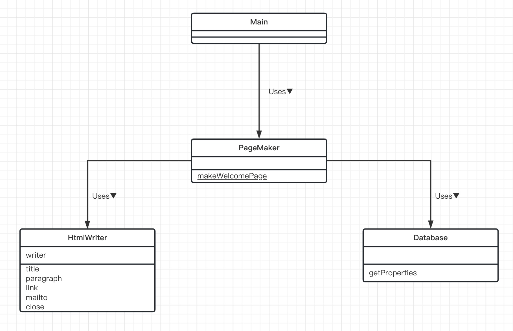

# Facade模式（外观模式）

> 程序这东西总是会越变越大。随着时间的推移，程序中的类会越来越多，而且他们之间相互关联，会导致程序结构也变的越来越复杂。我们在使用这些类之前，必须先弄清楚它们之间的关系，注意正确的调用顺序。
>
> 特别是在调用大型程序进行处理时，我们需要格外注意哪些数量庞大的类之间错综复杂的关系。不过与其这么做，不如为这个大型程序准备一个“窗口”。这样，我们就不必单独的关注每个类了，只需简单地对“窗口”提出请求即可。
>
> 这个“窗口”就是要学习的**Facade模式**。Facade是一个源自法语Facade的单词，它的意思是“建筑物的正面”。
>
> 使用Facade模式可以为互相关联在一起的错综复杂的类整理出高层接口（API）。其中的Facade角色可以让系统对外只有一个简单的接口（API）。而且，Facade角色还会考虑到系统内部各个类之间的责任关系和依赖关系，按照正确的顺序调用各个类。

## 示例类图

> 

### 源文件在文件夹中的格式

————— Main.java
		| —— maildata.txt
		| —— pagemaker
						|
						| —— Database.java
						| —— HtmlWriter.java
						| —— PageMaker.java

## 示例程序

### Database类

> Database类可获取指定数据库名（如maildata）所对应的Properties的实例。我们无法生成该类的任何实例，只能通过它的getProperties静态方法获取Properties的实例。

```java
package pagemaker;

import java.io.FileInputStream;
import java.util.Properties;

public class Database {
    // 防止外部new出Database的实例，所以声明为private
    private Database() {
    }

    /**
     * 根据数据库名获取 Properties
     * @param dbname 数据库名称
     * @return
     */
    public static Properties getProperties(String dbname) { // 根据数据库名获取 Properties
        String filename = dbname + ".txt";
        Properties prop = new Properties();
        try {
            prop.load(new FileInputStream(filename));
        } catch (Exception e) {
            System.out.println("提示：" + filename + "不存在");
        }
        return prop;
    }
}
```

### 数据文件(maildata.txt)

> hyuki@hyuki.com=Hiroshi Yuki
>
> hanako@hyuki.com=Hanako Sato
>
> tomura@hyuki.com=Tomura
>
> Mamoru@hyuki.com=Mamoru Takahashi

### HtmlWriter类

> HtmlWriter类用于编写简单的Web页面。我们在生成HtmlWriter类的实例时赋予其Writer，然后使用该Writer输出HTML。
>
> title方法用于输出标题；paragraph方法用于输出段落；link方法用于输出超链接；mailto方法用于输出邮件地址链接；close用于结束HTML的输出。
>
> 该类中隐藏着一个限制条件，那就是必须首先调用title方法。窗口类PageMaker使用HtmlWriter类时必须严格遵守这个显示条件。

```java
package pagemaker;

import java.io.IOException;
import java.io.Writer;

public class HtmlWriter {
    private Writer writer;

    /**
     * 构造函数
     * @param writer 
     */
    public HtmlWriter(Writer writer) {
        this.writer = writer;
    }

    /**
     * 输出标题
     * @param title 标题
     * @throws IOException
     */
    public void title(String title) throws IOException {
        writer.write("<html>");
        writer.write("<head>");
        writer.write("<title>" + title + "</title>");
        writer.write("</head>");
        writer.write("<body>\n");
        writer.write("<h1>" + title + "</h1>\n");
    }

    /**
     * 输出段落
     * @param msg massage
     * @throws IOException
     */
    public void paragraph (String msg) throws IOException {
        writer.write("<p> " + msg + " </p>\n");
    }

    /**
     * 输出超链接
     * @param href 链接
     * @param caption 链接标题
     * @throws IOException
     */
    public void link(String href, String caption) throws IOException {
        paragraph("<a href=\"" + href + "\">" + caption + "</a>");
    }

    /**
     * 输出邮件地址
     * @param mailaddr 邮件地址
     * @param username 用户名称
     * @throws IOException
     */
    public void mailto (String mailaddr, String username) throws IOException {
        link("mailto:" + mailaddr, username);
    }

    /**
     * 结束输出HTML
     * @throws IOException
     */
    public void close () throws IOException {
        writer.write("</body>");
        writer.write("</html> \n");
        writer.close();
    }
}
```

### PageMaker类

> PageMaker类使用Database类和HtmlWriter类来生成指定用户的Web页面。
>
> 在该类中定义的方法只有一个，那就是public的makeWelcomePage方法。该方法会根据指定的邮件地址和文件名生成相应的Web页面。
>
> PageMaker类一手包办了调用HtmlWriter类的方法这一工作。**对外部，它只提供了makeWelcomePage接口。这就是一个简单窗口。**

```java
package pagemaker;

import java.io.FileWriter;
import java.io.IOException;
import java.util.Properties;

public class PageMaker {
    /**
     * 防止外部生成实例
     */
    private PageMaker() {
    }
    public static void makeWelcomePage(String mailaddr,String filename) {
        try {
            Properties maildata = Database.getProperties("maildata");
            String username = maildata.getProperty(mailaddr);
            HtmlWriter writer = new HtmlWriter(new FileWriter(filename));
            writer.title("Welcome to" + username + "'s page!'");
            writer.paragraph(username + "欢迎来到" + username + "的主页。");
            writer.paragraph("等着你的邮件哦！");
            writer.mailto(mailaddr,username);
            writer.close();
            System.out.println(filename + "is created for" + mailaddr + "  (" + username + ")");
        } catch (IOException e) {
            e.printStackTrace();
        }
    }
}
```

### Main类

> Main类使用了pagemaker包中的PageMaker类，具体内容只用下面这一行。
>
> ```java
> PageMaker.makeWelcomePage("hyuki@hyuki.com", "welcome.html" );
> ```
>
> 它会获取hyuki@hyuki.com的名字，然后编写出一个名为welcome.html的Web页面。

```java
import pagemaker.PageMaker;

public class Main {
    public static void main(String[] args) {
        PageMaker.makeWelcomePage("hyuki@hyuki.com", "welcome.html" );
    }
}
```

## Facade模式中的登场角色

在Facade模式中有以下登场角色。

- ### **Facade（窗口）**

  > Facade角色是代表构成系统的许多其他角色的“简单窗口”。Facade角色向系统外部提供高层（API）接口。在实例程序中，由PageMaker类扮演此角色。

- ### **构成系统的许多其他角色**

  > 这些角色各自完成自己的工作，它们并不知道Facade角色。Facade角色调用其他角色进行工作，但是其他角色不会调用Facade角色。在示例程序中，由Database类和HtmlWriter类扮演此角色。

- ### Client（请求者）

  > Client角色负责调用Facade角色。在示例程序中，由Main类扮演此角色。

## 思路要点

- ### Facade角色到底做什么工作

  > Facade模式可以让复杂的东西看起来简单。那么，这里说到的“复杂的东西”到底是什么呢？其实就是在后台工作的这些类之间的关系和它们的使用方法。使用Facade模式可以让我们不必在意这些复杂的东西。
  >
  > 这里的重点就是**接口（API）变少了**。程序中如果有很多类和方法，我们在决定到底应该使用那个类或是方法时就很容易迷茫。有时，类和方法的调用顺序也很容易弄错，必须格外注意。因此，如果有一个能够使接口（API）变少的Facade角色是一件多么美好的事情。
  >
  > 接口（API）变少了还意味着程序与外部的关联关系弱化了，这样更容易使我们的包（类的集合）作为组件被复用。
  >
  > 在设计类时，我们还需要考虑将哪些方法的可见性设为public。如果公开的方法过多，会导致类的内部的修改变得困难。字段也是一样的，如果不小心将某个字段公开出去了，那么其他类可能会读取或是修改这个字段，导致难以修改该类。
  >
  > 与设计类一样，在设计包时，需要考虑类的可见性。如果让外部（包的外部）看到了类，包内部代码的修改就会变得困难。

- ### 递归地使用Facade模式

  > 既然上面我们从设计类谈到了设计包的问题，下面就让我们把思考范围再扩大一些。
  >
  > 假设现在有几个持有Facade角色的类的集合。那么，我们可以通过整合这几个集合来引入新的Facade角色。也就是说，我们可以递归地使用Facade模式。
  >
  > 在超大系统中，往往都含有非常多的类和包。如果我们在每个关键的地方都使用Facade模式，那么系统的维护就会变得轻松很多。

- ### 开发人员不愿意创建Facade角色的原因——心理原因

  > 下面来讨论一个非常有意思的话题。通常，熟悉系统内部复杂处理的开发人员可能不太愿意创建Facade角色。也就是说，他们在下意识地回避创建Facade角色。
  >
  > 这是为什么呢？这可能是因为对熟练的开发人员而言，系统中的所有信息全部都记忆在脑中，他们对类之间的所有相互依赖关系都一清二楚。当然，也可能是出于他们对自己技术的骄傲，或是不懂装懂。
  >
  > 当某个程序员得意地说出“啊，在调用那个类之前需要先调用这个类。在调用这个方法前需要现在这个类中注册一下”的时候，就意味着我们需要引入Facade角色了。
  >
  > 对于那些能够明确地用语言描述出来的知识，我们不应该将它们隐藏在自己脑袋中，而是应该用代码将它们表现出来。