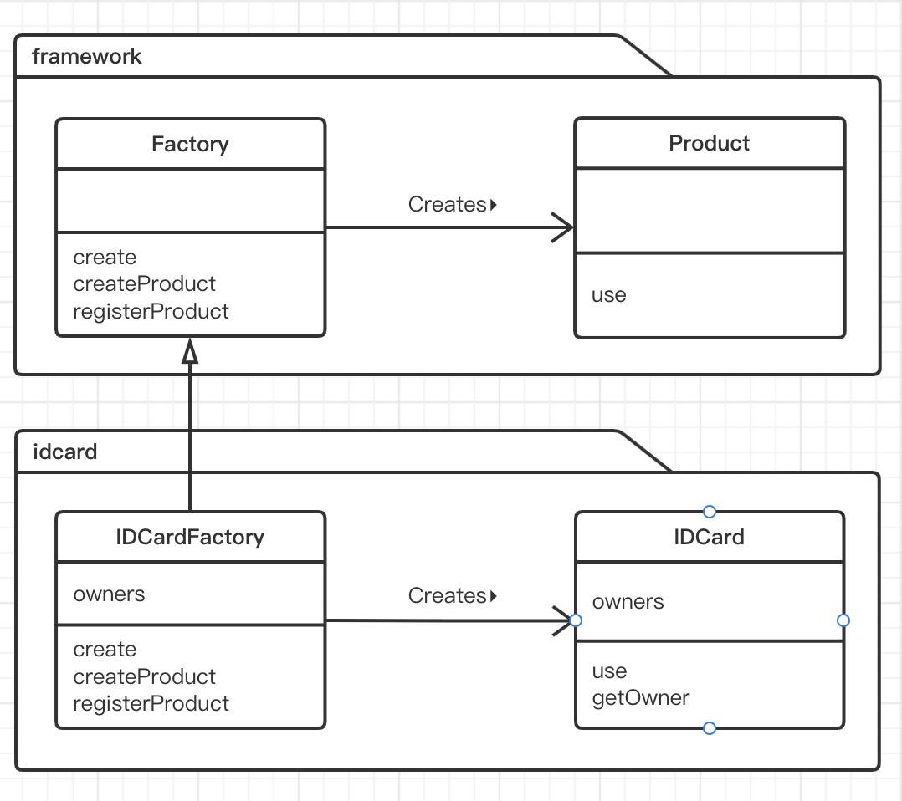
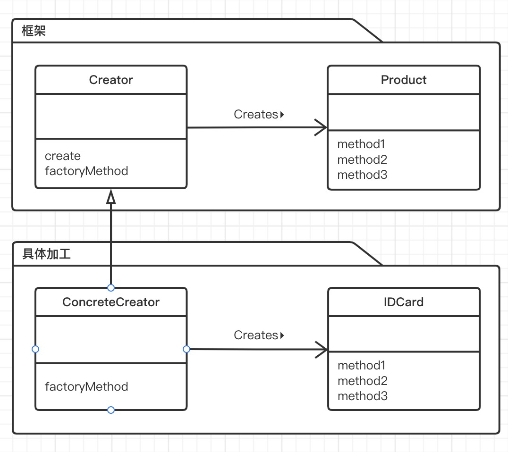

# Factory Method 模式

> 在 **Temlate Method 模式** 中，我们在父类中规定处理的流程，在子类中实现具体处理。如果我们将该模式用于生成实例，它就演变为 **Factory Method 模式**。
>
> Factory有“工厂”的意思。用 **Temlate Method 模式** 来构建生成实例的工厂，这就是 **Factory Method 模式**。
>
> 在 **Factory Method 模式**中，父类决定实例的生成方式，但并不决定所要生成的具体的类，具体的处理全部交给子类负责。这样就可以将生成实例的框架（framework）和实际负责生成实例的类解耦。

## 实例类图

> 

## 实例程序

> ### Product类
>
> framework包中的Product类是用来表示“产品”的类。在该类中仅声明了use抽象方法。
>
> use方法的实现则交给了Product类的子类负责。
>
> 在这个框架中，定义了产品是“任意的可以use的”东西。
>
> ```java
> public abstract class Product {
>     /**
>      * use 方法
>      */
>     public abstract void use();
> }
> ```
>
> ### Factory类
>
> 在framework包中的Factory类中，我们使用了Template Method 模式。该类还声明了用于“生成产品”的createProduct抽象方法和用于“注册商品”的registerProduct抽象方法。“生成产品”和“注册商品”的具体处理则被交给了Factory类的子类负责。
>
> 在这个框架中，我们定义了工厂是用来“调用create方法生成Product实例”的。而create方法的实现是先调用createProduct生成产品，接着调用registerProduct注册产品。
>
> 具体的实现内容根据 **Factory Method 模式** 适用的场景不同而不同。但是，只要是Factory Method 模式，在生成实例时就一定会使用到 Template Method 模式。
>
> ```java
> public abstract class Factory {
>     public final Product create(String owner){
>         Product p = createProduct(owner);
>         registerProduct(p);
>         return p;
>     }
>     protected abstract Product createProduct(String owner);
>     protected abstract void registerProduct(Product product);
> }
> ```
>
> ### IDCard 类
>
> ```java
> public class IDCard extends Product {
>     private String owner;
> 
>     public IDCard(String owner) {
>         System.out.println(" 制作 " + owner + " 的 ID 卡。");
>         this.owner = owner;
>     }
> 
>     @Override
>     public void use() {
>         System.out.println(" 使用 " + owner + " 的 ID 卡。");
>     }
> 
>     public String getOwner() {
>         return owner;
>     }
> }
> ```
>
> ### IDCardFactory 类
>
> ```java
> public class IDCardFactory extends Factory {
>     private List<String> owners = new ArrayList();
>     @Override
>     protected Product createProduct(String owner) {
>         return new IDCard(owner);
>     }
> 
>     @Override
>     protected void registerProduct(Product product) {
>         owners.add(((IDCard)product).getOwner());
>     }
>     public List<String> getOwners(){
>         return owners;
>     }
> }
> ```
>
> ### Main 类
>
> ```java
> public class Main {
>     public static void main(String[] args) {
>         Factory factory = new IDCardFactory();
>         Product card1 = factory.create(" 小明 ");
>         Product card2 = factory.create(" 小红 ");
>         Product card3 = factory.create(" 小刚 ");
>         card1.use();
>         card2.use();
>         card3.use();
>     }
> }
> ```

## Factory Method 模式中的登场角色



- ### Product（产品）

  > Product角色属于框架这一方，是一个抽象类。它定义了在Factory Method 模式中生成的那些实例所持有的接口，但具体的处理则由子类ConcreteProduct角色决定。示例程序中，由Product类扮演此角色。

- ### Creator（创建者）

  > Creator角色属于框架这一方，它是负责生成Product角色的抽象类，但具体的处理则由子类ConcreateCreator角色决定。示例程序中，由Factory类扮演此角色。
  >
  > Creator角色对于实例负责生成实例的ConcreteCreator角色一无所知，它唯一知道的就是，只要调用Product角色和生成实例的方法，就可以生成Product的示例。示例程序中，createProduct方法是用于生成实例的方法。
  >
  > **不用new关键字来生成实例，而是调用生成实例的专用方法来生成实例，这样就可以防止父类与其他具体的类耦合。**

- ### ConcreteProduct（具体的产品）

  > ConcreteProduct角色属于具体加工的这一方，它决定了具体的产品。示例程序中，由IDCard类扮演此角色。

- ### ConcreteCreator（具体的创建者）

  > ConcreteCreator角色属于具体加工这一方，它负责生成具体的商品。示例程序中，有IDCardFactory类扮演此角色。

## 拓展思路要点

- ### 框架与具体加工

  > 至此，我们分别学习了“框架”与“具体加工” 这两方面的内容。他们分别被封装在framework包和idcard包中。
  >
  > 这里，让我们用相同的框架创建出其他的“产品”和“工厂”。例如，我们这次要创建表示电视机的类Televison和表示TelevisonFactory。这时，我们只需要引入（import）framework包就可以编写televison包。
  >
  > 请注意这里没有修改，也根本没有必要需要framework包中的任何内容，就可以创建出其他的“产品”和“工厂”。
  >
  > 在framework包中我们并没有引入idcard包。在Product类和Factory类中，并没有出现IDCard和IDCardFactory等具体类的名字。因此，即使用已有的框架生成全新的类时，也完全不需要framework进行修改，即不需要“将televison包引入到框架中”。关于这一点，称作是“framework包不依赖于idcard包”。

- ### 生成实例——方法的三种实现方式

  > 示例程序中，Factory类的createProduct方法是抽象方法，也就是说需要在子类中实现该方法。
  >
  > createProduct方法的实现方式一般有以下3种。
  >
  > - ##### 指定为抽象方法
  >
  >   指定为抽象方法。一旦将createProduct指定为抽象方法后，子类就必须实现该方法。如果不实现该方法，编译器将会报告编译错误。
  >
  >   ```java
  >   abstract class Factory {
  >   	public abstract Product createProduct(String name);
  >   	……
  >   }
  >   ```
  >
  > - ##### 为其实现默认处理
  >
  >   为其实现默认处理。实现默认处理后，如果子类没有实现该方法，将进行默认处理。
  >
  >   ```java
  >   class Factory {
  >   	public Product createProduct(){
  >       return new Proudct(name);
  >     }
  >     ……
  >   }
  >   ```
  >
  >   不过，这时是使用new关键字创建出实例，因此不能将Product类定义为抽象类。
  >
  > - 在其中抛出异常
  >
  >   在其中抛出异常的方法。createProduct方法的默认处理为抛出异常，这样以来，如果未在子类中实现该方法，程序就会在运行时出错（报错，告知开发人员没有实现createProduct方法）。
  >
  >   ```java
  >   class Factory {
  >   	public Product createProduct(String name) {
  >   		throw new FactoryMethodRuntimeException();
  >   	}
  >   	……
  >   }
  >   ```
  >
  >   不过，需要另外编写FactoryMethodRuntimeException 异常类。

- ### 使用模式与开发人员之间的沟通

  > 不论是 **Template Method 模式**还是 **Factory Method 模式** ，在实际工作中使用时，都会让我们感受到比较困难。这是因为，如果仅阅读一个类的代码，是很难理解这个类的行为的。必须要理解父类中所定义的处理的框架和它里面所使用的抽象方法，然后阅读代码，了解这些抽象方法在子类中的实现才行。
  >
  > 通常，使用设计模式设计类时，必须要向维护这些类的开发人员正确地传达设计这些设计模式的意图。否则，维护人员在修改设计时可能会违背设计者最初的意图。
  >
  > 这时，我们建议在程序注释中和开发文档中记录所使用的设计模式的名称和意图。

## 所学知识

> 学习了使用 **Template Method 模式**生成实例的 **Factory Method 模式**。
>
> 在设计模式中，多个类和接口扮演各自的角色，互相协作进行工作。在分析设计模式时，不应当将其中一个类单独拿出来分析，必须着眼于类和接口之间的**相互关系**。