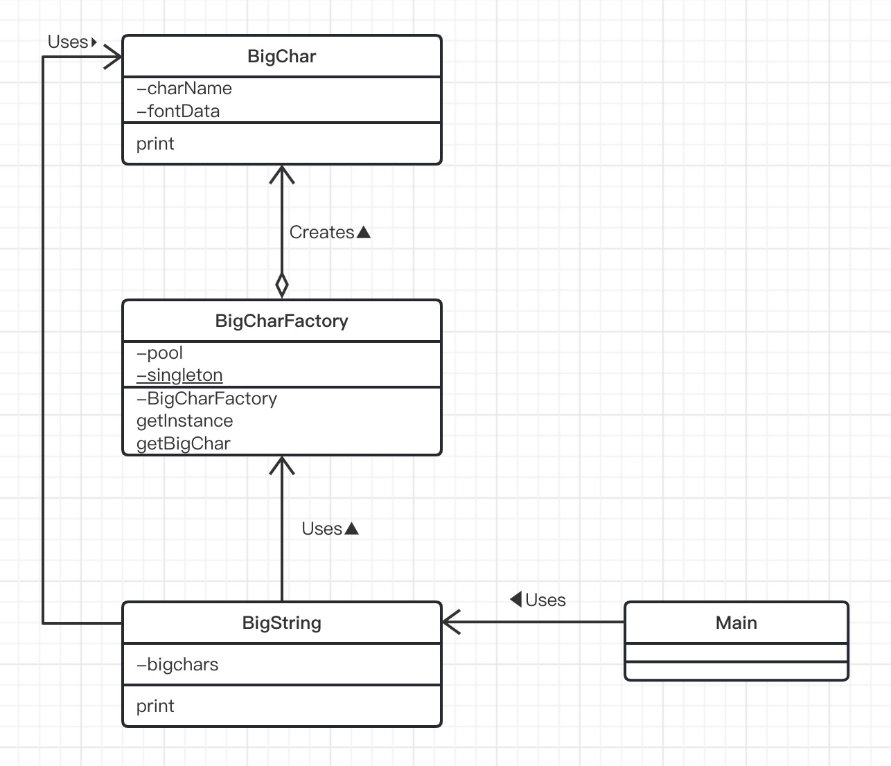
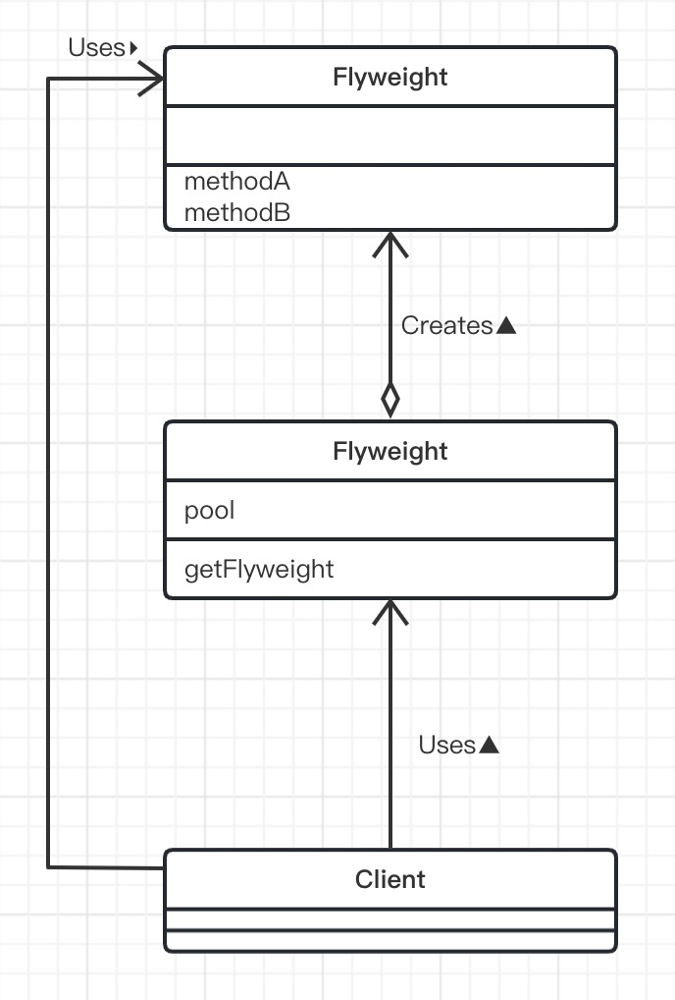

# Flyweight模式（享元模式）

> Flyweight是“轻量级”的意思，指的是拳击比赛中选手体重最轻的等级。顾名思义，该设计模式的作用是为了让对象变轻“轻”。
>
> 对象在计算机中是虚拟存在的东西，它的“重”和“轻”并非指实际重量，而是他们“所使用的内存大小”。使用内存多的对象就是“重”对象，使用内存少的对象就是“轻”对象。
>
> 在Java中，可以通过以下语句生成Something类的实例。
>
> ```java
> new Something()
> ```
>
> 为了能够在计算机中保存该对象，需要分配给其足够的内存空间。当程序中需要大量对象时，如果都使用new关键字来分配内存，将会消耗大量内存空间。
>
> 关于Flyweight模式，一言以蔽之就是“**通过尽量共享实例来避免new出实例**”。
>
> 当需要某个实例时，并不总是通过new关键字来生成实例，而是尽量共用已经存在的实例。这就是Flyweight模式的核心内容。

## 示例类图

> 

## 示例程序

> 首先来看一段使用了Flyweight模式的示例程序。在示例程序中，有一个将许多普通字符组合称为“大型字符”的类，它的实例就是重实例。为了进行测试，以文件形式保存了大型字符‘0’～‘9’和‘-’的字体数据。

### 数字0（big0.txt）

```
....######....
..##......##..
..##......##..
..##......##..
..##......##..
..##......##..
....######....
..............
```

### 数字1（big1.txt）

```
......##.....
..######.....
......##.....
......##.....
......##.....
......##.....
..##########.
.............
```

### 数字2（big2.txt）

```
....######....
..##......##..
..........##..
......####....
....##........
..##..........
..##########..
..............
```

### 数字3（big3.txt）

```
....######....
..##......##..
..........##..
......####....
..........##..
..##......##..
....######....
..............
```

### 数字4（big4.txt）

```
........##....
......####....
....##..##....
..##....##....
..##########..
........##....
......######..
..............
```

### 数字5（big5.txt）

```
..##########..
..##..........
..##..........
..########....
..........##..
..##......##..
....######....
..............
```

### 数字6（big6.txt）

```
....######....
..##......##..
..##..........
..########....
..##......##..
..##......##..
....######....
..............
```

### 数字7（big7.txt）

```
..##########..
..##......##..
..........##..
........##....
......##......
......##......
......##......
..............
```

### 数字8（big8.txt）

```
....########....
..##........##..
..##........##..
....########....
..##........##..
..##........##
....########....
................
```

### 数字9（big9.txt）

```
....########....
..##........##..
..##........##..
....##########..
............##..
..##........##..
....########....
................
```

### 字符-（big-.txt）

```
..............
..............
..............
..............
..##########..
..............
..............
..............
```

### BigChar类

> BigChar类是表示“大型字符”的类。
>
> 它的构造函数会生成接收到的字符所对应的“大型字符”版本的实例，并将其保存在fontData字段中。例如，如果收到的字符是‘3’，那么在fontData字段中保存的就是下面的字符串（为了方便阅读，我们在”\n“后换行了）。
>
> ```
> ....######....\n
> ..##......##..\n
> ..........##..\n
> ......####....\n
> ..........##..\n
> ..##......##..\n
> ....######....\n
> ..............\n
> ```
>
> 我们将组成这些“大型字符”的数据（即字体数据）保存在文件中。文件的命名规则是在该字体数据所代表的字符前加上“big”，文件后缀名是“.txt”。例如，‘3’对应的字体数据保存在“big3.txt”文件中。如果找不到某个字符对应的字体数据，就在该字符后面打上问号（“？”）作为其字体数据。
>
> 在该类中，没有出现关于Flyweight模式中“共享”的相关代码。关于控制共享的代码，请看BigCharFactory类。

```java
import java.io.BufferedReader;
import java.io.FileReader;
import java.io.IOException;

public class BigChar {
    /**
     * 字符名字
     */
    private char charName ;

    /**
     * 大型字符对应的字符串（由'#' '.' '\n' 组成 ）
     */
    private String fontDate;

    /**
     * 构造函数
     * @param charName 字符名
     */
    public BigChar(char charName) {
        this.charName = charName;

        try {
            BufferedReader reader = new BufferedReader(
                    new FileReader("big" + charName + ".txt")
            );
            String line;
            StringBuffer buf = new StringBuffer();
            while ((line = reader.readLine()) != null) {
                buf.append(line);
                buf.append("\n");
            }
            reader.close();
            this.fontDate = buf.toString();
        } catch (IOException e) {
            this.fontDate = charName + "?";
        }
    }

    /**
     * 显示大型字符
     */
    public void print() {
        System.out.println(fontDate);
    }
}
```

### BigCharFactory类

> BigCharFactory类是生成Bigchar类的实例的工厂(factory)。它实现了共享实例的功能。
>
> pool字段用于管理已经生成的BigChar类的实例。Pool有泳池的意思。现在任何存放某些东西的地方都可以被叫作Pool。泳池存储的是水，而BigCharFactory的poo1中存储的则是已经生成的BigChar类的实例。
>
> 在BigCharFactory类中，我们使用java.util.HashMap类来管理“字符串→实例”之间的对应关系。使用java.util.HashMap类的put方法可以将某个字符串(键)与一个实例(值)关联起来。之后，就可以通过键来获取它相应的值。在示例程序中，我们将接收到的单个字符(例如‘3’)作为键与表示了的BigChar的类的实例对应起来。
>
> 我们使用了Singleton模式(第5章)来实现BigCharFactory类，这是因为我们只需要一个BigCharFactory类的实例就可以了。getInstance方法用于获取BigCharFactory类的实例(注意不是BigChar类的实例哟)。
>
> getBigchar方法是Flyweight模式的核心方法。该方法会生成接收到的字符所对应的Bigchar类的实例。不过，如果它发现字符所对应的实例已经存在，就不会再生成新的实例，而是将之前的那个实例返回给调用者。
>
> 请仔细理解这段逻辑。该方法首先会通过pool.get()方法查找，以调查是否存在接收到的字符(charname)所对应的BigChar类的实例。如果返回值为nu11，表示目前为止还没有创建该实例，于是它会通过newBigChar(charname);来生成实例，并通过pool.put将该实例放入HashMap中。如果返回值不为null，则会将之前生成的实例返回给调用者。

```java
import java.util.HashMap;

public class BigCharFactory {
    /**
     * 管理生成的BigChar的实例
     */
    private HashMap pool = new HashMap();

    /**
     * Singleton模式
     */
    private static BigCharFactory singleton = new BigCharFactory();

    /**
     * 构造方法
     */
    private BigCharFactory() {
    }

    /**
     * 获取唯一实例
     * @return BigCharFactory
     */
    public static BigCharFactory getInstance() {
        return singleton;
    }

    /**
     * 生成（共享）BigChar类的实例
     * @param charName char
     * @return BigChar
     */
    public synchronized BigChar getBigChar(char charName){
        BigChar bc = (BigChar) pool.get("" + charName);
        if (bc == null) {
            bc = new BigChar(charName);
            pool.put("" + charName,bc);
        }
        return bc;
    }
}
```

### BigString类

> BigString类表示有BigChar组成的“大型字符串”的类。
>
> bigChars字段是BigChar类型的数组，它里面保存着BigChar类的实例。在构造函数for语句中，我们并没有像下面这样使用new关键字来生成BigChar类的实例。
>
> ```java
> for(int i = 0; i < bigChars.length; i++) {
>   bigChars[i] = new BigChar(String.charAt(i)); ←不共享实例
> }
> ```
>
> 而是调用了getBigChar方法，具体如需下。
>
> ```java
> for (int i = 0; i < bigChars.length; i++) {
>   bigChars[i] = factory.getBigChar(string.charAt(i));
> }
> ```
>
> 由于调用了BigCharFactory方法，所以对于相同的字符来说，可以实现BigChar类的实例共享。

```java
public class BigString {
    /**
     * "大型字符"的数组
     */
    private BigChar[] bigChars;

    /**
     * 构造函数
     * @param string 字符串
     */
    public BigString(String string) {
        bigChars = new BigChar[string.length()];
        BigCharFactory factory = BigCharFactory.getInstance();
        for (int i = 0; i < bigChars.length; i++) {
            bigChars[i] = factory.getBigChar(string.charAt(i));
        }
    }

    /**
     * 显示
     */
    public void print() {
        for (int i = 0; i < bigChars.length; i++) {
            bigChars[i].print();
        }
    }
}
```

### Main类

> Main类比较简单。它根据接收到的参数生成并显示BigString类的实例，仅此而已。

```java
public class Main {
    public static void main(String[] args) {
        if (args.length == 0) {
            System.out.println("Usage:java Main digits");
            System.out.println("Example: java Main 1212123");
            System.exit(0);
        }
        BigString bs = new BigString(args[0]);
        bs.print();
    }
}
```

### Flyweight模式的类图

> 

## Flyweight模式中的登场角色

- ### Flyweight（轻量级）

  > 按照通常方式编写程序会导致程序变重，所以如果能够共享实例会比较好，而Flyweight角色表示的就是那些实例会被共享的类。
  >
  > 在示例程序中，由BigChar类扮演此角色。

- ### FlyweightFactory（轻量级工程）

  > FlyweightFactory角色是生成Flyweight角色的工厂。在工厂中生成Flyweight角色可以实现共享实例。
  >
  > 在示例程序中，由BigCharFactory类扮演此角色。

- ### Client（请求者）

  > Client角色使用FlyweightFactory角色来生成Flyweight角色。
  >
  > 在示例程序中，由BigString类扮演此角色。

## 拓展思路要点

- ### 对多个地方产生影响

  >Flyweight模式的主题是“共享”。那么，在共享实例时应当注意什么呢?
  >
  >首先要想到的是“如果要改变被共享的对象，就会**对多个地方产生影响**”。也就是说，一个实例的改变会同时反映到所有使用该实例的地方。例如，假设我们改变了示例程序中Bigchar类的'3'所对应的字体数据，那么BigString类中使用的所有'3'的字体(形状)都会发生改变。在编程时，像这样修改一个地方会对多个地方产生影响并非总是不好。有些情况下这是好事，有些情况下这是坏事。不管怎样，“修改一个地方会对多个地方产生影响”，这就是共享的特点。
  >
  >因此，在次定Flyweight角色中的字段时，需要精挑细选。只将那些真正应该在多个地方共享的字段定义在Flyweight角色中即可。
  >
  >关于这一点，让我们简单地举个例子。假设我们要在示例程序中增加一个功能，实现显示〝带颜色的大型文字”。那么此时，颜色信息应当放在哪个类中呢?
  >
  >首先，假设我们将颜色信息放在BigChar类中。由于Bigchar类的实例是被共享的，因此颜色信息也被共享了。也就是说，BigString类中用到的所有BigChar类的实例都带有相同的颜色。如果我们不把颜色信息放在BigChar类中，而是将它放在BigString类中。那么BigString类会负责管理“第三个字符的颜色是红色的”这样的颜色信息。这样一来，我们就可以实现以不同的颜色显示同一个BigChar类的实例。
  >
  >那么两种解决方案到底哪个是正确的呢?关于这个问题，其实并没有绝对的答案。哪些信息应当共享，哪些信息不应当共享，这取决于类的使用目的。设计者在使用Flyweight模式共享信息时必须仔细思考应当共享哪些信息。

- ### Intrinsic于Extrinsic

  >前面讲到的“应当共享的信息和不应当共享的信息〞是有专有名词的。
  >
  >应当共享的信息被称作**Iintrinsic信息**。intrinsic的意思是“本质的”“固有的”。换言之，它指的是不论实例在哪里、不论在什么情况下都不会改变的信息，或是不依赖于实例状态的信息。在亦例程序中，Bigchar的字体数据不论在Bigstring中的哪个地方都不会改变。因此，BigChar的字体数据属于Intrinsic信息。
  >
  >另一方面，不应当共享的信息被称作**Extrinsic信息**。Extrinsic的意思是“外在的”“非本质的"。也就是说，它是当实例的位置、状况发生改变时会变化的信息，或是依赖于实例状态的信息。在示例程序中，BigChar的实例在BigString中是第几个字符这种信息会根据BigChar在BigString中的位置变化而发生变化。因此，不应当在BigChar中保存这个信息，它属于Extrinsic信息。
  >
  >因此，前面提到的是否共享〝颜色”信息这个问题，我们也可以换种说法，即应当将“颜色”看作是Intrinsic信息还是Extrinsic信息。
  >
  >| Intrinsic | 不依赖于位置与状况，可以共享 |
  >| --------- | ---------------------------- |
  >| Extrinsic | 依赖于位置与与状况，不能共享 |

- ### 不要让被共享的实例被垃圾回收器回收了

  > 在BigCharFactory类中，我们使用java.util.HashMap来管理已经生成的BigChar的实例。像这样在Java中自己“管理”实例时，必须注意“不要让实例被垃圾回收器回收了”。
  >
  > 下面我们简单地学习一下Java中的垃圾回收器。在Java程序中可以通过new关键字分配内存空间。如果分配了过多内存，就会导致内存不足。这时，运行Java程序的虚拟机就会开始**垃圾回收处理**。它会查看自己的内存空间（堆空间）中是否存在没有被使用的实例，如果存在就释放该实例，这样就可以回收可用的内存空间。总之，它像垃圾回收车一样回收那些不再被使用的内存空间。
  >
  > 得益于垃圾回收器，Java开发人员对于new出来的实例可以放任不管（在C++中，使用new关键字分配内存空间后，必领显式地使用delete关键字释放内存空间。不过在Java中没有必要进行delete处理。当然，Java也没有提供delete关键宇）。
  >
  > 此处的关键是垃圾回收器会“释放没有被使用的实例”。垃圾回收器在进行垃圾回收的过程中，会判断实例是否是垃圾。如果其他对象引用了该实例，垃圾回收器就会认为“该实例正在被使用”，不会将其当作垃圾回收掉。
  >
  > 现在，让我们再回顾一下示例程序。在示例程序中，pool字段负责管理已经生成的BigChar的实例。因此，只要是pool字段管理的BigChar的实例，就不会被看作是垃圾，即使该BigChar的实例实际上已经不再被BigString类的实例所使用。也就是说，只要生成了一个BigChar的实例，它就会长期驻留在内存中。在示例程序中，字符串的显示处理很快就结束了，因此不会发生内存不足的问题。但是如果应用程序需要长期运行或是需要以有限的内存来运行，那么在设计程序时，开发人员就必须时刻警惕“不要让被共享的实例被垃圾回收器回收了”。
  >
  > 虽然我们不能显式地删除实例，但我们可以删除对实例的引用。要想让实例可以被垃圾回收器回收掉，只需要显式地将其置于管理对象外即可。例如，只要我们从HashMap中移除该实例的Entry，就删除了对该实例的引用。

- ### 内存之外的其他资源

  > 在示例程序中，我们了解到共享实例可以减少内存使用量。一般来说，共享实例可以减少所需资源的使用量。这里的资源指的是计算机中的资源，而内存是资源中的一种。
  >
  > 时间也是一种资源。使用new关键宇生成实例会花费时间。通过Flyweight模式共享实例可以减少使用new关键字生成实例的次数。这样，就可以提高程序运行速度。
  >
  > 文件句柄(文件描述符)和衡又句柄等也都是一种资源。在操作系统中，可以同时使用的文件句柄和窗又句柄是有限制的。因此，如果不共享实例，应用程序在运行时很容易就会达到资源极限而导致崩溃。