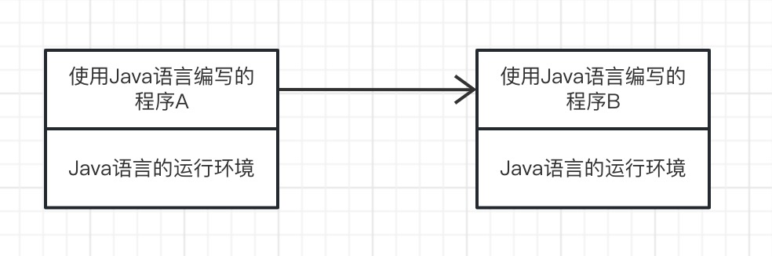
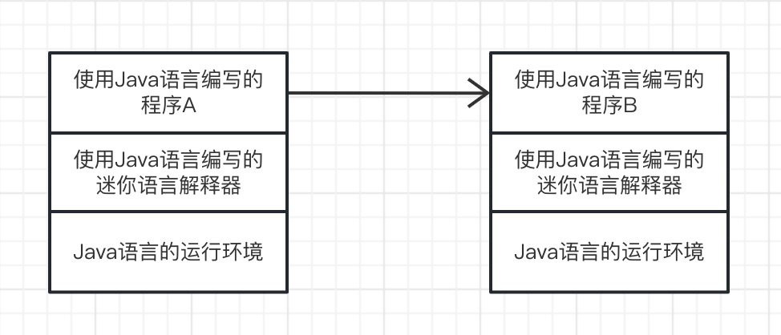
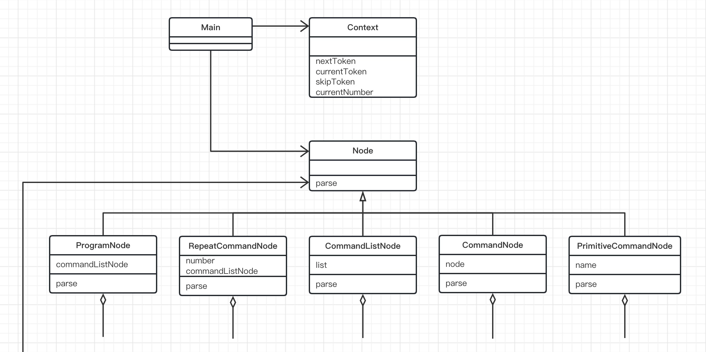
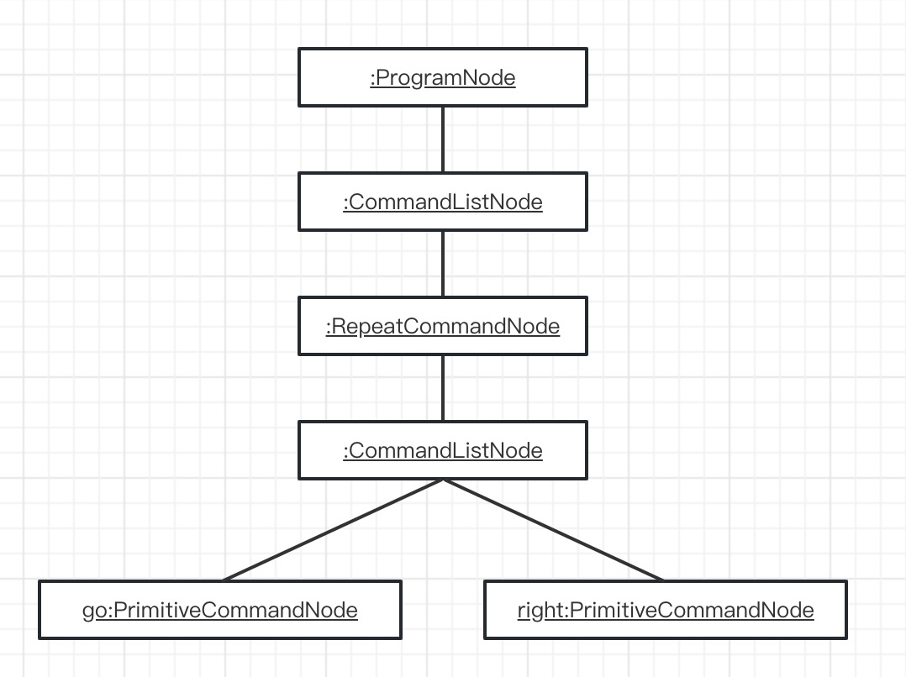
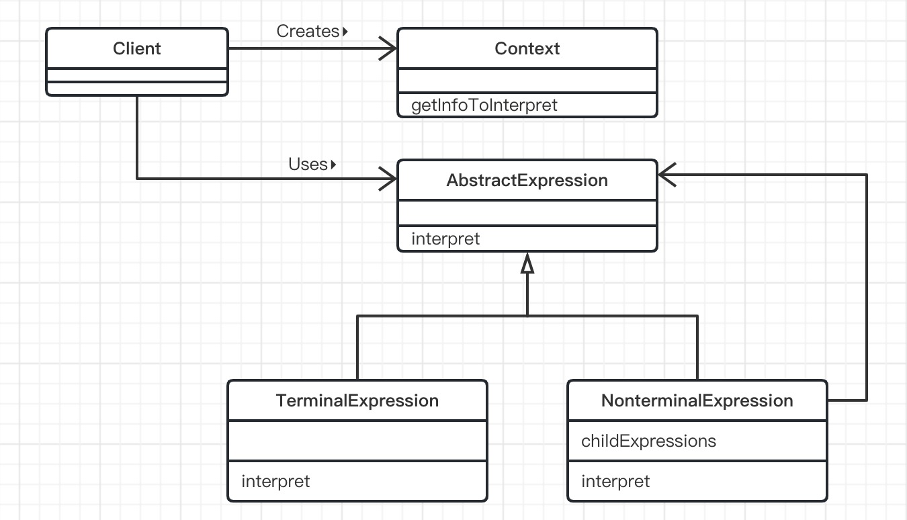

# Interpreter模式（解释器模式）

> 设计模式的目的之一就是提高类的可服用行。可复用性是指不哟过做太大修改（甚至是不做任何修改）就可以在多种场景使用之前编写的类。
>
> 在Interpreter模式中，程序要解决的问题会被用非常简单的“迷你语言”表述出来，即用”迷你语言“编写的”迷你程序“把具体的问题表述出来。迷你程序是无法单独工作的，我们还需要用Java语言编写一个负责”翻译“（interpreter）的程序。翻译程序会理解迷你语言，并解释和运行迷你程序。这单翻译程序也被称为解释器。这样，当需要解决的问题发生变化时，不需要修改Java语言程序，只需要修改迷你语言程序即可应对。
>
> 下面，用图示展示一下当问题发生变化时，需要那个级别的代码。使用java语言编程时，需要修改的代码如图所示。虽然我们希望需要修改的代码尽量少，但是多多少少都必须修改Java代码。
>
> 
>
> 但是，在使用Interpreter模式后，我们就无需修改Java程序，只需修改迷你语言编写的迷你程序即可。
>
> 

## 迷你语言

### 迷你语言的命令

> 在开始学习Interpreter模式的示例程序之前，先了解一下涉及的“迷你语言”。迷你语言的用途是控制无线玩具车。虽然说是控制无线玩具车，其实能做的事情不过一下3种。
>
> - 前进1米（go）
>
> - 右转（right）
>
> - 左转（left）
>
>   > 以上就是可以向玩具车发送的命令。go是前进1米后停止的命令；right是原地向右转的命令；left是原地向左转的命令。在实际操作时，是不能完全没有偏差地原地转弯的。为了使问题简单化，我们这里并不会改变玩具车的位置，而是像将其放在旋转桌子上一样，让它转个向。
>   >
>   > 如果只是这样，可能觉得没什么意思。所以，接下来我们再加一个循环命令。
>
> - 重复（repeat）
>
> 以上命令组合起来就是可以控制无线玩具车的迷你语言了。

### 迷你语言程序示例

> 下面来看一段用迷你语言编写的迷你程序。下面这条语句可以控制无线玩具车前进（之后停止）。
>
> ```
> program go end
> ```
>
> 为了便于大家看出语句的开头和结尾，在语句前后分别加上了program和end关键字（稍后会学习迷你语言的语法）。
>
> 接下来是一段让无线玩具车先前进一米，接着让它右旋转两次再返回来的程序。
>
> ```
> program go right right go end
> ```
>
> 再接下来这段程序是让无线玩具车按照正方形路径行进。
>
> ```
> program go right go right go right go right end ......（A）
> ```
>
> （A）程序的最后（即end之前）之所以加上了一个right，是因为当无线玩具车返回到起点后，我们希望它的方向与出发时相同。在（A）程序中，重复出现了4次go right。这样我们可以使用repeat...end语句来实现下面的（B）程序（为了能够编写出这段程序，我们需要定义迷你语言的语法）。
>
> ```
> program repeat 4 go right end end	   ......（B）
> ```
>
> 在（B）程序的最后出现了两个end，其中第一个（左边）end表示repeat的结束，第二个（右边）表示program的结束。也就是说，程序如下。
>
> ```
> program    程序开始
>     repeat    循环开始
>         4         循环次数
>         go        前进
>         right     右转
>     end       循环结束
> end        程序结束
> ```
>
> 在脑海中，车轮是不是已经骨碌骨碌转起来了呢？那么，我们再一起看看下面这段程序是如何操控无线玩具车的，
>
> ```
> program repeat 4 repeat 3 go right left end right end end
> ```
>
> 现在玩具车会按照锯齿形状的路线进行前进。这里有两个repeat，可能会有些难以理解，不过按照下面这样分解一下就很容易理解了。
>
> ```
> program        程序开始
>     repeat          循环开始（外侧）
>         4               循环的次数
>         repeat          循环开始（内侧）
>             3               循环的次数
>             go              前进
>             right 					右转
>             left            左转
>         end             循环结束（内侧）
>         right           右转
>     end             循环结束（外侧）
> end            程序结束
> ```

## 迷你语言的语法

> 下面展示了迷你语言的语法。这里使用的描述方法是BNF的一个变种。BNF是Backus- Naur Form或Backus Normal Form 的略称，它经常被用于描述语法。
>
> ```
> <program> ::= program <command list>
> <command list> ::= <command>* end
> <command> ::= <repeat command> | <primitive command>
> <repeat command> ::= repeat <number> <command list>
> <primitive command> ::= go | right | left
> ```
>
> 我们按照上面的顺序学习。
>
> ```
> <program> ::= program <command list>
> ```
>
> 首先，我们定义了程序`<program>`,即“所谓`<program>`，是指program关键字后面跟着的命令列表`<command list>`","::="的左边表示定义的名字，右边表示定义的内容。
>
> ```
> <command list> ::= <command>* end
> ```
>
> 接着，我们定义了命令列表`<command list>`，即“所谓`<command list>`，是指重复0次以上`<command>`后，接着一个end关键字”。“*”表示前面的内容循环0次以上。
>
> ```
> <command> ::= <repeat command> | <primitive command>
> ```
>
> 现在，我们来定义`<command>`，即“所谓`<command>`，是指`<repeat command>`或者`<primitive command>`"。该定义中“｜”表示“或”的意思。
>
> ```
> <repeat command> ::= repeat <number> <command list>
> ```
>
> 接下来，我们定义循环命令，即“所谓`<repeat command>`，是指repeat关键字后面跟着循环次数`<number>`和要循环的命令列表`<command list>`。其中的命令列表`<command list>`之前已经定义过了，而在定义命令列表`<command list>`的时候使用了`<command>`，在定义`<command>`的时候又使用了`<repeat command>`，而在定义`<repeat command>`的时候又使用了`<command list>`。像这样，在定义某个东西是，它自身又出现在了定义的内容中，我们称这种定义为递归定义。稍后，我们会使用Java语言实现迷你语言的解释器，到时候会有相应的代码结构来解释递归定义，因此，先在脑海中记住这个概念。
>
> ```
> <primitive command> ::= go | right | left
> ```
>
> 这是基本命令`<primitive command>`的定义，即“所谓`<primitive command>`，是指go或者right或者left”。
>
> 最后只剩下`<number>`了，想要定义出全部的`<number>`可能非常复杂，这里省略了它的定义。总之，请把`<number>`看作是3、4和12345这样的自然数即可。

### 终结符表达式与非终结符表达式

> 先来稍微了解一下语法术语。
>
> 前面讲到的像`<primitive command>`这样的不会被进一步展开的表达式称为“终结符表达式”（Terminal Expression）。我们知道，巴士和列车的终到站被称为终点站，这里的终结符就类似于终点站，它表示语法规则的重点。
>
> 与之相对的是，像`<program>`和`<command>`这样的需要被进一步展开的表达式被称为“非终结表达式”。

## 示例类图

> 

## 示例程序

> 迷你语言的学习至此就结束了，下面来看看示例程序。指段示例程序实现了一个迷你程序的**语法解析**器。
>
> 在之前学习迷你程序的相关内容时，分别学习了迷你程序的各个语法部分。像这样将迷你程序党组普通字符分解，然后看看各个部分分别时什么结构的过程，就是语法解析。
>
> 例如有以下迷你程序。
>
> ```
> program repeat 4 go righr end end
> ```
>
> 这段迷你程序推导成为下面那样的结构（语法树）的处理，就是语法解析。
>
> 

| 名字                 | 说明                               |
| -------------------- | ---------------------------------- |
| Node                 | 表示语法树“节点”的类               |
| ProgramNode          | 对应`<program>`类                  |
| CommandListNode      | 对应`<command list>`的类           |
| CommandNode          | 对应`<command>`的类                |
| RepeatCommandNode    | 对应`<repeat command>`的类         |
| PrimitiveCommandNode | 对应`<primitive command>`的类      |
| Context              | 表示语法解析上下文                 |
| ParseException       | 表示语法解析中可能会发生的异常的类 |
| Main                 | 测试程序行为的类                   |


### Node类

> Node类是语法树中各个部分（节点）中的最顶层的类。在Node类中只声明了一个parse抽象方法，该方法用于"进行语法解析处理"。但Node类仅仅是声明该方法，具体怎么解析交由Node类的子类负责。parse方法接收到的参数Context是表示语法解析上下文的类，稍后将来学习parse方法。在parse的声明中，我们使用了throws关键字。它表示在语法解析中如果发生了错误，parse方法就会抛出ParseException异常。
>
> 如果只看Node类，我们还无法知道具体怎么进行语法解析，所以接着往下看。
>
> ```java
> public abstract class Node {
>     public abstract void parse(Context context) throws ParseException;
> }
> ```

### ProgramNode类

> 首先，我们看看表示程序`<program>`ProgramNode类。在ProgramNode类中定义了一个Node类型的CommandListNode字段，该字段用于保存`<command list>`对应的结构（节点）。
>
> 那么，ProgramNode的parse方法究竟进行了什么处理呢？通过查看迷你语言的BNF描述我们可以发现，`<program>`的定义中最开始会出现program这个单词。因此，我们用下面的语句跳过这个单词。
>
> ```java
> context.skipToken("program");
> ```
>
> 我们称语法解析时的处理单位为**标记**（token），在迷你语言中，“标记”相当于“英文单词”。在一般的编程语言中，“+” 和 “==” 等也是标记。更具体地说，语法分析（lex）时从文字中得到的标记，而语法解析（parse）则是根据标记推导出语法树。
>
> 上面skipToken方法可以跳过program这个标记。如果没有这个标记就会抛出ParseException异常。
>
> 继续查看BNF描述会发现，在program后面会跟着`<command list>`。这里，我们会生成`<command list>`对应CommandListNode类的实例，然后调用实例的parse方法。请注意，ProgramNode类的方法并不知道`<command list>`的内容。即在ProgramNode类中实现的内容，并没有超出下面的BNF所描述的范围。
>
> ```
> <program> ::= program <command list>
> ```
>
> toString方法用于生成表示该节点的字符串。在Java中，连接实例与字符串时会自动调用实例的toString方法，因此如下（1）与（2）是等价的。
>
> ```java
> "[program " + commandListNode + "]";              ......(1)
> "[program " + commandListNode.toString() + "]";   ......(2)
> ```
>
> 请注意，toString方法的实现也与上面的BNF描述完全相符。

```java
public class ProgramNode extends Node{
    private Node commandListNode;
    public void parse(Context context) throws ParseException {
        context.skipToken("program");
        commandListNode = new CommandListNode();
        commandListNode.parse(context);
    }
    public String toString () {
        return "[program " + commandListNode + "]";
    }
}
```

### CommandListNode类

> 下面来看看CommandListNode类。`<command list>`的BNF描述如下。
>
> ```
> <command list> ::= <command>* end
> ```
>
> 即重复0次以上`<command>`，然后以end结束。为了能保存0次以上的`<command>`，我们定义了java.util.ArrayList类型的字段list，在该字段中保存与`<command>`对应的CommandNode类的实例。
>
> CommandListNode类的parse方法是怎么实现的呢？首先，如果当前的标记context.currentToken()是null，表示后面没有任何标记（也就是已经解析至迷你程序的末尾）了。这时，pares方法会先设置ParseExecption异常中的消息为“缺少end（Missing ‘end’）”，然后抛出ParseException异常。
>
> 接下来，如果当前的标记是end，表示已经解析至`<command1ist>`的末尾。这时，parse方法会跳过end，然后break出while循环。
>
> 再接下来，如果当前的标记不是end，则表示当前标记是`<command>`。这时，parse方法会生成与`<command>`对应的comandNode的实例，并调用它的parse方法进行解析。然后，还会将comandNode的实例add至list字段中。
>
> 应该看出来了，这里的实现也没有超出BNF描述的范围。我们在编程时要尽量忠实于BNF描述，原封不动地将BNF描述转换为Java程序。这样做可以降低出现Bug的可能性。在编程过程中，往往很容易受到“如果这样改一下可以提高程序效率吧”这样的诱惑，会不自觉地想在类中加人读取更深层次的节点的处理，但这样反而可能会引人意想不到的Bug。Interpreter模式本来就采用了迷你语言这样的间接处理，所以耍一些小聪明来试图提高效率并不明智。

```java
import java.util.ArrayList;

public class CommandListNode extends Node{
    private ArrayList list = new ArrayList();

    @Override
    public void parse(Context context) throws ParseException {
        while (true) {
            if (context.currentToken() == null) {
                throw new ParseException("Missing 'end'");
            } else if (context.currentToken().equals("end")) {
                context.skipToken("end");
                break;
            } else {
                Node commandNode = new CommandNode();
                commandNode.parse(context);
                list.add(commandNode);
            }
        }
    }

    public String toString() {
        return list.toString();
    }
}
```

### CommandNode类

> 如果理解了前面的ProgramNode类和CommandListNode类，那么应该也可以很快地理解CommandNode类。`<command>`的BNF描述如下。
>
> ```java
> <command> ::= <repeat command> | <primitive command>
> ```
>
> 在代码中的Node类型的node字段中保存的是与`<repeat command>`对应的RepeatCommandNode类的实例，或与`<primitive command>`对应的PrimitiveCommandNode类的实例。

```java
public class CommandNode extends Node{
    private Node node;
    @Override
    public void parse(Context context) throws ParseException {
        if (context.currentToken().equals("repeat")) {
            node = new RepeatCommandNode();
            node.parse(context);
        } else {
            node = new PrimitiveCommandNode();
            node.parse(context);
        }
    }
    public String toString() {
        return node.toString() ;
    }
}
```

### RepeatCommandNode类

> RepeatCommand类对应`<repeat command>`的类。`<repeat command>`的BNF描述如下。
>
> ```java
> <repeat command> ::= repeat <number><command list>
> ```
>
> 在代码中，`<nummber>`被保存在int型字段number中，`<command list>`被保存在Node型字段commandListNode中。
>
> 现在，大家应该都注意到parse方法的递归关系了。让我们追溯一下parse方法的调用关系。
>
> - 在RepeactCommandNode类parse方法中，会生成CommandListNode的实例，然后调用它的parse方法
> - 在CommandListNode类parse方法中，会生成CommandNode的实例，然后调用它的parse方法
> - 在CommandNode类的parse方法中，会生成RepeatCommandNode的实例，然后调用它的parse方法
> - 在RepeatCommandNode类的parse方法中······
>
> 这样的parse方法调用到底要持续到什么时候呢？其实，它的终点就是终结符表达式。在ConmandNode类的parse方法中，程序并不会一直进人if语句的RepeatcomandNode处理分支中，最终总是会进人PrimitiveComumandNode的处理分支。并且，不会从PrimitiveCommandNode的parse方法中再调用其他类的parse方法。
>
> 如果不习惯递归定义的处理方式，可能会感觉到这里似乎进人了死循环。其实这是错觉。不论是在BNF描述中还是在Java程序中，一定都会结束于终结符表达式。如果没有结束于终结符表达式，那么一定是语法描述有问题。

```java
public class RepeatCommandNode extends Node{
    private int number;
    private Node commandListNode;
    @Override
    public void parse(Context context) throws ParseException {
        context.skipToken("repeat");
        number = context.currentNumber();
        context.nextToken();
        commandListNode = new CommandListNode();
        commandListNode.parse(context);
    }
    public String toString() {
        return "[repeat " + number + " " + commandListNode + "]";
    }
}
```

### PrimitiveCommandNode类

> PrimitiveCommandNode类对应的BNF描述如下。
>
> ```
> <primitive command> ::= go | right | left
> ```
>
> 确实，PrimitiveCommandNode类的parse方法没有调用其他类的parse方法。

```java
public class PrimitiveCommandNode extends Node{
    private String name;
    @Override
    public void parse(Context context) throws ParseException {
        name = context.currentToken();
        context.skipToken(name);
        if (!name.equals("go") && !name.equals("right") && !name.equals("left")) {
            throw new ParseException(name + " is undefined");
        }
    }
    public String toString() {
        return name;
    }
}
```

### Context类

> 至此，关于Node类以及它的子类的学习就全部结束了。剩下的就是Context类了。Context类提供了语法解析所必须的方法。
>
> | 名字          | 说明                                                   |
> | ------------- | ------------------------------------------------------ |
> | NextToken     | 获取下一个标记（前进至下一个标记）                     |
> | currentToken  | 获取当前的标记（不回前进至下一个标记）                 |
> | skipToken     | 先检查当前标记，然后获取下一个标记（前进至下一个标记） |
> | currentNumber | 获取当前标记对应的数值（不会前进至下一个标记）         |
>
> 这里，我们使用java.util.StringTokenIzer类来简化我们的程序，它会将接收到的字符串分隔为标记。在分隔字符串时使用的分隔符是空格“‘ ’”、制表符“‘\t’”、换行符“‘\n’”、回车符“‘\r’”、换页符"'\f'"（也可以使用其他分隔符，请根据需要查阅Java的API文档）。
>
> Context类使用的java.util.StringTokenizer的方法
>
> 3
>
> | 名字         | 说明                               |
> | ------------ | ---------------------------------- |
> | NextToken    | 获取下一个标记（前进至下一个标记） |
> | hasMoreToken | 检查是否还有下一个标记             |

```java
	import java.util.StringTokenizer;

public class Context {
    private StringTokenizer tokenizer;
    private String currentToken;

    public Context(String text) {
        tokenizer = new StringTokenizer(text);
        nextToken();
    }

    public String nextToken() {
        if (tokenizer.hasMoreTokens()) {
            currentToken = tokenizer.nextToken();
        } else {
            currentToken = null;
        }
        return currentToken;
    }

    public String currentToken() {
        return currentToken;
    }

    public void skipToken(String token) throws ParseException{
        if (!token.equals(currentToken)) {
            throw new ParseException("Warning: " + token + " is expected, but " + currentToken + "is found.");
        }
        nextToken();
    }
    public int currentNumber() throws ParseException {
        int number = 0;
        try {
            number = Integer.parseInt(currentToken);
        } catch (NumberFormatException e) {
            throw new ParseException("Warning: " + e);
        }
        return number;
    }
}
```

### ParseException类

> ParseException类是表示语法解析时可能发生的异常的类。该类比较简单，没有什么需要特别注意的地方。

```java
public class ParseException extends Exception{
    public ParseException(String message) {
        super(message);
    }
}	
```

### Main类

> Main类是启动我们之前学习的迷你解释器的程序。它会读取program.txt文件，然后逐行解析迷你程序，并将解析结果显示出来。
>
> 在显示结果中，以“text =” 开头的部分是迷你程序语句，以“node = ”开头的部分是语法解析结果。通过查看运行运行结果我们可以发现，语法解释器识别出了program ... end字符串中的迷你语言的语法元素，并为它们加上了[]。这表示语法解释器正确的理解了我们定义的迷你语言。

```java

```

```java
import java.io.BufferedReader;
import java.io.FileReader;

public class Main {
    public static void main(String[] args) {
        try {
            BufferedReader reader = new BufferedReader(new FileReader("program.txt"));
            String text;
            while ((text = reader.readLine()) != null) {
                System.out.println("text = \"" + text +"\"");
                Node node = new ProgramNode();
                node.parse(new Context(text));
                System.out.println("node = " + node);
            }
            reader.close();
        } catch (Exception e) {
            e.printStackTrace();
        }
    }
}
```

### program.txt

```
program end
program go end
program go right go right go right go right end
program repeat 4 go right end end
program repeat 4 repeat 3 go right go left end right end end
```

## Interpreter模式中的登场角色

- ### AbstractExpression（抽象表达式）

  > AbstractExpression角色定义了语法树的共同接口（API）。在示例程序中，由Node类扮演此角色。
  >
  > 在示例程序中，共同接口（API）的名字是parse，不过在下面图中它的名字是interpreter。

- ### TerminalExpression（终结符表达式）

  > TerminalExpression角色对应BNF中的终结符表达式。
  >
  > 在示例程序中，由PrimitiveCommandNode类扮演此角色。

- ### NonterminalExpression（非终结表达式）

  > Context角色为解释器进行语法解析提供了必要的信息。
  >
  > 在示例程序中，由Context类扮演此角色。

- ### Context（文脉、上下文）

  > Context角色为解释器进行语法解析提供了必要的信息。
  >
  > 在示例程序中，由Context类扮演此角色。

- ### Client（请求者）

  > 为了推到语法树，Client角色会调用TerminalExpression角色和NonterminalExpression角色。
  >
  > 在示例程序中，由Main类扮演此角色。

### InterPreter模式的类图

> 

## 拓展思路要点

### 还有其他哪些迷你语言

> - **正则表达式**
>
>   > raining & (dogs | cats) *
>   >
>   > 这个表达式的意思是“在raining后重复出现0次以上dogs或cats”
> - **检索表达式**
>
>   > garkic and not onions
>   >
>   > 这个表达式的意思是“包含garlic但不包含onions”
> - **批处理表达式**
>
>   > Interpreter模式还可以处理批处理语言，即将基本命令组合在一起，并按顺序执行或是循环执行的语言。
>   >
>   > 无线遥控车操控就是一种批处理语言。

### 跳过标记还是读取标记

> 在制作解释器时，经常会出现多读了一个标记或是漏读了一个标记的Bug。在编写各个中姐夫表达式应对的方法时，我们经常时刻注意“进入这个方法时已经读至那个标记了？出了这个方法时应该读至那个标记？”