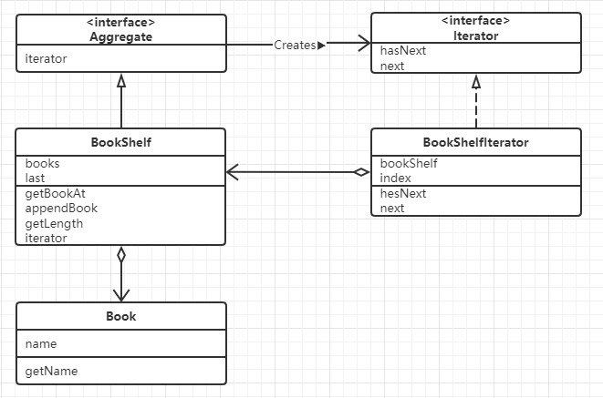

# Iterator模式（迭代器模式）

> 我们经常会在代码中看到下面这样的for循环的语句遍历数组。
>
> ```java
> for(int i = 0;i < arr.length;i++){
>    	System.out.println(arr[i]);
> }
> ```
>
> 数组中保存了很多元素，通过指定数组下标，我们可以从中选择任意一个元素。
>
> for循环中的 `i++` 作用是让i的值每次循环后自增1，这样就可以访问数组中的下一个元素，也就实现了从头到尾逐一遍历数组元素的功能。
>
> 将这里 `i` 的作用抽象化、通用化后形成的模式，在设计模式中称为`Iterate模式`。

------

## 示例类图

> 

## 示例代码

> 
>
> ### Aggregate接口
>
> ```java
> public interface Aggregate {
> 
> 	/**
>      * 生成用于遍历集合的迭代器
>      * @return 迭代器
>      */
>     public abstract Iterator iterator();
> }
> ```
>
> ### Iterator接口
>
> ```java
> public interface Iterator {
> 
>     /**
>      * 当集合中存在下一个元素时返回 true，遍历到结尾不存在下一个元素时返回false
>      * hasNext()方法主要用于循环终止条件
>      * @return
>      */
>     public abstract boolean hasNext();
> 
>     /**
>      * 方法返回类型时 Object 类型，这表明该方法返回的是集合中的一个元素。
>      * 为了能够在下次调用next()方法时，该方法还隐含了将迭代器移动至下一个元素的处理。
>      * @return Object
>      */
>     public abstract Object next();
> }
> ```
>
> ### Book类
>
> ```java
> public class Book {
>     /**
>      * 书名
>      */
>     private String name;
> 
>     public Book() {
>     }
> 
>     public Book(String name) {
>         this.name = name;
>     }
> 
>     public String getName() {
>         return name;
>     }
> 
>     public void setName(String name) {
>         this.name = name;
>     }
> }
> ```
>
> ### BookShelf类
>
> ```java
> public class BookShelf implements Aggregate {
> 
>     private Book[] books;
> 
>     private int last = 0;
> 
>     public BookShelf(int maxSize) {
>         this.books = new Book[maxSize];
>     }
> 
>     public Book getBookAt(int index){
>         return books[index];
>     }
> 
>     public void appendsBook(Book book){
>         this.books[last] = book;
>         last++;
>     }
> 
>     public int getLength(){
>         return last;
>     }
>     /**
>      * 生成用于遍历集合的迭代器
>      * @return 迭代器
>      */
>     @Override
>     public Iterator iterator() {
>         return new BookShelfIterator(this);
>     }
> }
> ```
>
> ### BookShelfIterator类
>
> ```java
> public class BookShelfIterator implements Iterator {
> 
>     /**
>      * 书架
>      */
>     private BookShelf bookShelf;
> 
>     /**
>      * 索引
>      */
>     private int index;
> 
>     public BookShelfIterator(BookShelf bookShelf) {
>         this.bookShelf = bookShelf;
>         this.index = 0;
>     }
> 
>     /**
>      * 当集合中存在下一个元素时返回 true，遍历到结尾不存在下一个元素时返回false
>      * hasNext()方法主要用于循环终止条件
>      *
>      * @return
>      */
>     @Override
>     public boolean hasNext() {
>         if (index < bookShelf.getLength()){
>             return true;
>         } else {
>             return false;
>         }
>     }
> 
>     /**
>      * 方法返回类型时 Object 类型，这表明该方法返回的是集合中的一个元素。
>      * 为了能够在下次调用next()方法时，该方法还隐含了将迭代器移动至下一个元素的处理。
>      * @return Object
>      */
>     @Override
>     public Object next() {
>         Book book = bookShelf.getBookAt(index);
>         index++;
>         return book;
>     }
> }
> ```
>
> Main类
>
> ```java
> public class Main {
>     public static void main(String[] args) {
>         BookShelf bookShelf = new BookShelf(4);
>         bookShelf.appendsBook(new Book("环游世界80天"));
>         bookShelf.appendsBook(new Book("圣经"));
>         bookShelf.appendsBook(new Book("灰姑娘"));
>         bookShelf.appendsBook(new Book("长腿爸爸"));
>         Iterator iterator = bookShelf.iterator();
>         while (iterator.hasNext()) {
>             Book book = (Book) iterator.next();
>             System.out.println(book.getName());
>         }
>     }
> }
> ```

## Iterator模式中的角色

- ### Iterator（迭代器）

  > 该角色定义按顺序逐个遍历的接口（API）。
  >
  > 在示例程序中，由`Iterator`接口扮演这个角色；
  >
  > 它定义了`hasNex`t和`next`两个方法。
  >
  > `hasNext`方法用于判断是否存在下一个元素；
  >
  > `next`方法用于获取元素；

- ### ConcreteIterator（具体的迭代器）

  > 该角色负责实现`Iterator`角色所定义的接口（API）。
  >
  > 由`BookShelfIterator`类扮演，该角色包含了遍历集合所需的信息。
  >
  > 示例中`BookShelf`类的实例保存在`bookShelf`字段中；
  >
  > 被指向的书下标保存在`index`字段中；

- ### Aggregate（集合）

  >该角色负责定义创建`Iterator`角色的接口（API）。
  >
  >这个接口是一个方法，会创建出“按顺序访问保存在我内部元素中的人”。
  >
  >示例中，由`Aggregate`接口扮演这个角色，它里面定义了`iterator`方法。

- ### ConcreteAggregate（具体的集合）

  > 该角色负责实现`Aggregate`角色顶一个的接口（API）。
  >
  > 它会创建出具体的`Iterator`角色，即`ConcreteIterator`角色。
  >
  > 示例中，由`BookShelf`类扮演这个角色，它实现了`iterator`方法。

## 思路要点

- ### 不管实现如何变化，都可以使用Iterator

  > 引入`Iterator`后可以将遍历与实现分开来。看下面代码；
  >
  > ```java
  > while(it.hasNext()){
  >     Book book = (Book) it.next();
  >     System.out.println(book.getName());
  > }
  > ```
  >
  > 这里只使用了`Iterator`的`hasNext`方法和`next`方法，并没有调用BookShelf的方法。
  >
  > 也就是说，**这里的`while`循环并不依赖于`BookShelf`的实现**。
  >
  > 如果编写`BookShelf`的开发人员决定放弃用数组来管理书本，而是用`java.util.Vector`取而代之，会怎样？
  >
  > 不管`BookShelf`如何变化，只要`BookShelf`的`iterator`方法能正确返回`Iterator`的实例（也就是说，返回的`Iterator`类的实例没有问题，`hasNext`和`next`方法都可以正常工作），即使不对上面的`while`循环做任何修改，代码都可以正常工作。

- ### 难以理解抽象类和接口

  > 难以理解抽象类和接口的人常常使用ConcreteAggregate角色和ConcreteIterator角色编程，而不使用Aggregate接口和Iterator接口，他们总想用具体的类来解决所有问题。
  >
  > 但是如果只使用具体的类来解决问题，很容易导致类之间的强耦合，这些类也难以作为组件呗再次利用，我们需要引入抽象类和接口。

- ### `Aggregate`和`Iterator`的对应

  > 我们是如何吧`BookShelfIterator`类定义为`BookShelf`类的`ConcreteIterator`角色的。
  >
  > `BookShelfIterator`类知道`BookShelf`是如何实现的。也正因为如此，我们才能调用用来获取下一本书的`getBookAt`方法。
  >
  > 也就是说，如果`BookShelf`的实现发生了改变，即`getBookAt`方法这个接口（API）发生变化时，我们必须修改`BookShelfIterator`类。
  >
  > 正如`Aggregate`和`Iterator`这两个接口是对应的一样，`ConcreteAggregate`和`ConcreteIterat`这两个类也是对应的。

- ### 容易弄错 “下一个”

  > 在Iterator模式的实现中，很容易在next方法上出错。该方法的返回值到底是应该指向当前元素还是当前元素的下一个元素呢？
  >
  > 更详细的讲，next方法的名字应该是下面这样的。
  >
  > returnCurrentElementAndAdvanceToNextPosition
  >
  > 也就是说，next方法是“返回当前元素，并指向下一个元素”。

- ### 还容易弄错最后一个

  > 在Iterator模式中，不仅容易弄错“下一个”还容易弄错“最后一个”。
  >
  > hasNext方法在返回最后一个元素前会返回true，当返回了最后一个元素后则返回false。
  >
  > 稍不注意，就会无法正确地返回“最后一个”元素。
  >
  > 将hasNext方法理解成“确认接下来是否可以调用next方法”的方法就可以了。

- ### 多个Iterator

  > “将遍历功能置于Aggregate角色外”是Iterator模式的一个特征。
  >
  > 根据这个特征，可以针对一个ConcreteAggregate角色编写多个ConcreteIterator角色

- ### 迭代器种类多种多样

  > 实例程序中展示的Iterator类只是很简单的从前向后遍历集合。其实遍历方法是多种多样的。
  >
  > - 从最后开始向前遍历
  > - 即可以从前向后遍历，也可以从后向前遍历（既有next方法也有previous方法）
  > - 指定下标进行“跳跃式”遍历

- ### 不需要deleteIterator

  > 在Java中，没有使用的对象实例将会自动被删除（垃圾回收，GC）。
  >
  > 因此在iterator中不需要于其对应的deleteIterator方法。

## 所学知识

> 按照统一的方法遍历集合中的元素的Iterator模式
