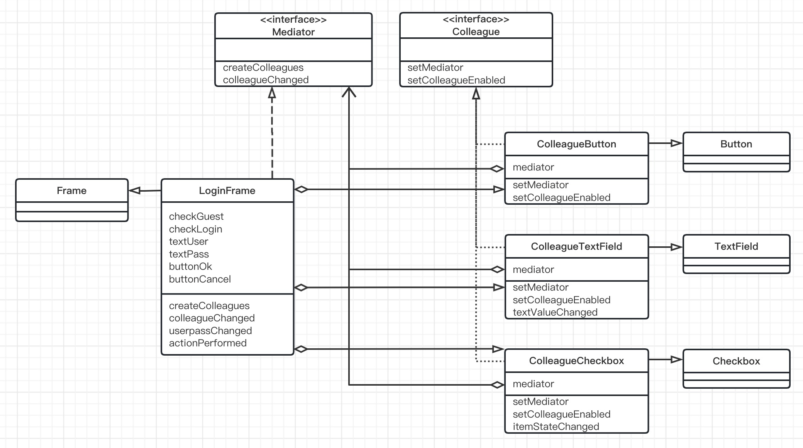
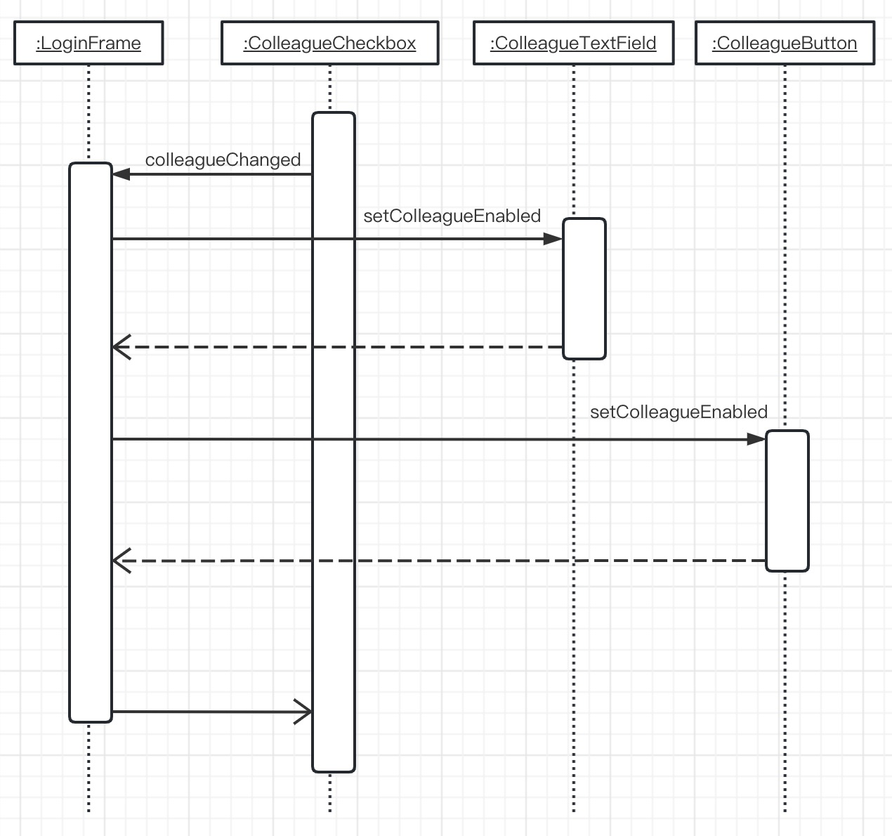

# Mediator模式（中介者模式）

> 想一下一个乱糟糟的开发小组的工作状态。小组中的10个成员一起协同工作，但是意见难以统一，总是互相只会，导致工作使进度始终滞后。不仅如此，他们还都十分在意编码细节，经常为此争执不下。这时，我们就需要一个中立的仲裁者站出来说：“各位，请大家将情况报告给我，我来负责仲裁。我会从团队整体出发进行考虑，然后下达指示。但我不会评价大家的工作细节。”这样，当大家争执时大家就会找仲裁者进行商量，仲裁者会负责统一大家的意见。
>
> 最后，整个团队的交流过程就会变为了组员向冲裁着报告，仲裁者向组员下达指示。组员之间不再相互询问和相互指示。
>
> Mediator的意思是“仲裁者”“中介者”。一方面，当发生麻烦事情的时候，通知仲裁者；当发生涉及全体组员的事情时，也通知仲裁者。当仲裁者下达指示时，组员会立即执行。团队组员之间不再互相沟通并私自做出决定，而是发生任何事情都向仲裁者报告。另一方面，仲裁者站在整个团队的角度上对组员上报的事情做出决定。这就是Mediator模式。
>
> 在Mediator模式中，“仲裁者”被称为Mediator，各组员被称为Colleague。

## 示例类图

> 

## 时序图

> 

## 示例程序

### Mediator接口

> Mediator接口是表示仲裁者的接口。具体的仲裁者（LoginFrame类）会实现这个接口。
>
> createColleagues方法用于生成Mediator要的组员。在示例程序中，createCOlleagues会生成对话框中的按钮和文本输入框等控件。
>
> colleagueChanged方法会被各个Colleague组员调用。它的作用是让组员可以向仲裁者进行报告。在本例中，当单选按钮和文本输入框的状态发生变化时，该方法会被调用。

```java
public interface Mediator {
    public abstract void createColleagues();
    public abstract void colleagueChanged();
}
```

### Colleague接口

> Colleague接口是表示向仲裁者进行报告的组员的接口。具体的组员（ColleagueButton、ColleagueTextField、ColleagueCheckbox）会实现这个接口。
>
> LoginFrame类（它实现了Mediator接口）首先会调用setMediator方法。该方法的做哟过是告知组员“我是仲裁者，有事请报告我”。向该方法中会传递的参数是仲裁者的实例。之后在需要向仲裁者报告时（即调用colleagueChanged方法时）会用到该实例。
>
> setColleagueEnabled方法的作用时告知组员仲裁者所下达的指示。参数enabled如果为true，就表示自己需要变为“启用状态”；如果是false，则表示自己需要变为“禁用状态”。这个方法表明，究竟是变为“启用状态”还是变为“禁用状态”，并非由组员自己决定，而是由仲裁者来决定。
>
> 此外需要说明的是，关于Mediator接口和Colleague接口中究竟需要定义那些方法这一点，是根据需求不同而不同的。在示例程序中，在我们在Mediator中定义了colleagueChanged方法，在Colleague接口中定义了setColleagueEnabled方法。如果需要让Mediator角色和Colleague角色之间进行更加详细的通信，还需要定义更多的方法。也就是说，即使两端程序都使用了Mediator模式，但它们实际定义的方法可能会不同。

```java
public interface Colleague {
    public abstract void setMediator(Mediator mediator);
    public abstract void setColleagueEnabled(boolean enabled);
}
```

### ColleagueButton类

> ColleagueButton类是java.awt.Button的子类，它实现了Colleague接口，与LoginFrame（Mediator接口）共同工作。
>
> mediator字段中保存了通过setMediator方法的参数传递进来的Mediator对象（LoginFrame类的实例）。setColleagueEnabled方法会调用Java的GUI中定义的setEnabled方法，设置禁用或是启用控件。setEnabled(true)后空间按钮可以被按下，setEnabled(false)后按钮无法被按下。

```java
import java.awt.Button;

public class ColleagueButton extends Button implements Colleague {
    private Mediator mediator;

    public ColleagueButton(String caption) {
        super(caption);
    }

    /**
     * 保存 Mediator
     * @param mediator 中介者
     */
    public void setMediator(Mediator mediator) {
        this.mediator = mediator;
    }

    /**
     * 下达启用/禁用的指示
     * @param enabled true 启用 / false 禁用
     */
    public void setColleagueEnabled(boolean enabled) {
        setEnabled(enabled);
    }
}

```

### ColleagueTextField类

> ColleagueTextField类是java.awt.TextField的子类，它不仅实现了Colleague接口，还实现了java.awt.event.TextListener接口。这是因为我们希望通过textValueChanged方法捕捉到文本内容发生变化这一件事，并通知仲裁者。
>
> 在Java语言中，我们虽然无法继承（extends）多个类，但是我们可以实现（implements）多个接口。在setColleagueEnanled方法中，我们不仅调用了setEnabled方法，还调用了setBackgroud方法。这是因为我们希望在启用控件后，将它的背景色改为白色；禁用控件后，将它的背景色改为灰色。
>
> textValueChanged方法是在TextListener接口中定义的方法。当文本内容发生变化时，AWT框架会调用该方法。在示例程序中，textValueChanged方法调用了colleagueChanged方法，这是向仲裁者表达“对不起，文本内容有变化，请处理。”的意思。

```java
import java.awt.*;
import java.awt.event.TextEvent;
import java.awt.event.TextListener;

public class ColleagueTextField extends TextField implements TextListener,Colleague {
    private Mediator mediator;

    /**
     * 构造函数
     * @param text
     * @param columns
     */
    public ColleagueTextField(String text, int columns) {
        super(text, columns);
    }

    /**
     * 保存 Mediator
     * @param mediator
     */
    @Override
    public void setMediator(Mediator mediator) {
        this.mediator = mediator;
    }

    /**
     * Mediator 下达启用 / 禁用的提示
     * @param enabled
     */
    @Override
    public void setColleagueEnabled(boolean enabled) {
        setEnabled(enabled);
        setBackground(enabled ? Color.white : Color.lightGray);
    }

    /**
     * 当文字发生变化时通知 Mediator
     * @param e
     */
    @Override
    public void textValueChanged(TextEvent e) {
        mediator.colleagueChanged();
    }

}
```

### ColleagueCheckbox类

> Colleaguecheckbox类是java.awt.checkbox的子类。在示例程序中，我们将其作为单选按钮使用，而没有将其作为勾选框使用(使用CheckboxGroup)。该类实现了java.awt.event.ItemListener接口，这是因为我们希望通过itemSateChanged方法来捕获单选按钮的状态变化。

```java
import java.awt.*;
import java.awt.event.ItemEvent;
import java.awt.event.ItemListener;

public class ColleagueCheckbox extends Checkbox implements ItemListener, Colleague {
    private Mediator mediator;

    /**
     * 构造函数
     * @param caption
     * @param group
     * @param state
     */
    public ColleagueCheckbox(String caption, CheckboxGroup group, boolean state) {
        super(caption, group, state);
    }

    /**
     * 保存 Mediator
     * @param mediator 中介者
     */
    @Override
    public void setMediator(Mediator mediator) {
        this.mediator = mediator;
    }

    /**
     * Mediator 下达启用 / 禁用指示
     * @param enabled true 启用 / false 禁用
     */
    @Override
    public void setColleagueEnabled(boolean enabled) {
        setEnabled(enabled);
    }

    /**
     * 当状态发生变化时通知 Mediator
     * @param e
     */
    @Override
    public void itemStateChanged(ItemEvent e) {
        mediator.colleagueChanged();
    }
}
```

### LoginFrame类

> 现在，终于可以看看仲裁者的代码了。LoginFrame类是java.awt.Frame(用于编写GUI程序的类)的子类，它实现了Mediator接口。
>
> 关于Java的AWT框架的内容已经超出了本书的范围，这里我们只学习与本章内容相关的重点知识。
>
> LoginFrame类的构造两数进行了以下处理。
>
> - 设置背景色
> - 设置布局管理器(配置4(纵)x2(横)窗格)
> - 调用createColleagues方法生成Colleague
> - 配置Colleague
> - 设置初始状态
> - 显示
>
> cereatecolleagues方法会生成登录对话框所需的colleague，并将它们保存在LoginFrame类的字段中。此外，它还会调用每个Colleague的setMediator方法，事先告知它们“我是仲裁者，有什么问题的可以向我报告”。createco11eagues方法还设置了各个olleague的Iistener。这样，AWT框架就可以调用合适的Listener了。
>
> 整个示例程序中最重要的方法当属LoginFrame类的colleagueChanged方法。该方法负责前面讲到过的“设置控件的启用/禁用的复杂逻辑处理”。回忆一下之前学习过的ColleagueButton、colleaguecheckbox、ColleaguerextField等各个类。这些类中虽然都有设置自身的启用/禁用状态的方法，但是并没有“具体什么情况下需要设置启用/禁用”的逻辑处理。它们都只是简单地调用仲裁者的co11eagueChanged方法告知仲裁者“剩下的就拜托给你了”。也就是说，所有最终的决定都是由仲裁者的co11eagueChanged方法下达的。
>
> 通过getstate方法可以获取单选按钮的状态，通过getrext方法可以获取文本输人框中的文字。那么剩下的工作就是在co1leagueChanged方法中实现之前学习过的那段复杂的控制逻辑处理了。此外，这里我们提取了一个共同的方法userpassChanged。该方法仅在LoginFrame类内部使用，其可见性为private。

```java
import java.awt.*;
import java.awt.event.ActionEvent;
import java.awt.event.ActionListener;

public class LoginFrame extends Frame implements ActionListener, Mediator {
    private ColleagueCheckbox checkGuest;
    private ColleagueCheckbox checkLogin;
    private ColleagueTextField textUser;
    private ColleagueTextField textPass;
    private ColleagueButton buttonOk;
    private ColleagueButton buttonCancel;

    public LoginFrame(String title) {
        super(title);
        setBackground(Color.lightGray);
        setLayout(new GridLayout(4, 2));
        createColleagues();
        add(checkGuest);
        add(checkLogin);
        add(new Label("Username:"));
        add(textUser);
        add(new Label("Password:"));
        add(textPass);
        add(buttonOk);
        add(buttonCancel);
        createColleagues();
        pack();
        show();
    }

    @Override
    public void createColleagues() {
        // 生成
        CheckboxGroup g = new CheckboxGroup();
        checkGuest = new ColleagueCheckbox("Guest", g, true);
        checkLogin = new ColleagueCheckbox("login", g, false);
        textUser = new ColleagueTextField("", 10);
        textPass = new ColleagueTextField("", 10);
        textPass.setEchoChar('*');
        buttonOk = new ColleagueButton("OK");
        buttonCancel = new ColleagueButton("Cancel");
        // 设置 Mediator
        checkGuest.setMediator(this);
        checkLogin.setMediator(this);
        textUser.setMediator(this);
        textPass.setMediator(this);
        buttonOk.setMediator(this);
        buttonCancel.setMediator(this);
        // 设置 Listener
        checkGuest.addItemListener(checkGuest);
        checkLogin.addItemListener(checkLogin);
        textUser.addTextListener(textUser);
        textPass.addTextListener(textPass);
        buttonOk.addActionListener(this);
        buttonCancel.addActionListener(this);
    }

    @Override
    public void colleagueChanged() {
        if (checkGuest.getState()) {
            textUser.setColleagueEnabled(false);
            textPass.setColleagueEnabled(false);
            buttonOk.setColleagueEnabled(true);
        } else {
            textUser.setColleagueEnabled(true);
            userPassChanged();
        }
    }

    private void userPassChanged(){
        if (textUser.getText().length() > 0) {
            textPass.setColleagueEnabled(true);
            if (textPass.getText().length() > 0) {
                buttonOk.setColleagueEnabled(true);
            }else {
                buttonOk.setColleagueEnabled(false);
            }
        }else {
            textPass.setColleagueEnabled(false);
            buttonOk.setColleagueEnabled(false);
        }
    }

    /**
     * Invoked when an action occurs.
     *
     * @param e the event to be processed
     */
    @Override
    public void actionPerformed(ActionEvent e) {
        System.out.println(e.toString());
        System.exit(0);
    }
}
```

### Main类

> Main类生成了LoginFrame类的实例。虽然Main类的main方法结束了，但是LoginFrame类的实例还一直被保存在AWT框架中

```java
public class Main {
    public static void main(String[] args) {
        new LoginFrame("Mediator Sample");
    }
}
```

## Mediator模式中的登场角色

- ### Mediator（仲裁者、中介者）

  > Mediator角色负责定义与Colleague角色进行通信和做出决定的接口（API）；
  >
  > 在示例程序中，由Mediator接口扮演此角色。

- ### ConcreteMediator（具体的仲裁者、中介者）

  > ConcreteMediator角色负责实现Mediator角色的接口（API），负责实际作出的决定。
  >
  > 在示例程序中，由LoginFrame类扮演此角色。

- ### Colleague（同事）

  > Colleague角色负责定义与Mediator角色的接口（API）。在示例程序中，由Colleague接口扮演此角色。

- ### ConcreteColleague（具体的同事）

  > ConcreteColleeague角色负责实现Colleague角色的接口（API）。
  >
  > 在示例程序中，由ColleagueButton类、ColleagueText类和ColleagueCheckbox类扮演此角色。

## 思路要点

- ### 当发生分散灾难时

  > 示例程序中的LoginFrame类的colleagueChanged方法稍微有些复杂。如果发生需求变更，该方法中很容易发生Bug。不过这并不是什么问题。因为即使col1eagueChanged方法中发生了Bug，由于其他地方并没有控制控件的启用/禁用状态的逻辑处理，因此只要调试该方法就能很容易地找出Bug的原因。
  >
  > 请试想一下，如果这段逻辑分散在ColleagueButton类、colleaguerextField类和ColleagueCheckbox类中，那么无论是编写代码还是调试代码和修改代码，都会非常困难。
  >
  > 通常情况下，面向对象编程可以帮助我们分散处理，避免处理过于集中，也就是说可以“分而治之”。但是在本章中的示例程序中，把处理分散在各个类中是不明智的。如果只是将应当分散的处理分散在各个类中，但是没有将应当集中的处理集中起来，那么这些分散的类最终只会导致灾难。

- ### 通信线路的增加

  > 假设现在有A和B这2个实例，它们之间互相通信(相互之间调用方法)，那么通信线路有两条，即A一B和A—B。如果是有A、B和C这了个实例，那么就会有6条通信线路，即A一B、A一B、B一C、B一C、C一A和C一A。如果有4个实例，会有12条通信线路;5个实例就会有20条通信线路，而6个实例则会有30条通信线路。如果存在很多这样的互相通信的实例，那么程序结构会变得非常复杂。
  >
  > 可能会有读者认为，如果实例很少就不需要Mediator模式了。但是需要考虑到的是，即使最初实例很少，很可能随着需求变更实例数量会慢慢变多，迟早会暴露出问题。

- ### 哪些角色可以复用

  > ConcreteColleague角色可以复用，但ConcreteMediator角色很难复用。例如，假设我们现在需要制作另外一个对话框。这时，我们可将扮演ConcreteColleague角色的ColleagueButton类、colleaguerextField类和Col1eaguecheckbox类用于新的对话框中。这是因为在ConcreteColleague角色中并没有任何依赖于特定对话框的代码。
  >
  > 在示例程序中，依赖于特定应用程序的部分都被封装在扮演ConcreteMediator角色的LoginFrame类中。依赖于特定应用程序就意味着难以复用。因此，LoginFrame类很难在其他对话框中被复用