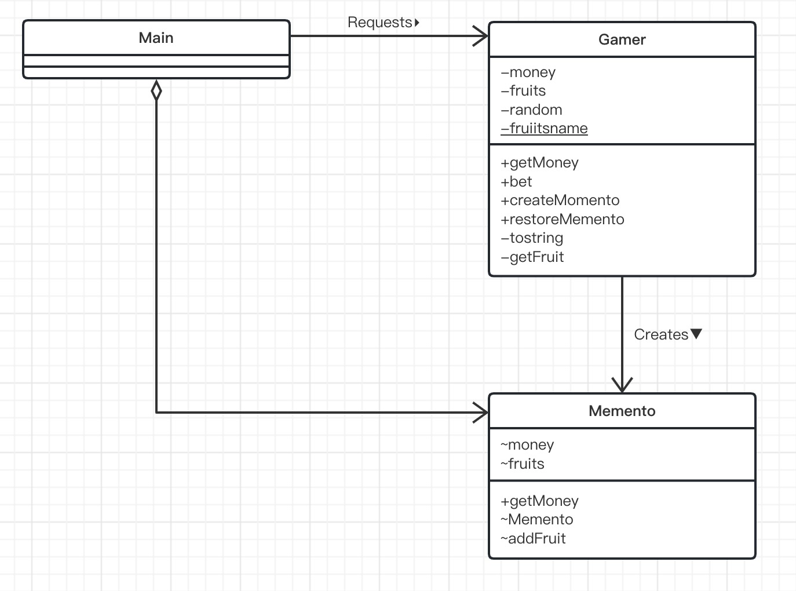
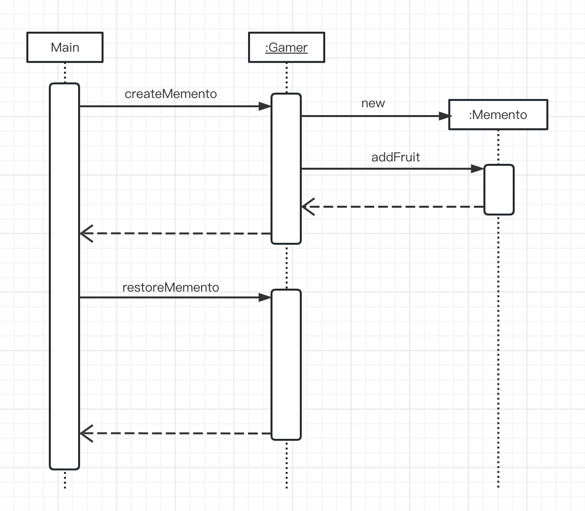
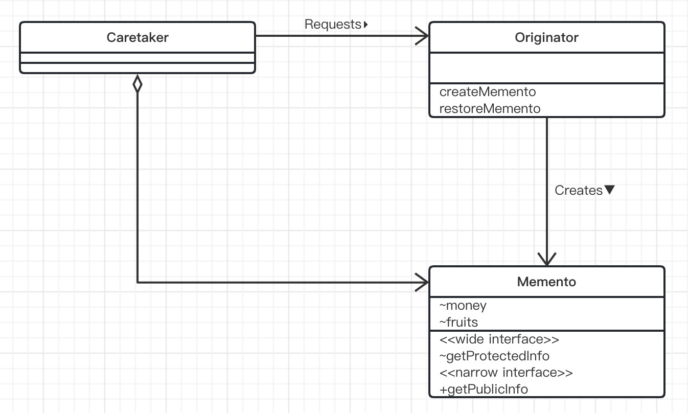

# Memento模式（备忘录模式）

> 在使用文本编辑器编写文件时，如果不小心删除了某句话，可以通过撤销（undo）功能将文件恢复至之前的状态。有些文本编辑器甚至支持多次撤销，能够恢复至很久之前的版本。
>
> 使用面向对象编程的方式实现撤销功能时，需要事先保存实例的相关状态信息。然后，在撤销时，还需要根据所保存信息将实例恢复至原来的状态。
>
> 想要恢复实例，需要一个可以自由访问实例内部结构的权限。但是，如果稍不注意，又可能会将依赖实例内部结构的代码分散的编写在程序中的各个地方，导致程序变得难以维护。这种情况就叫作“破环了封装性”。
>
> 通过引入表示实例状态的角色，可以在保存和恢复实例时有效的防止对象的封装性遭到破坏。这就是要学习的**Memento模式**。
>
> 使用Memento模式可以实现应用程序的以下功能。
>
> - Undo（撤销）
> - Redo（重做）
> - History（历史记录）
> - Snapshot（快照）
>
> Moment有“纪念品”、“遗物”、“备忘录”的意思。
>
> 当从抽屉中拿出一个让人怀念的照片时，肯定会感慨万千，感觉仿佛又回到了照片中的那个时候。Memento模式就是一个这样的设计模式，它事先将某个时间点的实例状态保存下来，之后在有必要时，再将实例恢复至当时的状态。

## 示例类图

> 

## 示例程序

下面来看一段使用Memento模式的实例程序。这是一个收集水果和获取金钱数的掷骰子游戏，游戏规则很简单，具体如下。

- 游戏是自动进行的
- 游戏的主人公通过掷骰子来决定下一个状态
- 当骰子点数为1的时候，主人公的金钱会增加
- 当骰子点数为2的时候，主人公的金钱会减少
- 当骰子点数为6的时候，主人公会得到水果
- 主人公没有钱时游戏就会结束

在程序中，如果金钱增加，为了方便恢复状态，我们会生成Memento类的实例，将现在的状态保存起来。所保存的数据为当前持有的金钱和水果。如果不断掷出了会导致金钱减少的点数，为了防止金钱变为0而结束游戏，我们会使用Memento的实例将游戏恢复至之前的状态。

下面，通过这个小游戏来学校Memento模式。

| 包   | 名字    | 说明                                                         |
| ---- | ------- | ------------------------------------------------------------ |
| game | Memento | 表示Gamer状态的类                                            |
| game | Gamer   | 表示游戏主人公的类。它会生成Memento的实例                    |
| 无名 | Main    | 进行游戏的类。它会事先保存Memento的实例，之后会根据需要恢复Gamer的状态 |

### Memento类

> Memento类是表示Gamer（主人公）状态的类。
>
> Memento类和Gamer类都位于game包下。
>
> Memento类中有两个字段，即money和fruits。money表示主人公现在所持有的金钱数目，fruits表示现在为止我们希望同在game包下的Gamer类可以访问这两个字段。
>
> getMoney方法的作用是获取主人公当前所持有的金钱数目。
>
> Memento类的构造函数并非public，因此并不是任何其他类都可以生成Memento类的实例。只有在同一个包（game包）下的其他类才能调用Memento类的构造函数。具体来说，只有game包下的Gamer类才能生存Memento类的实例。
>
> addFruit方法用于添加所获得的水果。该方法的可见性也不是public。这是因为只有同一个包下的其他类才能添加水果。因此，无法从game包外部改变Memento内部状态。

```java
import java.util.ArrayList;
import java.util.List;

public class Memento {
    /**
     * 所持金钱
     */
    int money;

    /**
     * 获得的水果
     */
    ArrayList fruits;

    /**
     * 获取当前所持有金钱
     * @return 金钱
     */
    public int getMoney(){
        return money;
    }

    /**
     * 构造函数
     * @param money 金钱
     */
    Memento(int money) {
        this.money = money;
        this.fruits = new ArrayList();
    }

    /**
     * 添加水果
     * @param fruit 水果
     */
    void addFruit(String fruit) {
        fruits.add(fruit);
    }

    /**
     * 获取当前所持所有水果
     * @return 所有水果
     */
    List getFruits() {
        return (List) fruits.clone();
    }
}
```

### Gamer类

> Gamer类是表示游戏主人公的类。它有3个字段，即所持金钱（money）、获得的水果（fruits）以及随机数生成器（random）。而且还有一个名为fruitsname的静态字段。
>
> 进行游戏的主要方法是bet方法。在该方法中，只要主人公没有破产，就会一直掷骰子，并根据骰子结果改变所持有的金钱数目和水果个数。
>
> createMemento方法的作用是保存当前的状态（拍摄快照）。在createMemento方法中，会根据在当前时间点所持有的金钱和水果生成一个Memento类的实例，该实例代表了“当前Gamer的状态”，它会被返回给调用者。就如同给对象照了张照片一样，我们将对象现在的状态封存在Memento类的实例中。请注意我们只保存了“好吃”的水果。
>
> restoreMemento方法的功能与createMemento相反，它会根据接收到的Memento类的实例来将Gamer恢复为以前的状态，仿佛是在游戏中念了一通“复活咒语”。

```java
import java.util.ArrayList;
import java.util.Iterator;
import java.util.List;
import java.util.Random;

public class Gamer {
    /**
     * 所持金钱
     */
    private int money;

    /**
     * 获得的水果
     */
    private List fruits = new ArrayList();

    /**
     * 随机数生成器
     */
    private Random random = new Random();

    /**
     * 表示水果种类的数组
     */
    private static String[] fruitsName = {
            "苹果","葡萄","香蕉","橘子"
    };

    /**
     * 构造方法
     * @param money 金额
     */
    public Gamer(int money) {
        this.money = money;
    }

    /**
     * 获取当前所持金钱
     * @return 金钱
     */
    public int getMoney() {
        return money;
    }

    /**
     * 投掷骰子进行游戏
     */
    public void bet() {
        // 投骰子
        int dice = random.nextInt(6) + 1;

        if (dice == 1) { //结果为1时，增加所持金钱
            money += 100;
            System.out.println("所持金钱增加。");
        } else if (dice == 2) { //结果为2时，减少所持金钱
            money /= 2;
            System.out.println("所持金钱减少。");
        }else if (dice == 6) { //结果为6时，获得水果
            String f = getFruit();
            fruits.add(f);
        }else { // 结果为3、4、5时什么都不会发生
            System.out.println("什么都没有发生。。。");
        }
    }

    /**
     * 拍摄快照
     * @return 快照
     */
    public Memento createMemento() {
        Memento m = new Memento(money);
        Iterator it = fruits.iterator();
        while (it.hasNext()) {
            String f = (String) it.next();
            if (f.startsWith(" 好吃的 ")) { //只保存好吃的水果
                m.addFruit(f);
            }
        }
        return m;
    }

    /**
     * 撤销
     * @param memento 快照
     */
    public void restoreMemento(Memento memento) {
        this.money = memento.money;
        this.fruits = memento.getFruits();
    }

    /**
     * 用字符串表示主人公的状态
     * @return 主人公状态
     */
    public String toString() {
        return "[money = " + money + ",fruits = " + fruits + " ]";
    }

    /**
     * 获得一个水果
     * @return 水果
     */
    private String getFruit() {
        String preFix = "";
        if (random.nextBoolean()) {
            preFix = " 好吃的 ";
        }
        return preFix + fruitsName[random.nextInt(fruitsName.length)];
    }
}
```

### Main类

> Main类生成了一个Gamer类的实例并进行游戏。它会重复调用Gamer的bet方法，并显示Gamer的所持金钱。
>
> 到目前为止，这只是普通的掷骰子游戏，接下来我们来引入Memento模式。在变量memento中保存了“某个时间点的Gamer的状态”。如果运气很好，金钱增加了，会调用createMemento方法保存现在的状态；如果运气不好，金钱不足了，就会以memento为参数调用restoreMemento方法返还金额。

```java
import game.Gamer;
import game.Memento;

public class Main {
    public static void main(String[] args) {
        Gamer gamer = new Gamer(100); // 最初的所持金钱数为 100
        Memento memento = gamer.createMemento(); // 保存最初的状态
        for (int i = 0; i < 100; i++) {
            System.out.println("====" + i); // 显示投掷骰子的次数
            System.out.println("当前状态：" + gamer); // 显示主人公现在的状态

            gamer.bet(); //进行游戏

            System.out.println("所持金钱为" + gamer.getMoney() + "元。");

            if (gamer.getMoney() > memento.getMoney()) {
                System.out.println("   (所持金钱增加了许多，因此保存游戏当前状态) ");
                memento = gamer.createMemento();
            }else if (gamer.getMoney() < memento.getMoney() / 2) {
                System.out.println("   (所持金钱减少了许多，因此游戏状态恢复以前的状态) ");
                gamer.restoreMemento(memento);
            }
            try {
                Thread.sleep(1000);
            } catch (InterruptedException e) {
            }
            System.out.println();
        }
    }
}
```

### 示例程序时序图

> 

## Memento模式中的登场角色

- ### Originator（生成者）

  > Originator角色会在保存自己的最新状态时生成Memento角色。当把以前保存的Memento角色传递给Origiator角色时，它会将自己恢复至生成该Memento角色时的状态。
  >
  > 在示例程序中，由Gamer类扮演此角色。

- ### Memento（纪念品）

  > Memento角色会将Originator角色的内部信息整合在一起。在Memento角色中虽然保存了Originator角色的信息，但它不会向外部公开这些信息。
  >
  > Memento角色有以下两种接口（API）
  >
  > - wide interface——宽接口（API）
  >
  >   Memento角色提供的“宽接口（API）”是指所有用于获取恢复对象状态信息的方法的集合。由于宽接口（API）会暴露所有Memento角色的内部信息，因此能够使用宽接口（API）的只有Originator角色。
  >
  > - narrowinterface——窄接口（API）
  >
  >   Memento角色为外部的Caretaker角色提供了“窄接口（API）”。可以通过窄接口（API）获取Memeneto角色的内部信息非常有限，因此可以有效地防止信息泄露。
  >
  > 通过对外提供以上两种接口（API），可以有效地防止对象的封装性被破坏。
  >
  > 在示例程序中，由Memento类扮演此角色。
  >
  > Originator角色和Memento角色之间有着非常紧密的联系。

- ### Caretaker（负责人）

  > 当Caretaker角色想要保存当前的Originator角色的状态时，会通知Originator角色。Originator角色在接收到通知后会生成Memento角色的实例并将其返回给Caretaker角色。由于以后可能会用Memento实例来将Originator恢复至原来的状态，因此Caretaker角色会一直保存Memento实例。
  >
  > 在示例程序中，由Main类扮演此角色。
  >
  > 不过，Caretaker角色只能使用Memento角色两种（API）中的窄接口（API），也就是说它无法访问Memento角色内部的所有信息。**它只将Originator角色生成的Memento角色当作一个黑盒子保存起来**。
  >
  > 虽然Originator角色和Menento角色之间是强关联关系，但Carataker角色和Memento角色之间是弱关联关系。Memento角色对Caretaker角色隐藏了自身的内部信息。

### Memento模式的类图

> 

## 拓展思路要点

- ### 两种接口（API）和可见性

  > 为了能够实现Memento模式中的两套接口（API），利用了Java语言中的可见性。
  >
  > | 可见性    | 说明                               |
  > | --------- | ---------------------------------- |
  > | public    | 所有类都可以访问                   |
  > | protected | 同一包中的类或是该类的子类可以访问 |
  > | 无        | 同一包中的类可以访问               |
  > | private   | 只有该类自身可以访问               |
  >
  > 在Memento类的方法和字段中，带有public修饰符的，也有不带修饰符的。这表示设计者希望能购进行控制，从而使某些类可以访问这些方法和字段，而其他一些类则无法访问
  >
  > | 可见性 | 字段、方法、构造函数 | 哪个类可以访问             |
  > | ------ | -------------------- | -------------------------- |
  > | 无     | money                | Memento类、Gamer类         |
  > | 无     | fruits               | Memento类、Gamer类         |
  > | public | getMoney             | Memento类、Gamer类、Main类 |
  > | 无     | Memento              | Memento类、Gamer类         |
  > | 无     | addFruit             | Memento类、Gamer类         |
  >
  > 在Memento类中，只有getMoney方法是public的，它是一个窄接又(API)，因此该方法也可以被扮演Caretaker角色的Main类调用。
  >
  > 这里做一下补充说明。明明该方法带有修饰符public，但它却一个是窄接又(API)，这不免让人感到有些奇怪。其实，这里所说的“窄〞是指外部可以操作的类内部的内容很少。在Memento类的所有方法中，只有getMoney的可见性是public的。也就是说，扮演Caretaker角色的Main类可以获取的只有当前状态下的金钱数目而已。像这种“能够获取的信息非常少”的状态就是本章中“窄”的意思。
  >
  > 由于扮演Caretaker角色的Main类并不在game包下，所以它只能调用public的getMoney方法。因此，Main类无法随意改变Memento类的状态。还有一点需要注意的是，在Main类中Memento类的构造两数是无法访问的，这就意味着无法像下面这样生成Memento类的实例。
  >
  > ```java
  > newMemento(100);
  > ```
  >
  > 如果像这样编写了代码，在编译代码时编译器就会报错。如果Main类中需要用到Memento类的实例，可以通过调用Game工类的createMemento方法告诉Game工类“我需要保存现在的状态，请生成一个Memento类的实例给我”。
  >
  > 如果我们在编程时需要实现“允许有些类访问这个方法，其他类则不能访问这个方法”这种需求，可以像上面这样使用可见性来控制访问权限。

- ### 需要多少个Memento

  > 在示例程序中，Main类只保存了一个Memento。如果在Main类中使用数组等集合，让它可以保存多个Memento类的实例，就可以实现保存各个时间点的对象状态。

- ### Memento的有效期限是多久

  > 在示例程序中，我们是在内存中保存Memento的，这样并没有什么问题。如果要将Memento永久保存在文件中，就会出现有效期限的问题了。
  >
  > 这是因为，假设我们在某个时间点将Memento保存在文件中，之后又升级了应用程序版本，那么可能会出现原来保存的Memento与当前的应用程序不匹配的情况。

- ### 划分Caretaker角色和Originator角色的意义

  > 到这里可能会有这样的疑问：如果是要实现撤销功能，直接在Originator角色中实现不就好了吗？为什么要这么麻烦地引入Memento模式呢？
  >
  > Caretaker角色的职责是决定何时拍摄快照，何时撤销以及保存Memento角色。
  >
  > 另一方面，Originator角色的职责则是生成Memento角色和使用用接收到的Memento角色来恢复自己的状态。
  >
  > 以上就是Caretaker角色与Originator角色的**职责分担**。有了这样的职责分担，当我们需要对应以下需求时，就可以完全不用修改Originator角色。
  >
  > - **变更为可以多次撤销**
  > - **变更为不仅可以撤销，还可以将现在的状态保存在文件中**