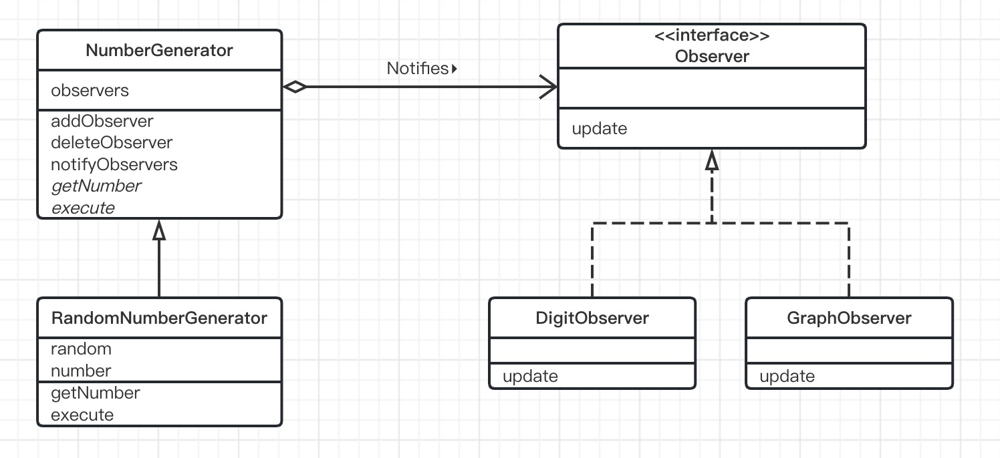

# Observer模式（观察者模式）

> Observer的意思是“进行观察的人”，也就是“观察者”的意思。
>
> 在Observer模式中，当观察对象的状态发生变化时，会通知给观察者。Observer模式适用于根据对象状态进行相应处理的场景。

## 示例类图

> 

## 示例程序

### Observer接口

> Observer接口时表示“观察者”的接口。具体的观察者会实现这个接口。
>
> 需要注意的是，这个Observer接口是为了便于我们了解Observer的示例程序而编写的，它与Java类库中的java.util.Observer接口不同。
>
> 用于生产数值的NumberGenerator类会调用update方法。Generator有“生成器”“产生器”的意思。如果调用update方法，NumberGenerator类就会将“生成的数值发生了变化，请更新显示内容”的通知发送给Observer。

```java
public interface Observer {
    public abstract void update(NumberGenerator generator);
}
```

### NumberGenerator类

> NumberGeneator类是用于生成数值的抽象类。生成数值的方法（execute方法）个获取数值的方法（getNumber方法）都是抽象方法，需要子类实现。
>
> observers字段中保存有观察NumberGenerator的Observer们。
>
> addObserver方法用于注册Observer，而deleteObserver方法用于删除Observer。
>
> notifyObservers方法会向所有的Observer发送通知，告诉他们“我生成的数值发生了变化，请及时跟新内容”。该方法会调用每个Observer的update方法。

```java
import java.util.ArrayList;
import java.util.Iterator;

public abstract class NumberGenerator {
    /**
     * 保存Observer们
     */
    private ArrayList observers = new ArrayList();

    /**
     * 注册Observer
     * @param observer observer
     */
    public void addObserver(Observer observer){
        observers.add(observer);
    }

    /**
     * 删除observer
     * @param observer observer
     */
    public void deleteObserver(Observer observer){
        observers.remove(observer);
    }

    /**
     * 向Observer发送通知
     */
    public void notifyObservers() {
        Iterator iterator = observers.iterator();
        while (iterator.hasNext()) {
            Observer o = (Observer) iterator.next();
            o.update(this);
        }
    }

    /**
     * 获取数值
     * @return 数值
     */
    public abstract int getNumber();

    /**
     * 生成数值
     */
    public abstract void execute();
}
```

### RandomNumberGenerator类

> RandomNumberGenerator类是NumberGenerator的子类，它会生成随机数。
>
> random字段中保存有java.util.Random类的实例（即随机数生成器）。而number字段中保存的是当前生成的随机数。
>
> getNumber方法是用于获取number字段的值。
>
> execute方法会生成20个随机数（0～49的整数），并通过notifyObservers方法把每次生成结果通知给观察者。这里使用nextInt方法是java.util.Random类的方法，它的功能是返回下一个随机整数值。（取值范围大于0，小于指定值）。

```java
import java.util.Random;

public class RandomNumberGenerator extends NumberGenerator{
    /**
     * 随机数生成器
     */
    private Random random = new Random();

    /**
     * 当前数值
     */
    private int number;

    /**
     * 获取当前数值
     * @return 随机数
     */
    public int getNumber() {
        return number;
    }
    public void execute() {
        for (int i = 0; i < 20; i ++) {
            number = random.nextInt(20);
            notifyObservers();
        }
    }
}
```

### DigitObserver类

> DigObserver类实现了Observer接口，它的功能是以数字形式显示观察到的数值。它的update方法接收NumberGenerator的实例作为参数，然后通过调用NumberGenerator类的实例的getNumber方法可以获取到当前的数值，并将这个数值显示出来。为了能够看清它是如何显示数值的，这里使用Thread.sleep来降低了程序的运行速度。

```java
public class DigitObserver implements Observer{

    @Override
    public void update(NumberGenerator generator) {
        System.out.println("DigitObserver:" + generator.getNumber());
        try {
            Thread.sleep(1000);
        } catch (InterruptedException e) {
        }
    }
}
```

### GraphObserver类

> GraphObserver类也实现了Observer接口。该类会将观察到的数值以`*****`这样的简单图示的形式显示出来。

```java
public class GraphObserver implements Observer{
    @Override
    public void update(NumberGenerator generator) {
        System.out.print("GraphObserver:");
        int count = generator.getNumber();
        for (int i = 0; i < count; i++) {
            System.out.print("*");
        }
        System.out.println("");
        try {
            Thread.sleep(100);
        } catch (InterruptedException e) {
        }
    }
}
```

### Main类

> Main类生成了一个RandomNumberGenerator类的实例和两个观察者，其中observer1是DigitObserver类的实例，observer2是GraphObserver类的实例。
>
> 在使用addObserver观察者后，它还会调用generator.execute方法生成随机数值。

```java
public class Main {
    public static void main(String[] args) {
        NumberGenerator generator = new RandomNumberGenerator();
        Observer observer1 = new DigitObserver();
        Observer observer2 = new GraphObserver();
        generator.addObserver(observer1);
        generator.addObserver(observer2);
        generator.execute();
    }
}
```

## Observer模式中登场的角色

- ### Subject（观察对象）

  > Subject角色表示观察对象。Subject角色定义了注册观察者和删除观察者的方法。此外，它还声明了“获取当前的状态”的方法。在示例程序中，由NumberGenerator类扮演此角色。

- ### ConcreteSubject（具体的观察对象）

  > ConcreteSubject角色表示具体的被观察对象。当自身状态发生变化后，它会通知所有已经注册的Observer角色。在示例程序中，由RandomNumberGenerator类扮演此角色。

- ### Observer（观察者）

  > Observer角色负责接收来自Subject角色的状态变化的通知。为此，它声明了update方法。
  >
  > 在示例程序中，由Observer接口扮演此角色。

- ### ConcreteObserver（具体的观察者）

  > ConcreteObserver角色表示具体的Observer。当时它的update方法被调用后，会获取要观察的对象的最新状态。在示例程序中，由DigitObserver类和GraphObserver类扮演此角色。

## 思路要点

- ### 这里也出现了可替换性

  > 使用设计模式的目的之一就是使类成为可服用的组件。
  >
  > 在Observer模式中，有带状态的ConcreteSubject角色和接收状态变化通知的ConcreteObserver角色。连接这两个角色的就是它们的接口（API）Subject角色和Observer角色。
  >
  > 一方面RandomNumberGenerator类并不是不知道，也无需在意正在观察自己的（自己需要通知的对象）到底是DigitObserver类的实例还是GraphObserver类的实例。不过它知道在它的observers字段中所保存的观察者们都实现了Observer接口。因为这些实例都是通过addObserver方法注册的，这就确保了它们一定都实现了Observer接口，一定可以调用它们的update方法。
  >
  > 另一方面，DigitObserver类也无需在意在即正在观察的究竟是RandomNumberGenerator类的实例还是其他XXXXNumberGenerator类的实例。不过，DigitObserver类知道它们是NumberGenerator类的子类的实例，并持有getNumber方法。
  >
  > 可替换性的设计思想：
  >
  > - 利用抽象类和接口从具体类中抽出抽象方法
  >
  > - 在将实例作为参数传递至类中，或者在类的字段中保存实例时，不使用具体类型，而是使用抽象类型和接口
  >
  >   这样的实现方式可以帮助我们轻松替换具体类。

- ### Observer的顺序

  > Subject角色中注册有多个Observer角色。在示例程序的notifyObservers方法中，先注册的Observer的update方法会先被调用。
  >
  > 通常，在设计ConcreteObserver角色的类时，需要注意这些Observer的update方法的调用顺序，不能因为update方法的调用顺序发生改变而产生问题。例如，在示例程序中，绝不能因为先调用DigitObserver的update方法后调用GraphObserver的update方法而导致应用程序不能正常工作。当然，通常，只要保持各个类的独立性，就不会发生上面这种类的依赖关系混乱的问题。
  >
  > 不过还需要注意下面将要提到的情况。

- ### 当Observer的行为会对Subject产生影响时

  > 在示例程序中，RandomNumberGenerator类会在自身内部生成数值，调用update方法。不过，在通常的Observer模式中，也可能是其他类出发Subject角色调用update方法。例如，在GUI应用程序中，多数情况下是用户按下按钮后会出发update方法被调用。
  >
  > 当然，Observer角色也可能会触发Subject角色调用update方法。这时，如果稍不留神，就可能会导致方法被循环调用。
  >
  > Subject状态发生变化
  >
  > ↓
  >
  > 通知Observer
  >
  > ↓
  >
  > Observer调用Subject的方法
  >
  > ↓
  >
  > 导致Subject状态发生变化
  >
  > ↓
  >
  > 通知Observer
  >
  > ↓
  >
  > ……

- ### 传递更新信息的方式

  > NumberGenerator利用update方法告诉Observer自己的状态发生了更新。传递给update方法的参数只有一个，就是调用update方法的NumberGenerator的实例自身。Observer会update方法中调用该实例的getNumber来获取足够的数据。
  >
  > 不过在示例程序中，update方法接收到的参数中并没有被更新的数值。也就是说，update方法的定义可能不是如下（1）中这样，而是如下（2）中这样，或者更简单的（3）这样的。
  >
  > ```java
  > void update(NumberGenerator generator);               ……(1)
  > void update(NumberGenerator generator, int number);   ……(2)
  > void update(int number);                              ……(3)
  > ```
  >
  > （1）只传递了Subject角色作为参数。Observer角色可以从Subject角色中获取数据。
  >
  > （2）除了传递Subject角色以外，还传递了Observer所需的数据（这里指的是所有的更新信息）。这样就省去了Observer自己获取数据的麻烦。不过，这样做的话，Subject角色就知道了Observer所要进行的处理的内容了。
  >
  > 在很复杂的程序中，让Subject角色知道Observer角色所要进行的处理会让程序变得缺少灵活性。例如，假设现在我们需要传递上次传递的数值和当前的数值之间的差值，那么我们就必须在Subject角色中先计算出这个差值。因此，我们需要综合考虑程序的复杂度来设计update方法的参数的最优方案。
  >
  > (3)比(2)简单，省略了Subject角色。示例程序同样也适用这种实现方式。不过，如果一个Observer角色需要观察多个Subject角色的时候，此方式就不适用了。这是因为Observer角色不知道传递给update方法的参数究竞是其中哪个Subject角色的数值。

- ### 从“观察”变为“通知”

  > Observer本来的意思就是“观察者”，但实际上Observer角色并非主动地去观察，而是在被动的接受来自Subject角色的通知。因此，Observer模式也被称为Publish—Subscribe（发布—订阅）模式。
  >
  > Publish（发布）和Subscribe（订阅）这个名字可能更加适合。

- ### Model/View/Controller（MVC）

  > MVC中的Model和View的关系与Subject角色和Observer角色的关系相对应。Model是指操作“不依赖于显示形式的内部模型”的部分，View则是管理Model“怎样显示”的部分。通常情况下，一个Model对应多个View。