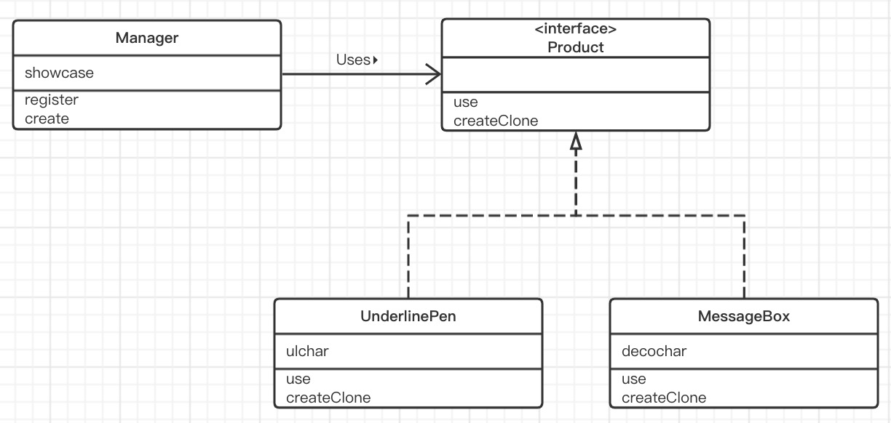
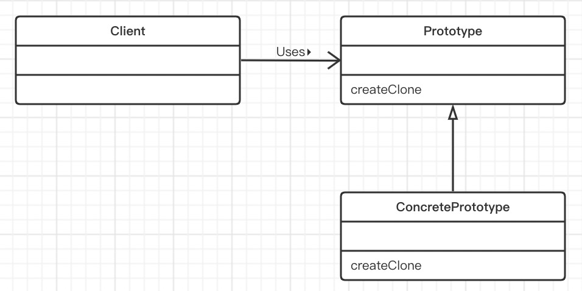

# Prototype模式（原型模式）

> 在java中，我们可以使用new关键字知道类名来生成类的实例。像这样使用new来生成实例时，是必须指定类名的。但是，开发过程中，有时也会有“在不指定类名的前提下生成实例”的需求。例如在一下情况下，我们不能根据类来生成实例，而要根据现有的实例来生成新的实例。
>
> 1. **对象种类繁多，无法将他们整合到一个类中时**
>
>    第一种情况时需要处理的对象太多如果将它们分作为一个类，必须要编写很多个类文件。
>
> 2. **难以根据类生成实例时**
>    第二种情况时生成实例的过程太过复杂，很难根据类来生成实例。例如，我们假设这里有一个实例，即表示用户在图形编辑器中使用鼠标制作出的图形的实例。想在程序中创建这样的实例是非常困难的。通常，在想生成一个和之前用户通过操作所创建出的实例完全一样的实例的时候，我们会事先将用户通过操作所创建出的实例保存起来，然后在需要时通过复制来生成新的实例。
>
> 3. **想解耦框架与生成的实例时**
>
>    第三种情况是想要生成实例的框架不依赖于具体的类。这时，不能指定类名来生成实例，而要事先“注册”一个“原型”实例，然后通过复刻该实例来生成新的实例。
>
>    根据实例生成实例与使用复印机复印文档相类似。即使不知道原来的文档中的内容，我们也可以使用复印机复印出完全相同的文档，无论多少份都行。

## 实例类图

> 

## 实例程序

> ### Product接口
>
> Product接口是复制功能的接口。该接口继承了java.lang.Cloneable接口。现在大家只需要知道实现了该接口的类的实例可以调用clone方法来自动复制实例即可。
>
> use方法是用于“使用”的方法。具体怎么“使用”，则被交给子类去实现。
>
> createClone方法是用于复制实例的方法。
>
> ```java
> public interface Product extends Cloneable {
>     /**
>      * 使用的方法
>      * @param s 使用
>      */
>     public abstract void use(String s);
> 
>     /**
>      * 用于复制实例的方法
>      * @return 实例
>      */
>     public abstract Product createClone();
> }
> ```
>
> ### Manage 类
>
> Manager 类 使用Product 接口来复制实例。
>
> showcase 字段是 java.util.HashMap 类型，它保存了实例的“名字”和“实例”之间的对应关系。
>
> register方法会将接收到的1组“名字”和“Product 接口” 注册 showcase 中。这里的 Product 类型的参数 proto 具体是什么呢？现在我们还无法知道 proto 到底是哪个类，但有一点可以确定的是，它肯定是实现了 Product 接口的类的实例（也就是说可以调用它的use方法和createClone方法）。
>
> 请注意，在 Product 接口和 Manager 类的代码中完全没有出现 MessageBox 类 和 UnderlinePen 类 的名字，这也意味着我们可以独立的修改Product 和Manager，不受MessageBox类和 UnderlinePen类的影响。这时非常重要的，因为一旦在类中使用到了别的类名，就意味着该类与其他类紧密的耦合在了一起。在Manager类中，并没有写明具体的类名，仅使用了Product这个接口名。也就是说，Product接口成为了链接Manager类与其他具体类之间的桥梁。
>
> ```java
> public class Manager {
>     /**
>      * 用来保存实例的容器
>      */
>     private HashMap showcase = new HashMap();
> 
>     /**
>      * 将实例保存到容器中
>      * @param name 实例名
>      * @param proto 实例
>      */
>     public void register(String name, Product proto){
>         showcase.put(name,proto);
>     }
> 
>     /**
>      * clone新实例
>      * @param protoName 原型名
>      * @return 实例
>      */
>     public Product create(String protoName){
>         Product p = (Product) showcase.get(protoName);
>         return p.createClone();
>     }
> }
> ```
>
> ### MessageBox 类
>
> MessageBox 类 实现（implements）了Product 接口。
>
> decochar字段中保存的是像装饰方框那样的环绕着字符串的字符。use方法会使用decochar字段中保存的字符把要展示的字符串框起来。
>
> ```java
> public class MessageBox implements Product {
> 
>     private char decochar;
> 
>     public MessageBox(char decochar) {
>         this.decochar = decochar;
>     }
> 
>     @Override
>     public void use(String s) {
>         int length = s.getBytes().length;
>         for (int i = 0; i < length + 4; i++) {
>             System.out.print(decochar);
>         }
>         System.out.println("");
>         System.out.println(decochar + " " + s + " " + decochar);
>         for (int i = 0; i < length + 4; i++) {
>             System.out.print(decochar);
>         }
>         System.out.println("");
>     }
> 
>     @Override
>     public Product createClone() {
>         Product p = null;
>         try {
>             p = (Product) clone();
>         } catch (CloneNotSupportedException e) {
>             e.printStackTrace();
>         }
>         return p;
>     }
> }
> ```
>
> ### UnderlinePen 类
>
> UnderlinePen类的实现与MessageBox几乎完全相同，不同的实现ulchar字段中保存的是修饰下划线样式的字符。
>
> use方法的作用是将字符串用双引号括起来显示，并在字符串下面加上下划线。
>
> ```java
> public class UnderlinePen implements Product {
> 
>     private char ulchar;
> 
>     public UnderlinePen(char ulchar) {
>         this.ulchar = ulchar;
>     }
> 
>     @Override
>     public void use(String s) {
>         int length = s.getBytes().length;
>         System.out.println("\"" + s + "\"");
>         System.out.print(" ");
>         for (int i = 0; i < length; i++) {
>             System.out.print(ulchar);
>         }
>         System.out.println("");
>     }
> 
>     @Override
>     public Product createClone() {
>         Product p = null;
>         try {
>             p = (Product) clone();
>         } catch (CloneNotSupportedException e) {
>             e.printStackTrace();
>         }
>         return p;
>     }
> }
> ```
>
> ### Main 类
>
> Main类首先生成了Manager的实例。接着，在Manager实例中注册了UnderlinePen的实例和MessageBox的实例。
>
> ```java
> public class Main {
>     public static void main(String[] args) {
>         Manager manager = new Manager();
>         UnderlinePen upen = new UnderlinePen('~');
>         MessageBox mbox = new MessageBox('*');
>         MessageBox sBox = new MessageBox('/');
>         manager.register("strong message", upen);
>         manager.register("warning box", mbox);
>         manager.register("slash box", sBox);
> 
>         Product p1 = manager.create("strong message");
>         p1.use("Hello, world.");
>         Product p2 = manager.create("warning box");
>         p2.use("Hello, world.");
>         Product p3 = manager.create("slash box");
>         p3.use("Hello, world.");
>     }
> }
> ```

## Prototype 模式中登场的角色

- ### Prototype（原型）

  > Product角色负责定义用于复制现有实例来生成新的方法。
  >
  > 在示例程序中，由Product接口扮演此角色。

- ### ConcretePrototype（具体的原型）

  > ConcretePrototype角色负责实现现有实例的方法。
  >
  > 在示例程序中，由MessageBox 类和UnderlinePen类扮演此角色。

- ### Client（使用者）

  > Client角色负责使用复制实例的方法生成新的实例。
  >
  > 在示例程序中，由Manager类扮演此角色。

### Prototype模式的类图

> 

## 思路要点

- ### 不能根据类来生成实例吗

  > 最初在学习Prototype模式时也曾感觉到迷茫，既然是要创建新的实例，直接用下面这个语句不就好了吗？为什么还需要Prototype模式？
  >
  > `new Something()`
  >
  > 1. **对象种类繁多，无法将它们整合到一个类中时**
  >
  >    在示例程序中出现了如下3种样式。
  >
  >    - 使用‘～’为字符串添加下划线
  >    - 使用‘*’为字符串添加边框
  >    - 使用‘/’为字符串添加边框
  >
  >    本例比较简单，只生成了3种样式，不过只要想做，不论多少种样式都可以生成。但是请试想一下，如果每种样式都编写为一个类，类的数量将会非常庞大，源程序的管理也会变得非常困难。
  >
  > 2. **难以根据类生成实例时**
  >
  >    本例感觉不到这一点。可以试想下要开发一个用户可以使用鼠标进行操作的、类似于图形编辑器的应用程序，这样可能更加容易理解。假设我们想生成一个用户通过一系列鼠标操作所创建出来的实例完全一样的实例。这个时候，与根据类来生成实例相比，根据实例来生成要简单得多。
  >
  > 3. **想解耦框架与生成的实例时**
  >
  >    在示例程序中，我们将复制（clone）实例的部分封装在framework包中了。
  >
  >    在message类和create方法中，我们并没有使用类名，取而代之使用了“strong message”和“slash box”等字符串为生成的实例命名。与Java语言自带的生成实例的new Something() 方式相比，这种方式具有更好的通用性，而且将框架从类名的束缚中解脱出来了。

- ### 类名是束缚吗

  > 话说回来，在源程序中使用类名到底会有什么问题呢？在代码中出现要使用的类的名字不是理所当然的吗？
  >
  > 这里，让我们再回忆一下面相对象编程的目标之一，即“作为组建复用”。
  >
  > 在代码中出现要使用的类的名字并非总是坏事。不过，**一旦在代码中出现要使用类的名字，就无法与该类分离开来，也就无法实现复用**。
  >
  > 当然，可以通过替换源代码或是改变类名来解决这个问题。但是，此处说的“作为组建复用”中不包含替换源代码。以Java来时，重要的是当手边只有class文件（.class）时，该类能否被复用。即使没有Java文件（.java）也能复用该类才是关键。
  >
  > 当多个类必须紧密结合时，代码中出现这些类的名字时没有问题的。但是如果那些需要被独立出来作为组建复用的类的名字出现在代码中，那就有问题了。

## 延伸阅读：clone方法和 java.lang.clonable 接口

- ### Java 语言的 clone

  > Java语言为我们准备了用于复制实例的clone方法。请主要，想要掉用clone方法，**被复制对象的类必须实现java.lang.Clonable接口**，不论是被复制对象的类实现java.lang.Cloneable接口还是其某个父类实现Cloneable接口，亦或是被复制对象的类实现了Cloneable接口的子接口都可以。在示例程序中，MassageBox 类和 UnderlinePen 类实现了 Product 接口，而 Product 接口则是 Cloneable接口的子接口。
  >
  > 实现了Cloneable接口的类的实例可以调用clone方法进行复制，clone方法的返回值是复制出的新实例（clone方法内部所进行的处理是分配与要复制的实例同样大小的内存空间，接着将要复制的实例中的字段的值复制到所分配的内存空间中去）。
  >
  > 如果没有实现Cloneable接口的类的实例调用了clone方法，则会在运行时抛出CloneNotSuppertedException（不支持clone方法）异常。
  >
  > - 实现了Cloneable接口的类的实例
  >
  >   →复制
  >
  > - 没有实现Cloneable接口的类的实例
  >
  >   →发生CloneNotSuppertedException异常
  >
  > 此外，java.lang 包是被默认引入的，因此无需显示地引入Java.lang 即可调用 clone 方法

- ### clone 方法时哪里定义的

  > clone方法定义在 java.lang.Object 中。因为Object 类是用所有Java类的父类，因此所有的Java类都继承了clone方法。

- ### 需要实现 Cloneable 的哪些方法

  > 提到Cloneable接口，很容易让人误解以为Cloneable接口中声明了clone方法。其实这是错误的。
  >
  > 在Cloneable接口中并没有声明任何方法。它只是被用来标记“可以使用clone方法进行复制”的。这样的接口被称为**标记接口（marker interface）**。

- ### clone 方法进行的是浅复制

  > clone 方法所进行的复制只是**将被复制实例的字段值直接复制到新的实例中**。换言之，它并没有考虑字段中所保存的实例的内容。例如，当字段中保存的是数组时，如果使用clone方法进行复制，则只会复制该数组的引用，并不会一一复制数组中的元素。
  >
  > 像上面这样的字段对字段的复制（field-to-field-copy）被称为浅复制（shallow copy）。clone方法所进行的复制就是浅复制。
  >
  > 当使用clone方法进行浅复制无法满足需求时，类的设计者可以实现重写clone方法，实现自己需要的复制功能（重写clone方法时，别忘记了使用super.clone()来调用父类的clone方法）。
  >
  > 需要注意的是，clone方法只会进行复制，并不会调用被复制实例的构造函数。此外，对于在生成实例时需要进行特殊的初始化处理的类，需要自己去实现clone方法，在其内部进行这项初始化处理。

## 所学知识

> 本章，学习不了根据类，而是根据实例来生成实例的Prototype模式。此外，我们还学习了clone方法和Cloneable方法。