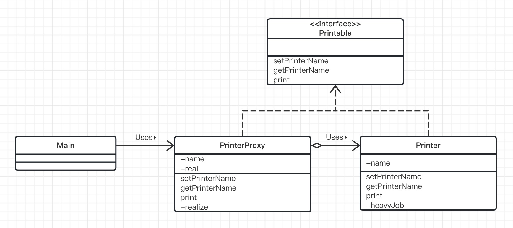
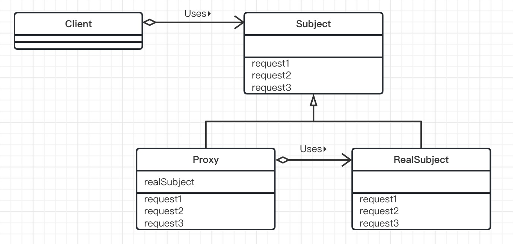

# Proxy模式（代理模式）

> Proxy是“代理人”的意思，它指的是代替别人进行工作的人。当不一定需要本人亲自进行工作时，就可以寻找代理人去完成工作。但代理人毕竟只是代理人，能代替本人做的事情终究还是有限的。因此，当代理人遇到无法自己解决的事情时就会去找本人解决该问题。
>
> 在面向对象编程中，“本人”和“代理人”都是对象。如果“本人”对象太忙了，有些工作无法自己亲自完成，就将其交给“代理人”对象负责。

## 示例类图

> 使用了Proxy模式的示例程序。这段示例程序实现了一个“带名字的打印机”。说是打印机，其实只是将文字显示在界面上而已。在Mian类中会生成PrinterProxy类的示例（即“代理人”）。首先我们会给实例赋予名字Alice并在界面中显示该名字。接着会将实例名字改为Bob，然后显示该名字。在设置和获取名字时，都不会生成真正的Printer类的实例（即本人），而是由PrinterProxy类代理。最后，直到我们调用print方法，**开始进入实际打印阶段后，PrinterProxy类才会生成Printer类的实例**。
>
> 为了让PrinterProxy类与Printer类具有一致性，我们定义了Printable接口。示例程序的前提是“生成Printer类的实例”这一处理需要花费很多时间。为了在程序中体现这一点，我们在Printer类的构造函数中调用heavyJob方法，让它干一些“重活”（虽说是重活，也不过是让程序睡眠5秒钟）。
>
> 

## 示例程序

### Printer类

> Printer类是表示“本人”的类。
>
> 在它的构造函数中，我们让它左一些所谓的“重活”（heavyJob）。
>
> setPrinterName方法用于设置打印机的名字；getPrinterName用于获取打印机的名字。
>
> print方法则用于显示带一串带打印机名字的文字。
>
> heavyJob是一个干5秒钟“重活”的方法，它每秒（l000毫秒）以点号（.）显示一次干活的进度。
>
> Proxy模式的核心是PrinterProxy类。Printer类自身并不难理解。

```java
public class Printer implements Printable{
    private String name;

    public Printer() {
        heavyJob("Priter的实例生成中 ");
    }

    /**
     * 构造方法
     * @param name 名字
     */
    public Printer(String name) {
        this.name = name;
        heavyJob("Printer的实例生成中（" + name +"）");
    }

    /**
     * 设置名字
     * @param name 名字
     */
    @Override
    public void setPrinterName(String name) {
        this.name = name;
    }

    /**
     * 获取名字
     * @return 名字
     */
    @Override
    public String getPrinterName() {
        return name;
    }

    /**
     * 显示带打印机名字的文字
     * @param string 文字
     */
    @Override
    public void print(String string) {
        System.out.println("=== " + name + " ===");
        System.out.println(string);
    }

    /**
     * 重活
     * @param msg 消息
     */
    private void heavyJob(String msg) {
        System.out.print(msg);
        for (int i = 0; i < 5; i++) {
            try {
                Thread.sleep(l000);
            } catch (InterruptedException e) {
            }
            System.out.print(".");
        }
        System.out.println("结束。");
    }
}
```

### Printabler类

> Printable接口用于使PrinterProxy类和Printer类具有一致性。setPrinterName方法用于设置打印机的名字；getPrinterName用于获取打印机的名字；print用于显示文字（打印输出）。

```java
public interface Printable {
    /**
     * 设置名字
     * @param name 名字
     */
    public abstract void setPrinterName(String name);

    /**
     * 获取名字
     * @return 名字
     */
    public abstract String getPrinterName();

    /**
     * 显示文字（ 打印输出 ）
     * @param string 文字
     */
    public abstract void print(String string);
}
```

### PrinterProxy类

> PrinterProxy类是扮演“代理人”角色的类，它实现了Printable接口。
>
> name宇段中保存了打印机的名字，而real宇段中保存的是“本人”。
>
> 在构造函数中设置打印机的名字(此时还没有生成“本人”)。
>
> setPrinterName方法用于设置新的打印机名字。如果real字段不为null(也就是已经生成了“本人”)，那么会设置“本人”的名字”。但是当real字段为null时(即还没有生成“本人”)，那么只会设置自己(PrinterProxy的实例)的名字。
>
> getPrinterName会返回自己的name字段。
>
> print方法己经超出了代理人的工作范围，因此它会调用realize方法来生成本人。Realize有“实现〞(使成为真的东西)的意思。在调用realize方法后，real宇段中会保存本人(Print类的实例)，因此可以调用real.print方法。这就是“委托”。
>
> **不论setPrinterName**方法和**getPrinterName方法被调用多少次，都不会生成Printer类的实例**。只有当真正需要本人时，才会生成Printer类的实例（PrinterProxy类的调用者完全不知道是否生成了本人，也不用在意是否生成了本人）。
>
> realize方法很简单，当real字段为null时，它会使用newPrinter来生成Printer类的实例；如果real字段不为null(即已己经生成了本人)，则什么都不做。
>
> 这里希望大家记住的是，**Printer类并不知道PrintezProxy类的存在**。即，Printer类并不知道自己到底是通过PrinterProxy被调用的还是直接被调用的。
>
> 但反过来，PrinterProxy类是知道Printer类的。这是因为PrinterProxy类的real字段是Printer类型的。在PrinterProxy类的代码中，显式地写出了Printer这个类名。因此，PrinterProxy类是与Printer类紧密地关联在一起的组件。
>
> 相信细心的读者应该已经发现了Printer类的setPrinterName方法和realize方法都是synchronized方法。

```java
public class PrinterProxy implements Printable{
    /**
     * 名字
     */
    private String name;

    /**
     * "本人"
     */
    private Printer real;

    /**
     * 构造方法
     */
    public PrinterProxy() {
    }

    /**
     * 构造方法
     * @param name 名字
     */
    public PrinterProxy(String name) {
        this.name = name;
    }

    /**
     * 设置名字
     *
     * @param name 名字
     */
    @Override
    public void setPrinterName(String name) {
        if (real != null) {
            real.setPrinterName(name);
        }
        this.name = name;
    }

    /**
     * 获取名字
     *
     * @return 名字
     */
    @Override
    public String getPrinterName() {
        return name;
    }

    /**
     * 显示文字（ 打印输出 ）
     *
     * @param string 文字
     */
    @Override
    public void print(String string) {
        realize();
        real.print(string);
    }

    private synchronized void realize() {
        if (real == null) {
            real = new Printer(name);
        }
    }
}
```

### Main类

> Main类通过PrinterProxy类使用Printer类。Main类首先会生成PrinterProxy，然后调用getPrinterName方法获取打印机名并显示它。之后通过setPrinterName方法重新设置打印机名。最后，调用print方法输出“Hello.world.”。
>
> 请注意，在设置名字和显示名字之间并没有生成Printer的实例（本人 ），直至调用print方法后，Printer的实例才被生成。

```java
public class Main {
    public static void main(String[] args) {
        Printable p = new PrinterProxy("Alice");
        System.out.println("现在的名字是" + p.getPrinterName() + "。");
        p.setPrinterName("Bob");
        System.out.println("现在的名字是" + p.getPrinterName() + "。");
        p.print("Hello, world.");
    }
}
```

## Proxy模式中的登场角色

- ### Subject（主体）

  > Subject角色定义了使Proxy角色和RealSubject角色之间具有一致性的接口。由于存在Subject角色，所以Client角色不必在意它所使用的究竟是Proxy角色还是RealSubject角色。
  >
  > 在示例程序中，由Printable接口扮演此角色。

- ### Proxy（代理人）

  > Proxy角色会尽量处理来自Client角色的请求。只有当自己不能处理时，它才会将工作交给RealSubject角色。Proxy角色只有在必要时才会生成RealSubject角色。Proxy角色实现了在Subject角色中定义的接口（API）。
  >
  > 在示例程序中，由PrinterProxy类扮演此角色。

- ### RealSubject（实体的主体）

  > "本人"RealSubject角色会在“代理人”Proxy角色无法胜任工作时出场。它与Proxy角色一样也实现了在Subject角色中定义的接口（API）。
  >
  > 在示例程序中，由Printer类扮演此角色。

- ### Client（请求者）

  > 使用Proxy模式的角色。Client角色并不包含在Proxy模式中。
  >
  > 在示例程序中，由Main类扮演此角色。

### Proxy模式的类图

> 

## 拓展思路要点

- ### 使用代理人来提升处理速度

  > 在Proxy模式中，Proxy角色作为代理人尽力肩负着工作使命。例如，在示例程序中，通过使用Proxy角色，我们成功地将耗时处理（生成实例的处理）推迟至print方法被调用后才进行。示例程序中的耗时处理的消耗时间并不算太长，大家可能感受不深。请大家试想一下，假如在一个大型系统的初始化过程中，存在大量的耗时处理。如果在启动系统时连那些暂时不会被使用的功能也初始化了，那么应用程序的启动时间将会非常漫长，这将会引发用户的不满。而如果我们只在需要使用某个功能时才将其初始化，则可以帮助我们改善用户体验。
  >
  > 在讲解Proxy模式时，使用了一个可以在文本中嵌人图形对象（例如图片等）的文本编辑器作为例子。为了生成这些图形对象，需要读取图片文件，这很耗费时间。因此如果在打开文档时就生成有所的图形对象，就会导致文档打开时间过长。所以，最好是当用户测览至文本中各个图形对象时，再去生成它们的实例。这时，Proxy模式就有了用武之地。

- ### 有必要划分代理人和本人吗

  >当然，我们也可以不划分PrinterProxy类和Printer类，而是直接在Printer类中加人惰性求值功能（即只有必要时才生成实例的功能）。不过，通过划分PrinterProxy角色和Printer角色，可以使它们成为独立的组件，在进行修改时也不会互相之间产生影响（分而治之）。
  >
  >只要改变了PrinterProxy类的实现方式，即可改变在Printable接口中定义的那些方法，即对于“哪些由代理人负责处理，哪些必须本人负责处理”进行更改。而且，不论怎么改变，都不必修改Printer类。如果不想使用惰性求值功能，只需要修改Main类，将它使用new关键宇生成的实例从PrinterProxy类的实例变为Printer类的实例即可。由于PrinterProxy类和Printer类都实现了Printable接口，因此Main类可以放心地切换这两个类。
  >
  >在示例程序中，PrinterProxy类代表了“Proxy角色”。因此使用或是不使用PrinterProxy类就代表了使用或是不使用代理功能。

- ### 代理与委托

  >代理人只代理他能解决的问题。当遇到他不能解快的问题时，还是会“转交”给本人去解决。这里的“转交”就是在本书中多次提到过的“委托”。从PrinterProxy类的print方法中调用real.print方法正是这种“委托”的体现。
  >
  >在现实世界中，应当是本人将事情委托给代理人负责，而在设计模式中则是反过来的。

- ### 透明性

  >PrinterProxy类和Printer类都实现了Printable接口，因此Main类可以完全不必在意调用的究竟是PrinterProxy类还是Printer类。无论是直接使用Printer类还是通过PrinterProxy类间接地使用Printer类都可以。
  >
  >在这种情况下，可以说PrinterProxy类是具有“透明性”的。就像在人和一幅画之间放置了一块透明的玻璃板后，我们依然可以透过它看到画一样，即使在Main类和Printer类之间加人一个PrinterProxy类，也不会有问题。

- ### HTTP代理

  >提到代理，许多人应该都会想到HTTP代理。HTTP代理是指位于HTTP服务器(Web服务器)和HTTP客户端(Web浏览器)之间，为Web页面提供高速缓存等功能的软件。我们也可以认为它是一种Proxy模式。
  >
  >HTTP代理有很多功能。作为示例，我们只讨论一下它的页面高速缓存功能。
  >
  >通过Web浏览器访问Web页面时，并不会每次都去访问远程Web服务器来获取页面的内容，而是会先去获取HTTP代理缓存的页面。只有当需要最新页面内容或是页面的缓存期限过期时，才去访问远程Web服务器。
  >
  >在这种情况下，Web服务器扮演的是Client角色，HTTP代理扮演的是Proxy角色，而Web服务器扮演的则是RealSubiject角色。

- ### 各种Proxy代理

  >- **Virtual Proxy（虚拟代理）**
  >
  >  > Virtual Proxy 就是学习的Proxy模式。只有当真正需要实例时，它才生成和初始化实例。
  >
  >- **Remote Proxy（远程代理）**
  >
  >  > Remote Proxy 可以让我们完全不必在意RealSubject角色是否在远程网络上，可以如同它在自己身边一样（透明地）调用它的方法。Java的RMI（RemoteMethodInvocatoin：远程方法调用）就相当于Remote Proxy。
  >
  >- **Access Proxy**
  >
  >  > Access Proxy 用于在调用RealSubject角色的功能时设置访问限制。例如，这种代理可以只允许指定的用户调用方法，而当其他用户调用方法时则报错。