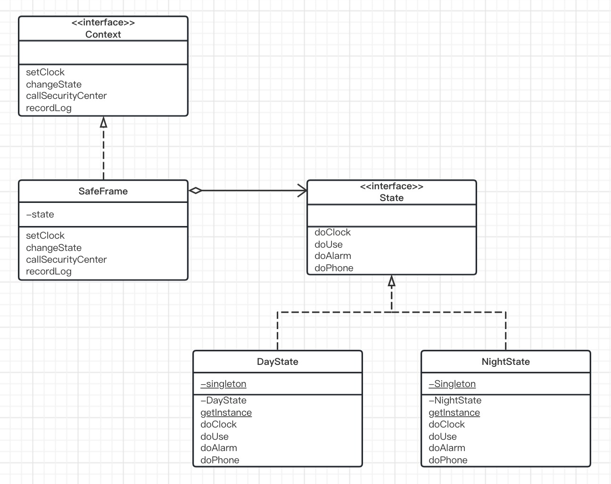
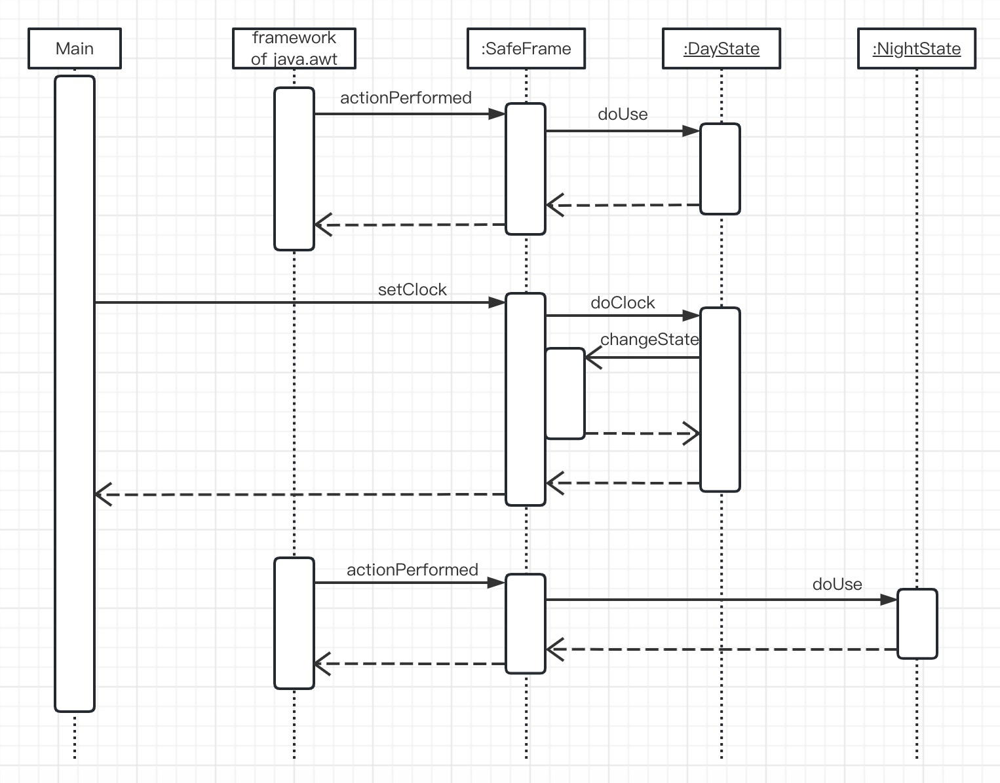
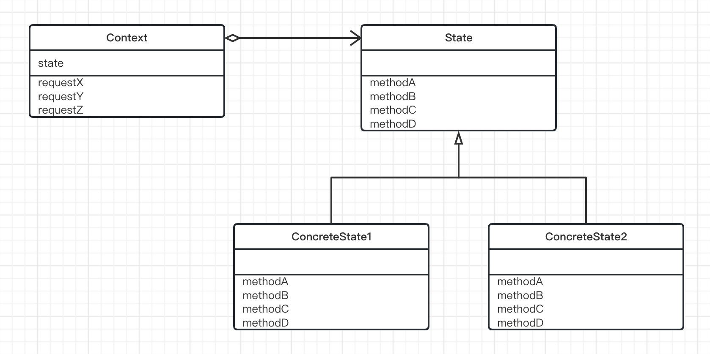

# State模式（状态模式）

> 在面向对象编程中，是用类表示对象的。也就是说，程序的设计者需要考虑用类来表示什么东西。类对应的东西可能存在于真实世界中，也可能不存在于真实世界中。对于后者，可能有人看到代码后会感到吃惊：这些东西居然也可以是类啊。
>
> 在State模式中，我们用类来表示状态。State的意思就是“状态”。在现实世界中，我们会考虑各种东西的“状态”，但是几乎不会将状态当作“东西”看待。因此，可能大家很难理解“用类来表示状态”的意思。
>
> 以类来表示状态后，我们就能通过切换类来方便的改变对象的状态。当需要增加新的状态时，如何修改代码这个问题也会很明确。

## 示例程序类图

> 

## 示例程序

| 名字       | 说明                                                  |
| ---------- | ----------------------------------------------------- |
| State      | 表示金库状态的接口                                    |
| DayState   | 表示“白天”状态的类。它实现了State接口                 |
| NightState | 表示“晚上”状态的类。它实现了State接口                 |
| Context    | 表示管理金库状态，并与报警中心联系的接口              |
| SafeFrame  | 实现了Context接口。在它内部持有按钮和画面显示等UI信息 |
| Main       | 测试程序行为的类                                      |

### State接口

> State接口时表示金库状态的接口。在State接口中定义了以下事件对应的接口（API）。
>
> - 设置时间
> - 使用金库
> - 按下警铃
> - 正常通话
>
> 以上这些接口（API）分别对应我们之前在伪代码中编写的“使用金库时被调用的方法”等方法。这些方法的处理都会根据状态不同而不同。可以说，State接口是一个依赖于状态的方法的集合。
>
> 这些方法接收的参数Context是管理状态的接口。

```java
public interface State {
    /**
     * 设置时间
     * @param context
     * @param hour 时间
     */
    public abstract void doClock(Context context,int hour);

    /**
     * 设置金库
     * @param context
     */
    public abstract void doUse(Context context);

    /**
     * 按下警铃
     * @param context
     */
    public abstract void doAlarm(Context context);

    /**
     * 正常通话
     * @param context
     */
    public abstract void doPhone(Context context);
}
```

### DayState类

> DayState类表示白天的状态。该类实现了State接口，因此它还实现了State接口中声明的所有方法。
>
> 对于每个表示状态的类，我们都只会生成一个实例。因为如果每次发生状态改变时都生成一个实例的话，太浪费内存和时间了。为此，此处我们使用了Singleton模式。
>
> doClock是用于设置时间的方法。如果接收到的参数是晚上的时间，就会切换到夜间状态，即发生状态变化（**状态迁移**）。在该类中，我们调用Context接口的changeState方法改变状态。表示晚上状态的类是NightState类，可以通过NightState类的getInstance方法获取它的实例（这里使用了Singleton模式。请注意并没有通过new NightState（）来生成NightState类的实例。）。
>
> doUse、doAlarm、doPhone分别是使用金库、按下警铃、正常通话等事件的对应的方法。请注意，在这些方法中，并没有任何“判断当前状态”的if语句。在编写这些方法时，开发人员都知道“现在是白天的状态”。在State模式中，每个状态都对应相应的类来表示，因此无需使用if语句或是switch语句来判断状态。

```java
public class DayState implements State{

    private static DayState singleton = new DayState();

    /**
     * 构造函数的可见性为private
     */
    private DayState(){
    }

    /**
     * 获取唯一实例
     * @return
     */
    public static State getInstance() {
        return singleton;
    }

    /**
     * 设置时间
     *
     * @param context
     * @param hour    时间
     */
    @Override
    public void doClock(Context context, int hour) {
        if (hour < 9 || 17 <= hour) {
            context.changState(NightState.getInstance());
        }
    }

    /**
     * 设置金库
     *
     * @param context
     */
    @Override
    public void doUse(Context context) {
        context.recordLog("使用金库（白天）");
    }

    /**
     * 按下警铃
     *
     * @param context
     */
    @Override
    public void doAlarm(Context context) {
        context.callSecurityCenter("按下警铃（白天）");
    }

    /**
     * 正常通话
     *
     * @param context
     */
    @Override
    public void doPhone(Context context) {
        context.callSecurityCenter("正常通话（白天）");
    }

    public String toString() {
        return "[白天]";
    }
}
```

### NightState类

> NightState类表示晚上的状态。它与DayState类一样，也使用了Singleton模式。NightState类的结构与DayState完全相同。

```java
public class NightState implements State{

    private static NightState singleton = new NightState();

    private NightState() {
    }

    public static State getInstance(){
        return singleton;
    }

    /**
     * 设置时间
     *
     * @param context
     * @param hour    时间
     */
    @Override
    public void doClock(Context context, int hour) {
        if (9 <= hour && hour < 17) {
            context.changState(DayState.getInstance());
        }
    }

    /**
     * 设置金库
     *
     * @param context
     */
    @Override
    public void doUse(Context context) {
        context.callSecurityCenter("紧急：晚上使用金库！ ");
    }

    /**
     * 按下警铃
     *
     * @param context
     */
    @Override
    public void doAlarm(Context context) {
        context.callSecurityCenter("按下警铃（晚上）");
    }

    /**
     * 正常通话
     *
     * @param context
     */
    @Override
    public void doPhone(Context context) {
        context.recordLog("晚上的通话记录");
    }

    public String toString(){
        return "[晚上]";
    }
}
```

### SafeFrame类

> SafeFrame类是使用GUI实现警报系统界面的类(safe有“金库”的意思)。它实现了Context接口。
>
> SafeFrame类中有表示文本输人框(TextField)、多行文本输人框(TextArea)和按钮(Button)等各种控件的宇段。不过，也有一个不是表示控件的字段—state字段。它表示的是金库现在的状态，其初始值为“白天〞状态。
>
> SafeFrame类的构造两数进行了以下处理。
>
> - **设置背景色**
> - **设置布局管理器**
> - **设置控件**
> - **设置监听器(Listener)**
>
> 监听器的设置非常重要，这里有必要稍微详细地了解一下。我们通过调用各个按钮的addActionListener方法来设置监听器。addActionListener方法接收的参数是“当按钮被按下时会被调用的实例”，该实例必须是实现了ActionListener接口的实例。本例中，我们传递的参数是this，即safeFrame类的实例自身(从代码中可以看到，safeFrame类的确实现了Actiontistener接口)。“当按钮被按下后，**监听器**会被调用”这种程序结构类似于Observer模式。
>
> 当按钮被按下后，actionPerformed方法会被调用。该方法是在ActionListener(java.awt.event.ActionListener)接口中定义的方法，因此我们不能随意改变该方法的名称。在该方法中，我们会先判断当前哪个按钮被按下了，然后进行相应的处理。
>
> 请注意，这里虽然出现了if语句，但是它是用来判断“按钮的种类”的，而并非用于判断“当前状态”。请不要将我们之前说过〝使用State模式可以消除if语句”误认为是“程序中不会出现任何if语句”。
>
> 处理的内容对State模式非常重要。例如，当金库使用按钮被按下时，以下语句会被执行。
>
> ```java
> state.doUse(this);
> ```
>
> 我们并没有先去判断当前时间是白天还是晚上，也没有判断金库的状态，而是直接调用了doUse方法。这就是State模式的特点。如果不使用State模式，这里就无法直接调用douse方法，而是需要“根据时问状态来进行相应的处理”。
>
> 在setClock方法中我们设置了当前时间。以下语句会将当前时间显示在标准输出中。
>
> ```java
> System.out.println(clockstring);
> ```
>
> 以下语向则会将当前时间显示在textclock文本输人框(界面最上方)中。
>
> ```java
> textclock.setrext(clockstring);
> ```
>
> 接着，下面的语句会进行当前状态下相应的处理(这时可能会发生状态迁移)。
>
> ```java
> state.doClock(this, hour);
> ```
>
> changestate方法会调用Daystate类和Nightstate类。当发生状态迁移时，该方法会被调用。实际改变状态的是下面这条语句。
>
> ```java
> this.state = state;
> ```
>
> **给代表状态的宇段赋予表示当前状态的类的实例，就相当于进行了状态迁移。**
>
> callsecurityCenter方法表示联系警报中心，recordLog方法表示在警报中心留下记录。这里我们只是简单地在textScreen多行文本输人框中增加代表记录的文字信息。真实情况下，这里应当访问警报中心的网络进行一些处理。

```java
import java.awt.*;
import java.awt.event.ActionEvent;
import java.awt.event.ActionListener;

public class SafeFrame extends Frame implements ActionListener,Context {
    private TextField textClock = new TextField(60);
    private TextArea textScreen = new TextArea(10,60);
    private Button buttonUse = new Button(" 使用金库 ");
    private Button buttonAlarm = new Button(" 按下警铃 ");
    private Button buttonPhone = new Button(" 正常通话 ");
    private Button buttonExit = new Button(" 结束 ");

    private State state = DayState.getInstance();

    public SafeFrame(String title) {
        super(title);
        setBackground(Color.lightGray);
        setLayout(new BorderLayout());
        //配置textClock
        add(textClock, BorderLayout.NORTH);
        textClock.setEditable(false);
        //配置textScreen
        add(textScreen, BorderLayout.CENTER);
        textScreen.setEditable(false);
        //为界面添加按钮
        Panel panel = new Panel();
        panel.add(buttonUse);
        panel.add(buttonAlarm);
        panel.add(buttonPhone);
        panel.add(buttonExit);
        //配置界面
        add(panel, BorderLayout.SOUTH);
        //显示
        pack();
        show();
        //设置监听器
        buttonUse.addActionListener(this);
        buttonAlarm.addActionListener(this);
        buttonPhone.addActionListener(this);
        buttonExit.addActionListener(this);
    }
    /**
     * Invoked when an action occurs.
     *
     * @param e the event to be processed
     */
    @Override
    public void actionPerformed(ActionEvent e) {
        System.out.println(e.toString());
        if (e.getSource() == buttonUse) {
            state.doUse(this);
        } else if (e.getSource() == buttonAlarm) {
            state.doAlarm(this);
        } else if (e.getSource() == buttonPhone) {
            state.doPhone(this);
        } else if (e.getSource() == buttonExit) {
            System.exit(0);
        } else {
            System.out.println("?");
        }
    }

    /**
     * 设置时间
     *
     * @param hour 时间
     */
    @Override
    public void setClock(int hour) {
        String clockString = "现在时间是 ";
        if (hour < 10) {
            clockString += "0" + hour + ":00";
        } else {
            clockString += hour + ":00";
        }
        System.out.println(clockString);
        textClock.setText(clockString);
        state.doClock(this, hour);
    }

    /**
     * 改变状态
     *
     * @param state 状态
     */
    @Override
    public void changState(State state) {
        System.out.println("从" + this.state + "状态变为了" + state + "状态。");
        this.state = state;
    }

    /**
     * 联系报警中心
     *
     * @param msg 消息
     */
    @Override
    public void callSecurityCenter(String msg) {
        textScreen.append("call! " + msg + "\n");
    }

    /**
     * 在报警中心留下记录
     *
     * @param msg 消息记录
     */
    @Override
    public void recordLog(String msg) {
        textScreen.append("record ... " + msg + "\n");
    }
}
```

### Main类

> Main类生成了一个SafeFrame类的实例并每秒调用一次setClock方法，对该实例设置一次事件。这相当于在真实世界中经过一个小时。

```java
public class Main {
    public static void main(String[] args) {
        SafeFrame frame = new SafeFrame("State Sample");
        while (true) {
            for (int hour = 0; hour < 24; hour++) {
                frame.setClock(hour);
                try {
                    Thread.sleep(1000);
                } catch (InterruptedException e) {
                }
            }
        }
    }
}
```

### 示例程序时序图

> 

## State模式中登场的角色

- ### State（状态）

  > State角色表示状态，定义了根据不同状态进行不同处理的接口（API）。该接口（API）是哪些**处理内容依赖处于状态的方法的集合**。
  >
  > 在示例程序中，由State接口扮演此角色。

- ### ConcreteState（具体状态）

  > ConcreteState角色表示各个具体的状态，它实现了State接口。
  >
  > 在示例程序中，由DayState类和NightState类扮演此角色。

- ### Context（状况、前后关系、上下文）

  > Context角色持有表示当前状态的ConcreteState角色。此外，它还定义了外部调用者使用State模式的接口（API）。
  >
  > 在示例程序中，由Context接口和SafeFrame类扮演此角色。
  >
  > 补充说明。在示例程序中，由Context角色的作用被Context接口和SafeFrame类分担了。具体而言，Context接口定义了外部调用者使用State模式的接口（API），而SafeFrame类则持有表示当前状态的ConcreteState角色。

### State模式的类图

> 

## 拓展思路

- ### 分而治之

  > 在编程时，我们经常会使用**分而治之**的方针。它非常适用于大规模的复杂处理。当遇到庞大且复杂的问题，不能用一般的方法解决时，我们会先将该问题分解为多个小问题。如果还是不能解决这些小问题，我们会将它们继续划分为更小的问题，直至可以解决它们为止。分而治之，简单而言就是将一个复杂的大问题分解为多个小问题然后逐个解决。
  >
  > 在State模式中，我们用类来表示状态，并为每一种具体的状态都定义一个相应的类。这样，问题就被分解了。开发人员可以在编写一个Concretestate角色的代码的同时，在头脑中(一定程度上)考志其他的类。在本章的金库警报系统的示例程序中，只有“白天〞和〝晚上〞两个状态，可能大家对此感受不深，但是当状态非常多的时候，State模式的优势就会非常明显了。
  >
  > 在不使用State模式时，我们需要使用条件分支语句判断当前的状态，然后进行相应的处理。状态越多，条件分支就会越多。而且，我们必须在所有的事件处理方法中都编写这些条件分支语句。
  >
  > State模式用类表示系统的“状态”，并以此将复东的程序分解开来。

- ### 依赖于状态的处理

  > 我们来思考一下SafeFrame类的setClock方法和state接口的doClock方法之间的关系。
  >
  > Main类会调用safeFrame类的setClock方法，告诉setClock方法“请设置时间”。在setClock方法中，会像下面这样将处理委托给state类。
  >
  > ```java
  > state.doClock(this, hour);
  > ```
  >
  > 也就是说，我们将设置时间的处理看作是“依赖于状态的处理”。
  >
  > 当然，不只是doClock方法。在state接口中声明的所有方法都是“依赖于状态的处理”，都是“状态不同处理也不同”。这虽然看似理所当然，不过却需要我们特别注意。
  >
  > 在State模式中，应该如何编程，以实现“依赖于状态的处理”呢？总结起来有如下两点。
  >
  > - **定义接口，声明抽象方法**
  > - **定义多个类，实现具体方法**
  >
  > 这就是State模式中的“依赖于状态的处理”的实现方法。
  >
  > 这里故意将上面两点说得很笼统，但是，在读完这两点之后会点头表示赞同，那就意味着大家完全理解了State模式以及接口与类之间的关系

- ### 应当是谁来管理状态迁移

  > 用类来表示状态，将依赖于状态的处理分散在每个ConcreteState角色中，这是一种非常好的解决办法。
  >
  > 不过，在使用State模式时需要注意**应当是谁来管理状态迁移**。
  >
  > 在示例程序中，扮演Context角色的SafeFrame类实现了实际进行状态迁移的changeState方法。但是，实际调用该方法的却是扮演ConcreteState角色的DayState类和NightState类。也就是说，在示例程序中，我们将“状态迁移”看作是“依赖于状态的处理”。这种处理方式既有优点也有缺点。
  >
  > 优点是这种处理方式将“什么时候从一个状态迁移到其他状态”的信息集中在了一个类中。也就是说，当我们想知道“什么时候会从DayState类变化为其他状态”时，只需要阅读DayState类的代码就可以了。
  >
  > 缺点是〝每个ConcreteState角色都需要知道其他ConereteState角色”。例如，DayState类的doClock方法就使用了NightState类。这样，如果以后发生需求变更，需要删除NightState类时，就必须要相应地修改DayState类的代码。将状态迁移交给ConcreteState角色后，每个ConcreteState角色都需要或多或少地知道其他ConcreteState角色。也就是说，将状态迁移交给ConcreteState角色后，各个类之间的依赖关系就会加强。我们也可以不使用示例程序中的做法，而是将所有的状态迁移交给扮演Context角色的SafeFrame类来负责。有时，使用这种解决方法可以提高ConcreteState角色的独立性，程序的整体结构也会更加清晰。不过这样做的话，Context角色就必须要知道“所有的ConcreteState角色”。在这种情况下，我们可以使用Mediator模式。
  >
  > 当然，还可以不用State模式，而是用状态迁移表来设计程序。所谓状态迁移表是可以根据“输人和内部状态”得到〝输出和下一个状态〞的一览表。当状态迁移遵循一定的规则时，使用状态迁移表非常有效。此外，当状态数过多时，可以用程序来生成代码而不是手写代码。

- ### 不会自相矛盾

  > 如果不使用State模式，我们需要使用多个变量的值的集合来表示系统的状态。这时，必须十分小心，注意不要让变量的值之间互相矛盾。
  >
  > 而在State模式中，是用类来表示状态的。这样，我们就只需要一个表示系统状态的变量即可。在示例程序中，SafeFrame类的state字段就是这个变量，它决定了系统的状态。因此，不会存在自相矛盾的状态。

- ### 易于增加新的状态

  > 在State模式中增加新的状态是非常简单的。以示例程序来说，编写一个xxxState类，让它实现State接口，然后实现一些所需的方法就可以了。当然，在修改状态迁移部分的代码时，还是需要仔细一点的。因为状态迁移的部分正是与其他ConcreteState角色相关联的部分。
  >
  > 但是，在State模式中增加其他“依赖于状态的处理”是很困难的。这是因为我们需要在State接口中增加新的方法，并在所有的ConcreteState角色中都实现这个方法。虽说很困难，但是好在我们绝对不会忘记实现这个方法。假设我们现在在State接口中增加了一个doYYY方法，而忘记了在DayState类和NightState类中实现这个方法，那么编译器在编译代码时就会报错，告诉我们存在还设有实现的方法。
  >
  > 如果不使用State模式，那么增加新的状态时会怎样呢?这里，如果不使用State模式，就必领用if语句判断状态。这样就很难在编译代码时检测出“忘记实现方法〞这种错误了(在运行时检测出问题并不难。我们只要事先在每个方法内部都加上一段“当检测到没有考虑到的状态时就报错”的代码即可)。

- ### 实例的多面性

  > 请注意SafeFrame类中的以下两条语句。
  >
  > - **SafeFrame类的构造函数中的**
  >
  >   ```java
  >   buttonUse.addActionListener(this);
  >   ```
  >
  > - **actionPerformed方決中的**
  >
  >   ```java
  >   state.doUse(this);
  >   ```
  >
  >   
  >
  > 这两条语句中都有this。那么这个this到底是什么呢?当然，它们都是SafeFrame类的实例。由于在示例程序中只生成了一个SafeFrame的实例，因此这两个this其实是同一个对象。
  >
  > 不过，在addActionListener方法中和doUse方法中，对this的使用方式是不一样
  >
  > 向addActionListener方法传递this时，该实例会被当作“实现了ActionListener接又的类的实例”来使用。这是因为addActionListener方法的参数类型是ActionListener类型。在addactionListener方法中会用到的方法也都是在ActionListener接又中定义了的方法。至于这个参数是否是SafeFrame类的实例并不重要。
  >
  > 向doUse方法传递this时，该实例会被当作“实现了Context接又的类的实例”来使用。这是因为doUse方法的参数类型是Context类型。在doUse方法中会用到的方法也都是在Context接又中定义了的方法(只要再回顾一下DayState类和NightState类的doUse方法就会明白了)。
  >
  > 一定要透彻理解此处的实例的多面性。