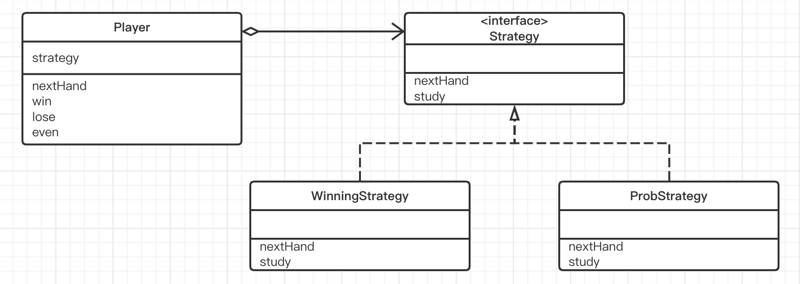
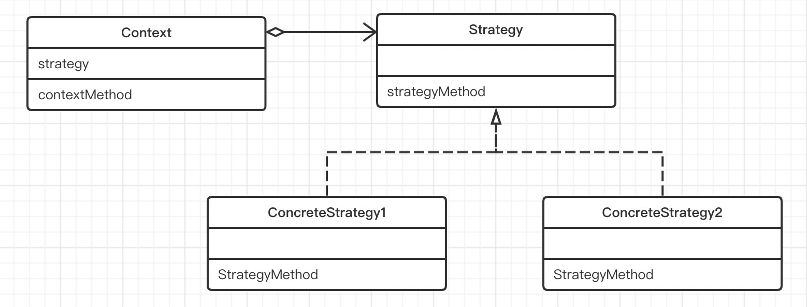

# Strategy模式（策略模式）

> Strategy 的意思是“策略”，指的是与敌军对垒时行军作战的方法。在编程中，我们可以将它们理解为“算法”。
>
> 无论什么程序，其目的都是解决问题。而是为了解决问题，我们又需要编写特定的算法。使用Strategy模式可以整体地替换算法的实现部分。能够整体地替换算法，能让我们轻松地以不同的算法去解决同一个问题，这种模式就是Strategy。

## 示例类图

> 

## 示例程序

> ### Hand类
>
> ```java
> public class Hand {
>     public static final int HANDVALUE_GUU = 0; //表示石头的值
>     public static final int HANDVALUE_CHO = 1; //表示剪刀的值
>     public static final int HANDVALUE_PAA = 2; //表示布的值
>     /**
>      * 表示猜拳中3种手势的实例
>      */
>     public static final Hand[] hand = {
>             new Hand(HANDVALUE_GUU),
>             new Hand(HANDVALUE_CHO),
>             new Hand(HANDVALUE_PAA)
>     };
>     /**
>      * 猜拳中手势所对应的字符串
>      */
>     private static final String[] name = {
>             "石头","剪刀","布"
>     };
>     /**
>      * 猜拳中出的手势值
>      */
>     private int handValue;
> 
>     public Hand(int handValue) {
>         this.handValue = handValue;
>     }
> 
>     /**
>      * 根据手势的值获取其对应的实例
>      * @param handValue 值
>      * @return 对应的实例
>      */
>     public static Hand getHand(int handValue){
>         return hand[handValue];
>     }
> 
>     /**
>      * 如果this胜了h则返回true
>      * @param h 实例
>      * @return 胜负
>      */
>     public boolean isStrongerThen(Hand h){
>         return fight(h) == 1;
>     }
> 
>     /**
>      * 如果this输给了h则返回true
>      * @param h 实例
>      * @return 胜负
>      */
>     public boolean isWeakerThen(Hand h){
>         return fight(h) == -1;
>     }
> 
>     /**
>      * 计分：平 0，胜 1，负 -1
>      * @param h
>      * @return
>      */
>     private int fight(Hand h){
>         if (this == h){
>             return 0;
>         } else if ((this.handValue + 1) % 3 == h.handValue) {
>             return 1;
>         } else {
>             return -1;
>         }
>     }
> 
>     /**
>      * 转化为手势值所对应的字符串
>      * @return
>      */
>     public String toString() {
>         return name[handValue];
>     }
> }
> ```
>
> ### Strategy 接口
>
> Strategy接口是定义了猜拳策略的抽象方法的接口。
>
> nextHand方法的作用是“获取下一局要出的手势”。调用该方法后，实现了Strategy接口的类会绞尽脑汁想出下一局出什么手势。
>
> study方法的作用是学习“上一局的手势是否获胜了”。如果在上一局中调用了nextHand方法获胜了，就接着调用study（true）；如果输了，就接着调用study（false）。这样，Strategy接口的实现类就会改变自己的内部状态，从而为下一次nextHand被调用时究竟是返回“石头” “剪刀” 还是“布”提供判断依据。
>
> ```java
> public interface Strategy {
>     public abstract Hand nextHand();
>     public abstract void study(boolean win);
> }
> ```
>
> ### WinningStrategy 类
>
> WinningStrategy类是Strategy接口的实现类之一，它实现了nextHand和study两个方法。
>
> 该类的猜拳策略有些崩，如果上一局的手势获胜了，则下一局的手势就与上局相同（上一局出石头，下一局继续出石头；上一局出布，下一局继续出布）。如果让一局的手势输了，则下一局就随机出手势。
>
> 由于在WinningStrategy类中需要使用随机值，因此我们在random字段中保存了java.util.Random的实例。也可以说，random字段是该类的一个随机数生成器。
>
> 在won字段中保存了上一局猜拳的输赢结果。如果上一局猜拳获胜了，则won值为true；如果输了，则won值为false。
>
> 在prevHand字段中保存的是上一局出的手势。
>
> ```java
> public class WinningStrategy implements Strategy{
>     private Random random;
>     private boolean won = false;
>     private Hand prevHand;
> 
>     public WinningStrategy(int seed) {
>         this.random = new Random(seed);
>     }
> 
>     @Override
>     public Hand nextHand() {
>         if (!won) {
>             prevHand = Hand.getHand(random.nextInt(3));
>         }
>         return prevHand;
>     }
> 
>     @Override
>     public void study(boolean win) {
>         won = win;
>     }
> }
> ```
>
> ### ProbStrategy 类
>
> ProbStrategy类是另外一个具体策略，这个策略就需要“动点脑筋”了。虽然它与WinningStrategy类一样，也是随机出手势，但是每一种手势出现的概率会根据疫情的猜拳结果而改变。
>
> history字段是一个表，被用于根据过去的胜负来进行概率计算。它是一个二维数组，每个数组下标的意思如下。
>
> `history[上一局出的手势][这一局所出的手势]`
>
> 这个表达式的值越大，表示过去的胜率越高。下面稍微讲解下。
>
> `history[0][0]`两局分别出石头、石头时胜了的次数
>
> `history[0][1]`两局分别出石头、剪刀时胜了的次数
>
> `history[0][2]`两局分别出石头、布时胜了的次数
>
> 那么，我们就可以根据`history[0][0]`、`history[0][1]`、`history[0][2]`这3个表达式的值从概率上计算出下一局出声明。简而言之，就是先计算3个表达式的值和（getSun方法），然后再从0与这个之间取一个随机数，并据此决定下一局应该出什么（nextHand方法）。
>
> 例如，如果
>
> `history[0][0]`是3
>
> `history[0][1]`是5
>
> `history[0][2]`是7
>
> 那么，下一局出什么就会以石头、剪刀和布的比率为3:5:7来决定。然后在0至15（不含15，15是3+5+7的和）之间取一个随机数。
>
> **如果该随机数在0至3（不含3）之间，那么出石头**
>
> **如果该随机数在3至8（不含8）之间，那么出剪刀**
>
> **如果该随机数在8至15（不含15）之间，那么出布**
>
> study方法会根据nextHand方法返回的手势的胜负结果来更新history字段中的值。
>
> ```java
> public class ProbStrategy implements Strategy{
>     private Random random;
>     private int prevHandValue = 0;
>     private int currentHandValue = 0;
>     private int[][] history = {
>             {1,1,1},
>             {1,1,1},
>             {1,1,1}
>     };
> 
>     public ProbStrategy(int seed) {
>         this.random = new Random(seed);
>     }
> 
>     @Override
>     public Hand nextHand() {
>         int bet = random.nextInt(getSum(currentHandValue));
>         int handvalue = 0;
>         if ( bet < history[currentHandValue][0] ){
>             handvalue = 0;
>         } else if ( bet < history[currentHandValue][0] + history[currentHandValue][1]) {
>             handvalue = 1;
>         } else {
>             handvalue = 2;
>         }
>         prevHandValue = currentHandValue;
>         currentHandValue = handvalue;
>         return Hand.getHand(handvalue);
>     }
> 
>     private int getSum(int hv){
>         int sum = 0;
>         for (int i = 0; i < 3; i++) {
>             sum += history[hv][i];
>         }
>         return sum;
>     }
> 
>     @Override
>     public void study(boolean win) {
>         if (win) {
>             history[prevHandValue][currentHandValue]++;
>         } else {
>             history[prevHandValue][(currentHandValue + 1) % 3]++;
>             history[prevHandValue][(currentHandValue + 2) % 3]++;
>         }
>     }
> }
> ```
>
> ### Player 类
>
> Player类是表示进行猜拳游戏的选手的类。在生成Player类的实例时，需要向其传递“姓名”和“策略”。nextHand方法是用来获取下一局手势的方法，不过实际上决定下一局手势的是各个策略。Player类的nextHand方法的返回值其实就是策略的nextHand方法的返回值。nextHand方法将自己的工作委托给了Strategy，这就形成了一种委托关系。
>
> 在决定下一局要出的手势时。需要知道之前各局的胜（win）、负（lose）、平（even）等结果，因此Player类会通过strategy字段吊桶study方法，然后study方法会改变策略的内部状态。wincount、losecount和gamecount用于记录选手的猜拳结果。
>
> ```java
> public class Player {
>     private String name;
>     private Strategy strategy;
>     private int winCount;
>     private int loseCount;
>     private int gameCount;
> 
>     public Player(String name, Strategy strategy) {
>         this.name = name;
>         this.strategy = strategy;
>     }
> 
>     public Hand nextHand() {
>         return strategy.nextHand();
>     }
>     public void win() {
>         strategy.study(true);
>         winCount++;
>         gameCount++;
>     }
>     public void lose() {
>         strategy.study(false);
>         loseCount++;
>         gameCount++;
>     }
>     public void even() {
>         gameCount++;
>     }
> 
>     @Override
>     public String toString() {
>         return "[" + name + ":" + gameCount + " games," + winCount + " win," + loseCount + " lose" + "]";
>     }
> }
> ```
>
> ### Main 类
>
> Main类负责使用以上类让电脑进行猜拳游戏。这里Main类让以下两位选手进行10000局比赛，然后显示比赛结果。
>
> - **姓名：“Taro”、策略：WinningStrategy**
>
> - **姓名：“Hana”、策略：ProbStrategy**
>
> 此外，“Winner：” + player1 与 “Winner：” + Player1 .toString()的意思是一样的。
>
> ```java
> public class Main {
>     public static void main(String[] args) {
>         if (args.length != 2) {
>             System.out.println("Usage: java Main randomseed1 randomseed2");
>             System.out.println("Example: java Main 314 15");
>             System.exit(0);
>         }
>         int seed1 = Integer.parseInt(args[0]);
>         int seed2 = Integer.parseInt(args[1]);
>         Player player1 = new Player("Taro", new WinningStrategy(seed1));
>         Player player2 = new Player("Hana", new ProbStrategy(seed2));
>         for (int i = 0; i < 10000; i++) {
>             Hand nextHand1 = player1.nextHand();
>             Hand nextHand2 = player2.nextHand();
>             if (nextHand1.isStrongerThen(nextHand2)) {
>                 System.out.println("Winner:" + player1);
>                 player1.win();
>                 player2.lose();
>             } else if (nextHand2.isStrongerThen(nextHand1)) {
>                 System.out.println("Winner:" + player2);
>                 player1.lose();
>                 player2.win();
>             } else {
>                 System.out.println("Even...");
>                 player1.even();
>                 player2.even();
>             }
>         }
>         System.out.println("Total result:");
>         System.out.println(player1.toString());
>         System.out.println(player2.toString());
>     }
> }
> ```
>
> 

## Strategy模式中的登场角色

### Strategy模式的类图

> 

- ### Strategy（策略）

  > Strategy角色负责决定实现策略所必需的接口（API）。
  >
  > 在示例程序中，由Strategy接口扮演此角色。

- ### ConcreteStrategy（具体的策略）

  > ConcreteStrategy角色负责实现Strategy角色的接口（API），即负责实现具体的策略（战略、方向、方法和算法）。
  >
  > 在示例程序中，由WinningStrategy类和ProbStrategy类扮演此角色。

- ### Context（上下文）

  > 负责使用Strategy角色。Context角色保存了ConcreteStrategy角色的实例，并使用ConcreteStrategy角色去实现需求（总之，还是要调用Strategy 角色的接口（API））。
  >
  > 在示例程序中，由Player类扮演此角色。

## 思路要点

- ### 为什么需要特意编写Strategy角色

  > 通常在编程时算法会被写在具体方法中。Strategy模式却特意将算法与其他部分分离开来，只是定义了与算法相关的接口（API），然后在程序中以委托的方式来使用算法。
  >
  > 这样看起来程序好像变负责了，其不然。例如，当我们想要通过改善算法来提高算法的处理速度时，如果使用了Strategy模式，就不必修改Strategy角色的接口（API）了，仅仅修改ConcreteStrategy角色即可。而且，**使用委托这种弱关联关系可以很方便的整体替换算法**。例如，如果想比较原来的算法与改进后的算法的处理速度有多大区别，简单的替换下算法即可进行测试。
  >
  > 使用Strategy模式编写象棋程序时，可以方便的根据棋手的选择切换AI例程的水平。

- ### 程序运行中也可以切换策略

  > 若果使用Strategy模式，在程序进行中也可以切换ConcreteStrategy角色。例如，在内存容量少的运行环境中可以使用SlowButLessMemoryStrategy（速度慢但省内存的策略），而在内存容量多的运行环境中则可以使用FastButMoreMemoryStrategy（速度快但耗内存的策略）。
  >
  > 此外，还可以用某种算法去“验算”另外一种算法。例如，假设要在某个表格计算软件的开发版本中进行复杂的计算。这时，我们可以准备两种算法，即“高速但计算上可能有Bug的算法”和“低速但计算准确的算法”，然后让后者去验算两者的计算结果。

## 所学知识

> 借助于委托，算法的替换，特别是动态替换成为了可能。