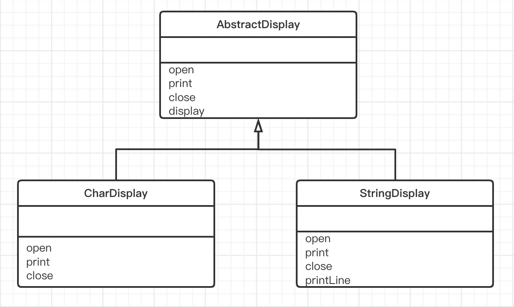

# TemplateMethod模式（模版方法模式）

> **Template Method模式**是带有模版功能的模式，组成模版的方法被定义在父类中。
> 由于这些方法是抽象方法，所以只查看父类的代码是无法知道这些方法最终会进行何种具体处理的，唯一能知道的就是父类是如何调用这些方法的。
>
> 实现上述这些抽象方法的是子类。在子类中实现了抽象方法也就决定了具体的处理。也就是说，只要在不同的子类中实现不同的具体处理，当父类的模版方法被调用时程序行为也会不同。但是，不论子类中的具体实现如何，处理的流程都会按照父类中所定义的那样进行。
>
> 像这样**在父类中定义处理流程的框架，在子类中实现具体处理**的模式就称为**Template Method模式**。

## 示例类图

> 

## 示例程序

> ### AbstractDisplay类
>
> AbstractDisplay类有4个方法，分别是display、open、print、close。其中只有display方法实现了，open、print、close都是抽象方法。通过查看AbstractDisplay类中display方法的代码，我们可以知道display方法进行了以下处理。
>
> - 调用open方法
> - 调用5次print方法
> - 调用close方法
>
> 那么在open方法、print方法、close方法中各进行了什么处理呢？通过查看AbstractDisplay类的代码，我们可以知道这3个方法都是抽象方法。也就是说，如果仅仅查看AbstractDisplay类的代码，我们无法知道这3个方法中到底进行了什么样的处理。这是因为open方法、print方法、close方法的实际处理被交给了AbstractDisplay类的子类。
>
> ```java
> public abstract class AbstractDisplay {
>     /**
>      * 交给子类实现的抽象方法 open()
>      */
>     public abstract void open();
> 
>     /**
>      * 交给子类实现的抽象方法 print()
>      */
>     public abstract void print();
> 
>     /**
>      * 交给子类实现的抽象方法 close()
>      */
>     public abstract void close();
> 
>     /**
>      * 本抽象类中实现的 display()
>      */
>     public final void display(){
>         open();
>         for (int i = 0; i < 5; i++) {
>             print();
>         }
>         close();
>     }
> }
> ```
>
> ### CharDisplay类
>
> CharDisplay类实现了父类AbstractDisplay类中的3个抽象方法open、print、close，因此它并不是抽象类。
>
> ```java
> public class CharDisplay extends AbstractDisplay{
>     private char aChar;
> 
>     public CharDisplay(char aChar) {
>         this.aChar = aChar;
>     }
> 
>     /**
>      * 交给子类实现的抽象方法 open()
>      */
>     @Override
>     public void open() {
>         System.out.print("<<");
>     }
> 
>     /**
>      * 交给子类实现的抽象方法 print()
>      */
>     @Override
>     public void print() {
>         System.out.print(aChar);
>     }
> 
>     /**
>      * 交给子类实现的抽象方法 close()
>      */
>     @Override
>     public void close() {
>         System.out.println(">>");
>     }
> }
> ```
>
> ### StringDisplay类
>
> StringDisplay类，与CharDisplay类一样，它也实现了open、print、close方法。
>
> ```java
> public class StringDisplay extends AbstractDisplay{
> 
>     private String string;
> 
>     private int width;
> 
>     public StringDisplay(String string) {
>         this.string = string;
>         width = string.getBytes().length;
>     }
> 
>     /**
>      * 交给子类实现的抽象方法 open()
>      */
>     @Override
>     public void open() {
>         printLine();
>     }
> 
>     /**
>      * 交给子类实现的抽象方法 print()
>      */
>     @Override
>     public void print() {
>         System.out.print("|" + string + "|");
>     }
> 
>     /**
>      * 交给子类实现的抽象方法 close()
>      */
>     @Override
>     public void close() {
>         printLine();
>     }
> 
>     public void printLine(){
>         System.out.print("+");
>         for (int i = 0; i < width; i++) {
>             System.out.print("-");
>         }
>         System.out.println("+");
>     }
> }
> ```
>
> ### Main类
>
> Main类，在该类中生成了CharDisplay类和StringDisplay类的实例，并调用display方法。
>
> ```java
> public class Main {
>     public static void main(String[] args) {
>         // 生成一个持有'A'的CharDisplay类的实例
>         AbstractDisplay d1 = new CharDisplay('A');
>         // 生成一个持有"hello,world."的StringDisplay类的实例
>         AbstractDisplay d2 = new StringDisplay("hello,world.");
>         // 生成一个持有"你好，世界。"的StringDisplay类的实例
>         AbstractDisplay d3 = new StringDisplay("你好，世界。");
>         /*
>         * 由于d1、d2、d3都是AbstractDisplay的子类
>         * 可以调用display方法
>         * 实际程序运行的行为取决与CharDisplay类和StringDisplay类的具体实现
>         * */
>         d1.display();
>         d2.display();
>         d3.display();
>     }
> }
> ```

## Template Method 模式中的登场角色

- ### AbstractClass（抽象类）

  > **AbstractClass角色**不仅负责实现模版方法，还负责声明在模版方法中所使用到的抽象方法。这些抽象方法由子类**ConcreteClass角色**负责实现。

- ### ConcreteClass（具体类）

  > 该角色负责具体实现**AbstractClass角色**中定义的抽象方法。

## 拓展思路要点

- ### 可以使逻辑处理通用化

  > 使用Template Method 模式有什么好处？这里，它的优点是由于在父类的模版方法中编写了算法，因此无需在每个子类中再编写算法。
  >
  > 例如，我们没使用Template Method模式，而是使用文本编辑器复制和粘贴功能编写了多个ConcreteClass角色。此时，会出现ConcreteClass1、ConcreteClass2、ConcreteClass3等很多相似的类。编写完成后立即发现bug还好，但如果是过了一段时间才发现在ConcreteClass1中有Bug，该怎么办？这时，我们就必须将这个Bug的修改反应到所有的ConcreteClass角色中才行。
  >
  > 如果是使用Template Method模式进行编程，当我们在模版模式中发现Bug时，只需要修改模版方法即可解决问题。

- ### 父类与子类之间的协作

  > 在Template Method 模式中，父类和子类是紧密联系、共同工作的。因此，在子类中实现父类中声明的抽象方法时，必须要理解这些抽象方法被调用的时机。在看不到父类的源码的情况下想要编写出子类时非常困难的。

- ### 父类与子类的一致性

  > 在示例程序中，不论时CharDisplay的实例还是StringDisplay的示例，都是先保存在AbstractDisplay类型的变量中，然后再来调用display方法的。
  >
  > 使用父类型的变量保存子类实例的优点是，即使没有用instanceof等指定子类的种类，程序也能正常工作。
  >
  > 无论在父类型的变量中保存那个子类的实例，程序都可以正常工作，这种原则称为里氏替换原则（The Liskov Substitution Principle, LSP）。当然，LSP并非仅限于 Template Method 模式，它是通用的继承原作。

## 类的层次与抽象类

- ### 父类对子类的要求

  > 我们在理解类的层次，通常是站在子类的角度进行思考的。也就是说，很容易着眼与一下几点。
  >
  > - 在子类中可以使用父类中定义的方法
  > - 可以通过在子类中增加方法以实现新的功能
  > - 在子类中重写父类的方法可以改变程序的行为
  >
  > 现在，让我们稍微改变一下立场，站在父类的角度进行思考。在父类中，我们声明了抽象方法，而将该方法的实现交给了子类。换言之，就程序而言，声明抽象方法是希望达到以下的目的。
  >
  > - 期待子类去实现抽象方法
  > - 要求子类去实现抽象方法
  >
  > 也就是说，子类具有实现在父类中所声明的抽象方法的责任。因此，这种责任被称为“子类责任”。

- ### 抽象类的意义

  > 对于抽象类，我们时无法生成其实例的。在初学抽象类时，有人 回有这样的疑问：“无法生成实例的类到底有什么作用“在学完了Template Method 模式后。大家 应该能够稍微理解抽象类的意义了吧。由于在抽象类方法中并没有编写具体的实现，所以我们无法知道在抽象方法中到底进行了什么样的处理。但是我们可以决定抽象方法的名字，然后通过调用使用了抽象方法的模板方法去编写处理。虽然具体的处理内容是由子类决定的，不过**在抽象类阶段确定处理的流程非常重要**。

- ### 父类与子类之间的协作

  > 父类与子类的相互协作支撑起了整个程序。虽然将更多方法的实现放在父类中会让子类变得更轻松，但是同时也降低了子类的灵活性；反之，如果父类中实现的方法过少，子类就会变得臃肿不堪，而且还会导致各子类间的代码出现重复。
  >
  > 在Template Method 模式中，处理的流程被定义在父类中，而具体的处理则交给子类。但是对于“如何划分处理的级别，那些处理需要由父类完成，那些处理需要交给子类负责”并没有定式，这些都需要由负责程序设计的开发人员来决定。