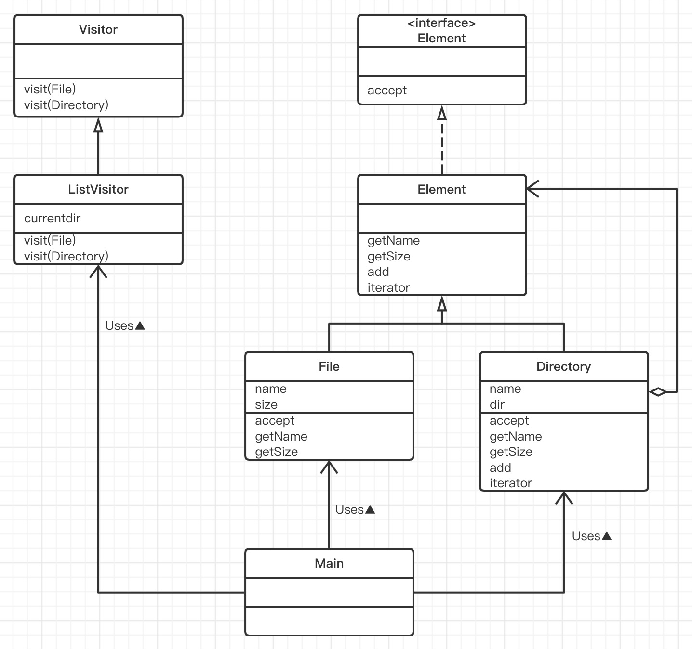
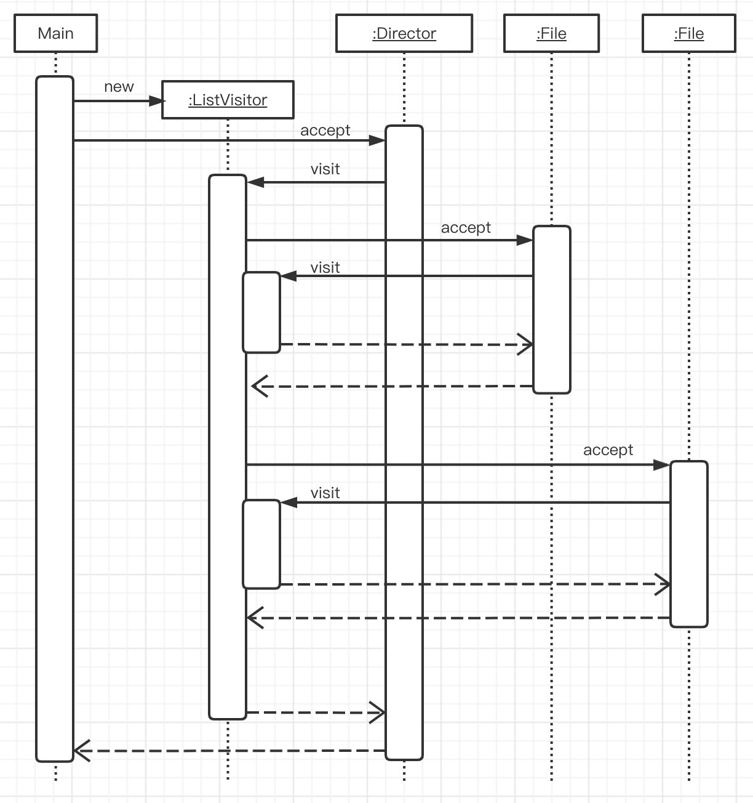

# Visitor模式（访问者模式）

## Visitor模式

> Visitor是“访问者”的意思。
>
> 在数据结构中保存着许多元素，我们回对这些元素进行“处理”。这时，“处理”代码放在哪里比较好呢？通常的做法是将它们放在表示数据结构的类中。但是，如果“处理”有许多种呢？这种情况下，每当增加一种处理，我们就不得不去修改表示数据结构的类。
>
> 在Visitor模式中，**数据结构与处理被分离开来**。我们编写一个表示“访问者”的类来访问数据结构中的元素，并把对各元素的处理交给访问者类。这样，当需要增加新的处理时，我们只需要编写新的访问者，然后让数据结构可以接受访问者的访问即可。

## 示例类图

> 

## 示例程序

> ### Visitor类
>
> Visitor类是表示访问者的抽象类。访问者依赖于它所访问的数据结构（即File类和Directory类）。
>
> Visitor类中定义了两个方法，名字都叫visit。不过它们接收的参数不同，一个接收File类型的参数，另一个接收Directory类的参数。从外部调用visit方法时，程序回根据接收的参数的类型自动选择和执行相应的visit方法。通常，我们称这种方式为方法的**重载**。
>
> ```java
> public abstract class Visitor {
>     public abstract void visitor(File file);
>     public abstract void visitor(Directory directory);
> }
> ```
>
> ### Element接口
>
> Visitor类时表示访问者的类，而Element接口则是接收访问者的访问接口。如果将Visitor比喻为玛丽亚，Element接口就相当于住宿的地方（实现了Element接口的类的实例才是实际住宿的地方）。
>
> Element接口中声明了accept方法（accept在英文中是“接受”的意思）。该方法的参数是访问者Visitor类。
>
> ```java
> public interface Element {
>     public abstract void accept(Visitor v);
> }
> ```
>
> ### Entry类
>
> 虽然Entry类在本质上与Composite模式中的Entry类是一样的，不过本章中的Entry类实现（implements）了Element接口。这是为了让Entry类适用于Visitor模式。实际上实现Element接口中声明的抽象方法accept的是Entry类的子类——File类和Directory类。
>
> add方法仅对Directory类有效，因此在Entry类中，我们让它简单地报错。同样地，用于获取Iterator的iterator方法也仅对Directory类有效，我们也让它简单的报错。
>
> ```java
> public abstract class Entry implements Element{
>     /**
>      * 获取文件名字
>      * @return 文件名字
>      */
>     public abstract String getName();
> 
>     /**
>      * 获取文件大小
>      * @return 文件大小
>      */
>     public abstract int getSize();
> 
>     /**
>      * 增加目录条目
>      * @param entry 条目
>      * @return 条目
>      * @throws FileTreatmentException 文件处理异常
>      */
>     public Entry add(Entry entry) throws FileTreatmentException{
>         throw new FileTreatmentException();
>     }
> 
>     /**
>      * 生成Iterator
>      * @return 迭代器
>      * @throws FileTreatmentException 文件处理异常
>      */
>     public Iterator iterator() throws FileTreatmentException{
>         throw new FileTreatmentException();
>     }
> 
>     /**
>      * 显示字符串
>      * @return 文件详情
>      */
>     public String toString(){
>         return getName() + "(" + getSize() + ")";
>     }
> }
> ```
>
> ### File类
>
> File类也与Composite模式中的File类一样。当然，在Visitor模式中要注意理解它是如何实现accept接口的。accept方法的参数是Visitor类，然后accept方法的内部处理是“v.visit(this);”,即调用了Visitor类的visitor方法。visit方法被重载了，此处调用的是visit(File)。这是因为这里的this是File类的实例。
>
> 通过调用visit方法，可以告诉Visitor“正在访问的对象是File类的实例this”。
>
> ```java
> public class File extends Entry{
>     /**
>      * 文件名
>      */
>     private String name;
>     /**
>      * 文件大小
>      */
>     private int size;
> 
>     public File(String name, int size) {
>         this.name = name;
>         this.size = size;
>     }
> 
>     /**
>      * 获取文件名字
>      *
>      * @return 文件名字
>      */
>     @Override
>     public String getName() {
>         return name;
>     }
> 
>     /**
>      * 获取文件大小
>      *
>      * @return 文件大小
>      */
>     @Override
>     public int getSize() {
>         return size;
>     }
> 
>     @Override
>     public void accept(Visitor v) {
>         v.visitor(this);
>     }
> }
> ```
>
> ### Directory类
>
> Directory类是表示文件夹的类。与Composite模式中的Directory类相比，本章中的Directory类中增加了下面两个方法。
>
> 第一个方法是iterator方法。iterator方法回返回Iterator，我们可以使用它遍历文件夹中的所有目录条目（文件和文件夹）。
>
> 第二个方法当然就是accept方法了。与File类中accept方法调用了visit（File）方法一样，Directory类中的accept方法调用了visit（Directory）方法。这样就可以告诉访问者“当前正在访问的是Directory类的实例”。
>
> ```java
> public class Directory extends Entry{
>     private String name;
>     private ArrayList dir = new ArrayList();
> 
>     public Directory(String name) {
>         this.name = name;
>     }
> 
>     /**
>      * 获取文件名字
>      *
>      * @return 文件名字
>      */
>     @Override
>     public String getName() {
>         return name;
>     }
> 
>     /**
>      * 获取文件大小
>      *
>      * @return 文件大小
>      */
>     @Override
>     public int getSize() {
>         int size = 0;
>         Iterator iterator = dir.iterator();
>         while (iterator.hasNext()) {
>             Entry entry = (Entry) iterator.next();
>             size += entry.getSize();
>         }
>         return size;
>     }
> 
>     /**
>      * 增加目录条目
>      *
>      * @param entry 条目
>      * @return 条目
>      * @throws FileTreatmentException 文件处理异常
>      */
>     @Override
>     public Entry add(Entry entry) throws FileTreatmentException {
>         dir.add(entry);
>         return this;
>     }
> 
>     /**
>      * 生成Iterator
>      *
>      * @return 迭代器
>      * @throws FileTreatmentException 文件处理异常
>      */
>     @Override
>     public Iterator iterator() throws FileTreatmentException {
>         return dir.iterator();
>     }
> 
> 
>     @Override
>     public void accept(Visitor v) {
>         v.visitor(this);
>     }
> }
> ```
>
> ### ListVisitor类
>
> ListVisitor类是Visitor类的子类，它的作用是访问数据结构并显示元素一览。因为ListVisitor类是Visitor类的子类，所以它实现了Visit(File)方法和Visit(Directory)方法。
>
> currentdir字段中保存的是现在正在访问的文件夹的名字。Visit(File)方法在访问者访问文件时会被File类的accept方法调用，参数file是所访问的File类的实例。也就是说，visit(File)方法是用来实现“对File类的实例进行的处理”的。在本例中，我们实现的处理是先显示当前文件夹的名字（currentdir），然后显示间隔符号“/”，最后显示文件名。
>
> visit(Directory)方法实现了“**对Directory类的实例要进行的处理**”。
>
> 本例中是如何实现呢？与visit(File)方法一样，我们先显示当前文件夹的名字，接着调用iterator方法获取文件夹的Iterator，然后通过Iterator遍历文件夹中所有目录条目并调用它们各自的accept方法。由于文件夹中可能存在着许多目录条米，逐一访问会非常困难。
>
> accept方法调用visit方法，visit方法又会调用accept方法，这样就形成了非常复杂的递归调用。通常的递归调用是某个方法调用自身，在Visitor模式中，则是accept方法与visit方法之间相互递归调用。
>
> ```java
> public class ListVisitor extends Visitor{
>     private String currentDir = "";
>     @Override
>     public void visitor(File file) {
>         System.out.println(currentDir + "/" + file);
>     }
> 
>     @Override
>     public void visitor(Directory directory) {
>         System.out.println(currentDir + "/" + directory);
>         String saveDir = this.currentDir;
>         currentDir = currentDir + "/" + directory.getName();
>         Iterator iterator = directory.iterator();
>         while (iterator.hasNext()) {
>             Entry entry = (Entry) iterator.next();
>             entry.accept(this);
>         }
>         currentDir = saveDir;
>     }
> }
> ```
>
> ### FileTeratmentException类
>
> FileTeratmentException类与Composite模式中的FileTeratmentException类完全相同。
>
> ```java
> public class FileTreatmentException extends RuntimeException{
>     public FileTreatmentException() {
>     }
>     
>     public FileTreatmentException(String message) {
>         super(message);
>     }
> }
> ```
>
> ### Main类
>
> Main类与Composite模式中的Main类基本相同。不同之处仅仅在于，本章中的Main类使用了访问者ListVisitor类的实例来显示Directory中的内容。
>
> 在Composite模式中，我们调用printList方法来显示文件夹中的内容。该方法已经在Directory类中（即表示数据结构的类）中被实现了。与之相对，在Visitor模式中是在访问者中显示文件夹中的内容。这是因为显示文件夹中的内容也属于对数据结构中的各元素进行的处理。
>
> ```java
> public class Main {
>     public static void main(String[] args) {
>         try {
>             System.out.println("Making root entries...");
>             Directory rootDir = new Directory("root");
>             Directory binDir = new Directory("bin");
>             Directory tmpDir = new Directory("tmp");
>             Directory usrDir = new Directory("usr");
>             rootDir.add (binDir);
>             rootDir.add(tmpDir);
>             rootDir.add(usrDir);
>             binDir.add(new File("vi",10000));
>             binDir.add(new File("latex",20000));
>             rootDir.accept(new ListVisitor());
> 
>             System.out.println("");
>             System.out.println("Making user entries...");
>             Directory yuki = new Directory("yuki");
>             Directory hanako = new Directory("hanako");
>             Directory tomura = new Directory("tomura");
>             usrDir.add(yuki);
>             usrDir.add(hanako);
>             usrDir.add(tomura);
>             yuki.add(new File("diary.html",100));
>             yuki.add(new File("Composite.java",200));
>             hanako.add(new File("memo.tex",300));
>             tomura.add(new File("game.doc",400));
>             tomura.add(new File("junk.mail",500));
>             rootDir.accept(new ListVisitor());
>         } catch (FileTreatmentException e) {
>             e.printStackTrace();
>         }
>     }
> }
> ```
>
> ### Visitor与Element之间的相互调用
>
> 到这里，应该理解了Visitor模式是如何工作的吧。在初次接触Visitor模式时，完全无法理解这个模式。在头脑中，accept方法和visit方法的调用关系时一片混乱的。因此，这里我们再结合时序图来学习一下示例程序中的处理流程。
>
> 为了方便理解，我们在图中展示了当一个文件夹下有两个文件时，示例程序的处理流程。
>
> 1. 首先，Main类生成ListVisitor的实例。在示例程序中，Main类还生成了其他的Directory类和File类的实例，但在本图中省略了。
> 2. 接着，Main类调用了Directory类的accept方法。这时传递的参数时ListVisitor的实例，但在本图中省略了。
> 3. Directory类的实例调用接收的参数ListVisitor的visit(Directory)方法。
> 4. 接下来，ListVisitor类的实例会访问文件夹，并调用找到的第一个文件的accept方法。传递的参数时自（this）。
> 5. File的示例调用接收到的参数ListVisitor的visit(File)方法。请注意，这时ListVisitor的Visit(Directory)还在执行中（并非多线程执行，而是表示visit(Directory)还存在于调用堆栈(callstack)中的意思。在时序图中，表示声明周期长方形右侧发生了重叠就说明了这一点）。
> 6. 从visit(File)返回到accept，接着又从accept也返回出来，然后调用另外一个File的实例（通一个文件夹下的第二个文件）的accept方法。传递的参数ListVisitor的实例this。
> 7. 与前面一样，File的实例调用visit(File)方法。所有处理完成后，逐步返回，最后回到Main类中调用accept方法的地方。
>
> #### 示例程序的时序图
>
> 
>
> 在阅读时序图时，请注意以下几点。
>
> - 对于Directory类的实例和File类的实例，我们调用了它们的accept方法
> - 对于每个Directory类的实例和File类的实例，我们只调用了一次它们的accept方法
> - 对于ListVisitor的实例，我们调用了它的visit(Directory)和visit(File)方法
> - 处理visit(Directory)和visit(File)的是同一个ListVisitor的实例
>
> 通过上面的学习应该明白了吧。在Visitor模式中，visit方法将“处理”都集中在ListVisitor里面了。

## Visitor模式中的登场角色

- ### **Visitor（访问者）**

  > Visitor角色负责对数据结构中每个具体的元素（ConcreteElement角色）声明一个用于访问XXXXX的visit(XXXXX)方法。visit(XXXXX)是用于处理XXXXX的方法，负责实现该方法的ConcreteVisitor角色。
  >
  > 在示例程序中，由Visitor类扮演此角色。

- ### **ConceteVisitor（具体的访问者）**

  > ConcreteVisitor角色负责实现Visitor角色所定义的接口（API）。他要实现所有的visit(XXXXX)方法，即实现如何处理每个ConcreteElement角色。在示例程序中，由ListVistor类扮演此角色。如同在ListVisitor中，currentdir字段的值不断发生变化一样，随着visit(XXXXX)处理的进行，ConcreteVisitor角色。在示例程序中，由Element接口扮演此角色。

- ### **Element（元素）**

  > Element角色表示Visitor角色的访问对象。它声明了接受访问者的accept方法。accept方法接收到的参数是Visitor角色。
  >
  > 在示例程序中，由Element接口扮演此角色。

- ### **ConcreteElement**

  > ConcreteElement角色负责实现Element角色所定义的接口（API）。
  >
  > 在示例程序中，由File类和Directory类扮演此类角色。

- ### **ObjectStructure（对象结构）**

  > ObjectStructur角色负责处理Element角色的集合。ConcreteVisitor角色为每个Element角色都准备了处理方法。
  >
  > 在示例程序中，由Directory类扮演此角色（一人分饰两角）。
  >
  > 为了让ConcreteVisitor角色可以遍历处理每个Element角色，在示例程序中，我们在Directory类中实现了iterator方法。

## 拓展思路要点

- ### 双重分发

  > 整理一下Visitor模式中方法的调用关系。
  >
  > accept（接受）方法的调用方法如下。
  >
  > element.accept(visitor);
  >
  > 而visitor(访问)方法的调用方式如下。
  >
  > visitor.visit(element);
  >
  > 对比一下这两个方法回发现，他们是相反的关系。element接受visitor，而visitor又访问element。
  >
  > 在Visitor模式中，ConcreteElement和ConcreteVisitor这两个角色共同决定了实际进行的处理。这种消息分发的方式一般被称为**双重分发（double dispatch）**。

- ### 为什么要弄的这么复杂

  >当看到上面的处理流程后，可能会感觉到“Visitor模式不是把简单问题复杂化了吗？” “如果需要循环处理，在数据机构的类中直接编写成循环语句不久解决了吗？为什么要搞出accept方法和visit方法之间那样复杂的调用关系呢？”
  >
  >Visitor模式的目的是将处理从数据结构中分离出来。数据结构很重要，它能将元素集合和关联在一起。但是，需要注意的是，保存数据结构以数据结构为基础进行处理是两种不同的东西。
  >
  >在示例程序中，我们创建了ListVisitor类作为显示文件内容的ConcreteVisitor角色。此外，在练习题中，我们还要编写进行其他处理的ConcreteVisitor角色。通常，ConcreteVisitor角色的开发可以独立于File类和Directory类。也就是说，Visitor模式提高了File类和Directory类**作为组件的独立性**。如果将进行处理的方法定义在File类和Directory类中，当每次要扩展功能，添加新的“处理”时，就不得不去修改File类和Directory类。

- ### 开闭原则——对扩展开放，对修改关闭

  > 既然谈到了功能扩展和修改，那就顺带谈一谈开闭原则（The Open-Closed Principle, OCP）。该原则是勃兰特·梅耶提出的，而后Robert C.Martin 在 C++ Report（1996年1月）中的Engineering NoteBook专栏中对其进行了总结。
  >
  > 该原则主张类应当是下面这样的。
  >
  > - **对扩展（extension）是开放（open）的**
  > - **对修改（modification）是关闭（close）的**
  >
  > 在设计类时，若无特殊理由，必须要考虑到将来可能会扩展类。绝不能毫无理由地禁止扩展类。这就是“对扩展是开放的”的意思。
  >
  > 但是，如果在每次扩展类时都需要修改现有的类就太麻烦了。所以我们需要在不用修改现有类的前提下能够扩展类，这就是对“对修改是关闭的”的意思。
  >
  > 我们提倡扩展，但是如果需要修改现有代码，那就不行了。**在不修改代码的前提下进行扩展**，这就是开闭原则。
  >
  > 至此已经学习了多种设计模式。那么在看到这条设计原则后，应该都会点头表示赞同吧。
  >
  > 功能需求总是在不断变化，而且这些功能需求大都是“希望扩展某个功能”。因此，如果不能比较容易地扩展类，开发过程将会变的非常困难。另一方面，如果要修改已经编写和测试完成的类，又可能会导致软件产品的质量降低。
  >
  > 对扩展开放、对修改关闭的类具有高复用性，可作为组件复用。设计模式和面向对象的目的正是为我们提供一种结构，可以帮助我们设计出这样的类。

- ### 易于增加ConcreteVisitor角色

  > 使用Visitor模式可以哼容易的增加ConcteteVisitor角色。因为具体的处理被交给ConcreteVisitor角色负责，因此完全不用修改ConcreteElement角色。

- ### 难以增加ConcreteElement角色

  > 虽然使用Visitor模式可以很容易地增加ConcreteVisitor角色，不过它却很难应对ConcreteElement角色的增加。
  >
  > 例如，假设现在我们要在示例程序中增加Entry类的子类Device类。也就是说，Device类是File类和Directory类的兄弟类。这时我们需要在Visitor类中声明一个visit(Device)方法，并在所有的Visitor类的子类中都实现这个方法。

- ### Visitor工作所需的条件

  > “在Visitor模式中，对数据结构中的元素进行处理的任务被分离出来，交给Visitor类负责。这样，就实现了数据结构与处理的分离”这个主题，在本章学习过程中已经提到很多次了。但是要达到这个目的是有条件的，那就是Element角色必须向Visitor角色公开足够多的信息。
  >
  > 例如，在示例程序中，visit(Directory)方法需要调用每个目录条目的accept方法。为此，Directory类必须提供用于获取每个目录条目的iterator方法。
  >
  > 访问者只有从数据结构中获取了足够多的信息才能工作。如果无法获取到这些信息，它就无法工作。这样做的缺点是，如果公开了不应当被公开的信息，将来对数据结构的改良就会变得非常困难。

## 所学知识

> 学习了访问数据结构并对数据结构中的元素进行处理的Visitor模式。